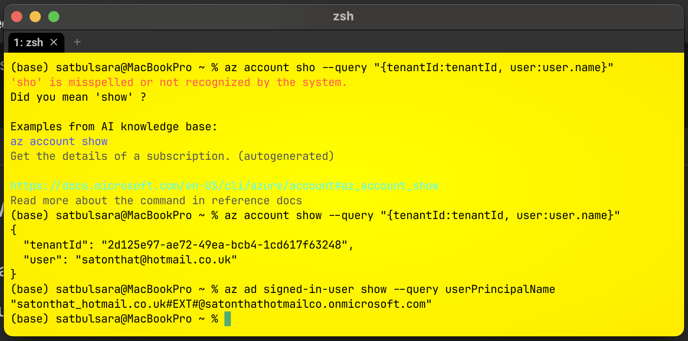
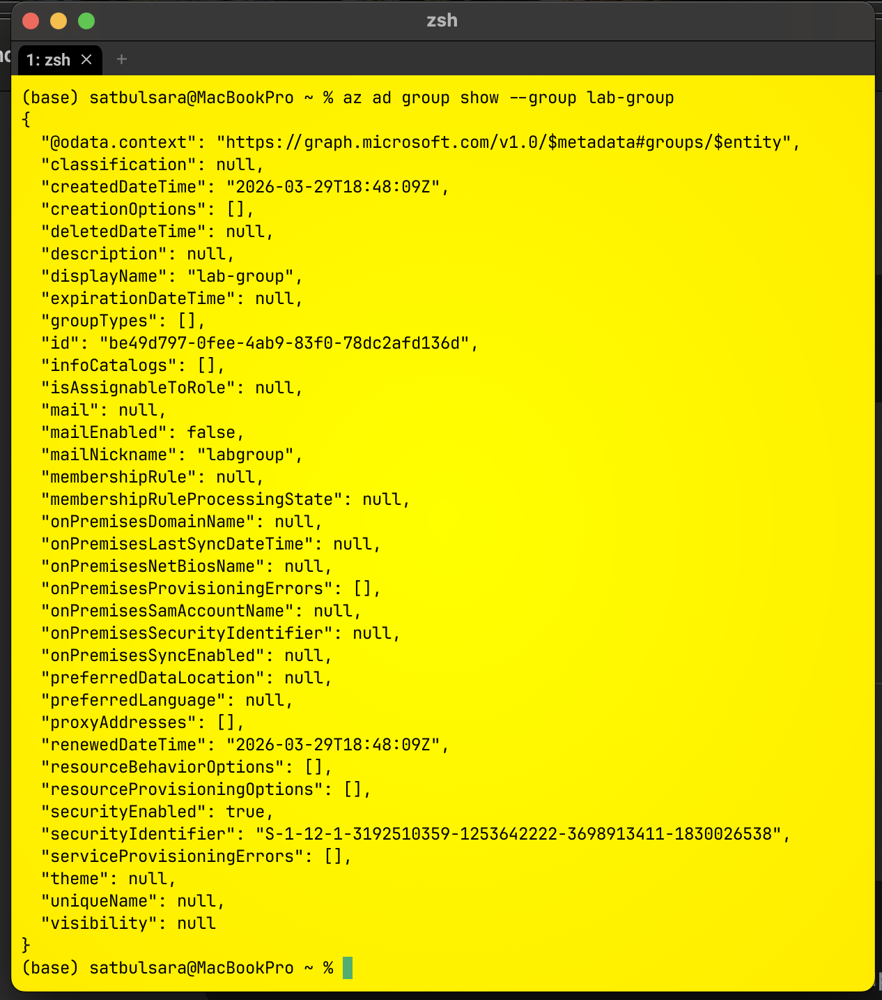
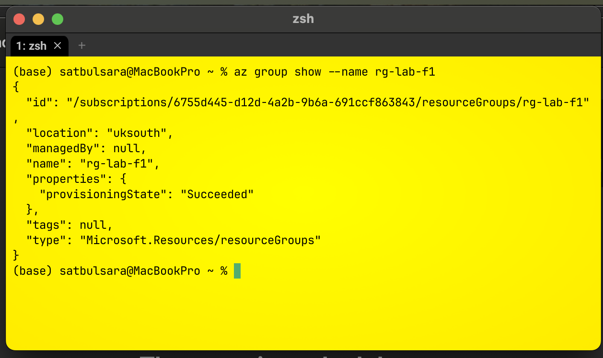
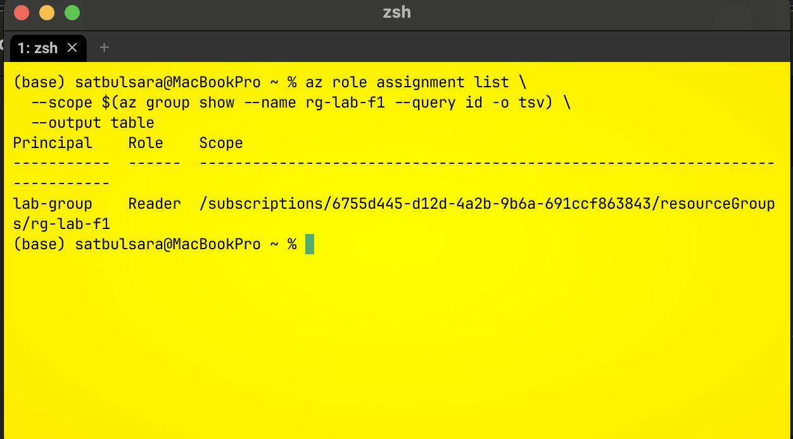
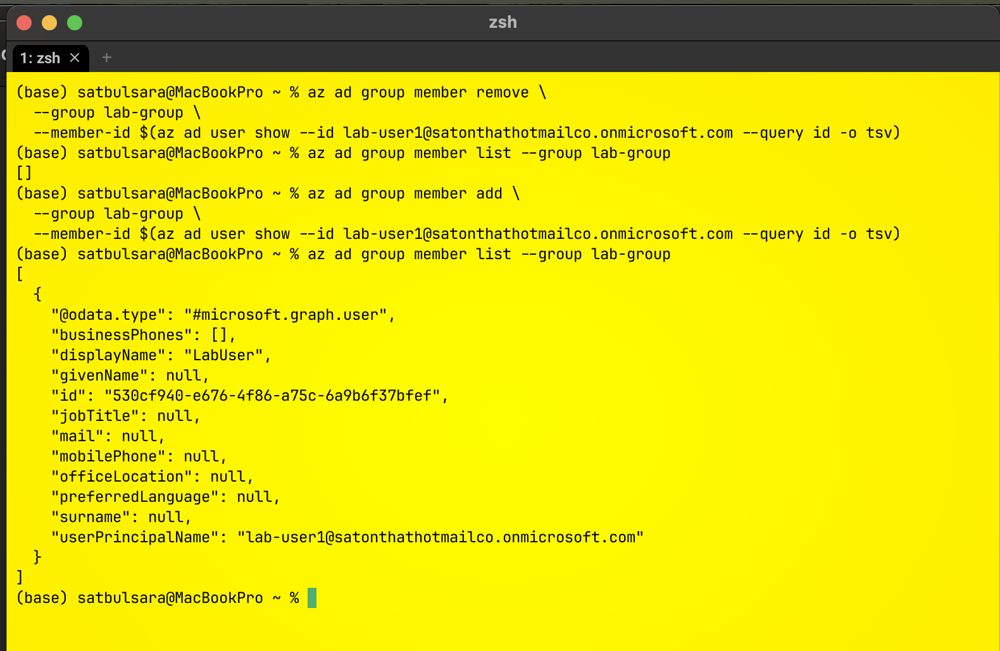

# Azure Group-Based RBAC

> A guided learning lab exploring group-based role assignment, scope, inheritance and access removal with Azure CLI.

## Lab Summary

| Item | Detail |
| --- | --- |
| Type | Guided learning lab |
| Status | Complete |
| Interface | Azure CLI in zsh |
| Identity platform | Microsoft Entra ID |
| Azure role | Reader |
| Assignment scope | Resource group |

## Objective

Practise managing Azure access through a Microsoft Entra security group instead of assigning a role directly to an individual user.

```text
User -> Security group -> Reader role -> Resource group
```

This model centralises access management: group membership controls who receives the role assignment.

## Skills Practised

- Confirming the active tenant and signed-in identity
- Looking up a Microsoft Entra user and security group
- Verifying group membership
- Inspecting an Azure resource group
- Inspecting an Azure RBAC assignment at resource-group scope
- Removing and restoring group membership during a break/fix exercise
- Distinguishing authentication from authorisation

## Prerequisites

- Azure CLI installed
- Access to a disposable Azure lab tenant and subscription
- An authenticated Azure CLI session
- An existing lab user, security group and resource group
- Permission to read directory objects, group membership and role assignments

The original lab used these non-secret resource names:

```text
Group:          lab-group
Resource group: rg-lab-f1
Role:           Reader
```

Tenant, subscription, user and object identifiers are intentionally replaced with placeholders.

## Verification Walkthrough

The retained evidence primarily records verification commands. It does not include every command originally used to create the resources.

### 1. Confirm tenant context

```bash
az account show --query "{tenantId:tenantId, user:user.name}"
az ad signed-in-user show --query userPrincipalName
```

This confirms which tenant and identity the Azure CLI session is using before any access checks are performed.



### 2. Verify the lab user

```bash
az ad user show \
  --id <lab-user-upn> \
  --query "{displayName:displayName, userPrincipalName:userPrincipalName}"
```


### 3. Verify the security group

```bash
az ad group show \
  --group lab-group \
  --query "{displayName:displayName, securityEnabled:securityEnabled}"
```



### 4. Verify group membership

```bash
az ad group member list \
  --group lab-group \
  --query "[].{displayName:displayName, userPrincipalName:userPrincipalName}"
```


### 5. Verify the resource group

```bash
az group show \
  --name rg-lab-f1 \
  --query "{name:name, location:location, provisioningState:properties.provisioningState}"
```



### 6. Verify the RBAC assignment

```bash
RESOURCE_GROUP_ID=$(az group show --name rg-lab-f1 --query id -o tsv)

az role assignment list \
  --scope "$RESOURCE_GROUP_ID" \
  --query "[].{Principal:principalName, Role:roleDefinitionName, Scope:scope}" \
  --output table
```

The captured result showed `lab-group` assigned the `Reader` role at the `rg-lab-f1` resource-group scope.



## Break/Fix Exercise

> Run membership changes only in a disposable lab tenant.

The user was removed from the security group, the empty membership was verified, and the user was then restored.

```bash
USER_ID=$(az ad user show --id <lab-user-upn> --query id -o tsv)

az ad group member remove --group lab-group --member-id "$USER_ID"
az ad group member list --group lab-group --output table

az ad group member add --group lab-group --member-id "$USER_ID"
az ad group member list --group lab-group --output table
```

This demonstrated how removing a user from a role-bearing group removes the relationship that grants group-based access, without changing the role assignment itself.



## Verification Results

| Check | Result |
| --- | --- |
| Azure CLI tenant context identified | Passed |
| Lab user resolved in Microsoft Entra ID | Passed |
| Security group resolved | Passed |
| User membership listed | Passed |
| Resource group provisioning state inspected | Passed |
| Reader assignment at resource-group scope listed | Passed |
| User removed and restored during break/fix | Passed |

## Troubleshooting Note

The first tenant-context command used `az account sho`, which Azure CLI rejected as an unknown command. Reading the suggestion and correcting it to `az account show` resolved the problem.

This reinforced two useful habits:

1. Read the full CLI error before changing anything.
2. Use `--query` to return only the properties needed for verification.

## Key Learnings

- Authentication establishes identity; authorisation determines permitted actions.
- Assigning roles to groups can simplify access management compared with direct user assignments.
- Azure RBAC scope controls where a role assignment applies.
- Group membership and role assignment are separate relationships.
- Removing a member does not remove the group's role assignment.
- Verification commands are not the same as implementation commands.

## Limitations

- This was guided learning rather than an independently designed project.
- The retained commands mainly verify the environment; the original creation commands were not captured.
- The evidence confirms membership and role configuration, but does not include a direct positive/negative resource-access test as the lab user.
- Cleanup activity was not recorded, so no cleanup claim is made here.

## Evidence

Seven screenshots are included with the walkthrough. They come from a disposable practice environment and have been renamed descriptively. They contain no passwords, access keys, tokens or client secrets.
