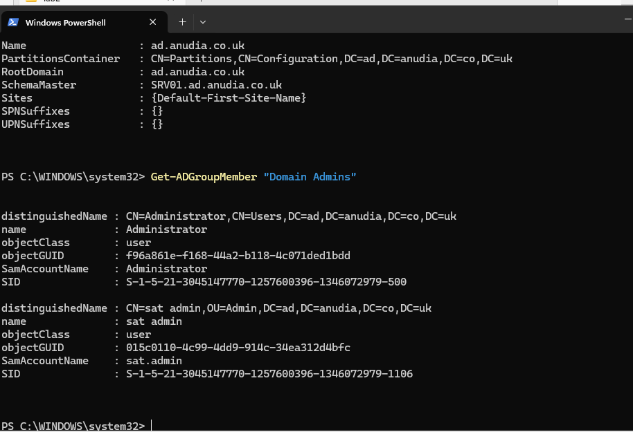

# Enterprise Active Directory Domain

## Overview

Built a Windows Server 2025 Active Directory environment for a fictional organisation, with centralised identity management, departmental security groups and PowerShell-based user provisioning.

**Domain:** `ad.anudia.co.uk`  
**Domain Controller:** `SRV01`  
**Departments:** IT, HR, Finance, Sales, Marketing, Operations  
**Department group memberships:** 200

The domain provides the identity foundation for the rest of my Windows infrastructure lab.

---

## Security Considerations

Security was part of the design from the start.

For this build I focused on:

- **Least privilege:** standard accounts remain non-privileged.
- **Separate admin access:** privileged work uses a dedicated administrative account.
- **Group-based access:** departmental access is managed through security groups rather than individual users.
- **Credential protection:** passwords are not stored in CSV files, scripts or GitHub.
- **Privileged-access auditing:** sensitive AD groups are reviewed after provisioning.
- **Authentication monitoring:** failed logons are reviewed through Windows Security events.
- **Verification:** bulk changes and permissions are checked rather than assumed to be correct.
- **Break/fix testing:** incorrect OU placement and excessive group membership are deliberately tested and remediated.

---

## Domain Deployment

I installed Active Directory Domain Services on `SRV01` and created the `ad.anudia.co.uk` forest and domain.

I verified the resulting configuration with PowerShell.

SRV01 currently acts as the domain controller and Global Catalog.

---

## Directory Design

The environment is organised around six business departments:

- IT
- HR
- Finance
- Sales
- Marketing
- Operations

Each department uses a security group following the naming convention:

`GG_<Department>_Users`

This provides a group-based access model that can later be reused for file permissions, Group Policy and Joiner/Mover/Leaver processes.

The OU structure was refined during the build as the environment developed from initial testing into the final departmental design.

---

## Standard and Administrative Access

Normal and privileged access are kept separate.

My standard account remains a normal domain user without Domain Admin privileges.

A separate `sat.admin` account is used for privileged administration.

This keeps elevated privileges away from the account used for normal activity.

---

## PowerShell Bulk Provisioning

Rather than creating departmental users individually, I used CSV data and PowerShell to provision accounts at scale.

The workflow handled:

- Username creation
- Departmental OU placement
- Security-group membership
- Existing-account checks
- Duplicate names
- Safe reruns
- Password change at first logon

The temporary account password was supplied securely at runtime rather than stored in the CSV.

I audited the resulting department groups afterwards.

The six department groups contained **200 memberships in total**:

| Department | Memberships |
| --- | ---: |
| IT | 25 |
| HR | 20 |
| Finance | 30 |
| Sales | 50 |
| Marketing | 30 |
| Operations | 45 |
| **Total** | **200** |

These figures represent group memberships rather than a verified count of unique AD accounts.

---

## Security Validation

After provisioning, I reviewed sensitive Active Directory groups including:

- Domain Admins
- Enterprise Admins
- Schema Admins

This helped identify any unexpected privileged access after making changes at scale.

### Password and Lockout Baseline

I reviewed the existing domain password and account lockout configuration.

The review identified a `LockoutThreshold` of `0`, meaning account lockout was disabled.

I treated this as a security finding rather than assuming the default configuration was suitably hardened.

### Failed Authentication

I also reviewed failed authentication attempts using Windows Security Event ID `4625`.

This introduced Windows event logs as another source for identity troubleshooting and security monitoring.

---

## AD Health

I ran `dcdiag` to verify the health of the domain controller and Active Directory services.

I also verified the FSMO role holders.

SRV01 currently holds all five FSMO roles, which is expected in this single-domain-controller environment.

---

## Break/Fix

I deliberately introduced configuration problems to practise identifying and correcting them.

### Incorrect OU Placement

I moved an employee into the wrong departmental OU while their department information still reflected their correct role.

I identified the mismatch and returned the account to the correct location.

This demonstrated why OU placement needs to be verified, particularly once policies are linked to the directory structure.

### Excessive Group Membership

I deliberately gave an employee membership of a departmental security group outside their role.

I identified and removed the unnecessary membership.

This demonstrated how a simple group-membership mistake can become a least-privilege issue.

------------

## Troubleshooting

Bulk provisioning exposed several issues:

- Malformed department data
- Incorrect OU paths
- Duplicate employee names
- Existing objects during reruns
- Insufficient administrative permissions

Rather than manually working around failed accounts, I corrected the provisioning process and verified the results before continuing.

This made the workflow safer and more repeatable.

------------

## Outcome

The finished environment provides:

- Centralised domain identity
- Departmental organisation
- Group-based access control
- Separate standard and privileged accounts
- PowerShell-based user provisioning
- Privileged-access auditing
- Authentication monitoring
- AD health verification
- Break/fix troubleshooting

The domain now provides the identity foundation for later Group Policy, DNS, DHCP, file services, PKI and hybrid identity work.

---

## Documentation

- [PowerShell Cheat Sheet](03_active-directory-powershell-cheatsheet.md)
- [Build Instructions](active-directory-instructions.md)
