# Enterprise Active Directory Domain

## Overview

Built a Windows Server 2025 Active Directory environment for a fictional organisation, with structured identity management, PowerShell-based user provisioning and group-based access control.

**Domain:** `ad.anudia.co.uk`  
**Domain Controller:** `SRV01`  
**Users:** ~200  
**Departments:** IT, HR, Finance, Sales, Marketing, Operations

The domain now provides the identity foundation for the rest of my Windows infrastructure lab.

---

## Security Considerations

Security was part of the design from the start rather than something added afterwards.

For this project I focused on:

- **Least privilege** — access is based on role and group membership.
- **Separate admin access** — privileged administration is kept separate from standard user access.
- **Group-based access** — security groups are used instead of assigning access directly to individual users.
- **Credential handling** — passwords are not stored in CSV files, scripts or GitHub.
- **Privileged access auditing** — sensitive AD groups are checked after provisioning.
- **Authentication monitoring** — failed logons are reviewed through Windows Security events.
- **Verification** — provisioning and access are checked rather than assumed to be correct.
- **Break/fix testing** — excessive access and configuration mistakes are deliberately tested and remediated.

---

## Domain Deployment

I installed Active Directory Domain Services on `SRV01` and created the `ad.anudia.co.uk` forest and domain.

I verified the resulting configuration with PowerShell.

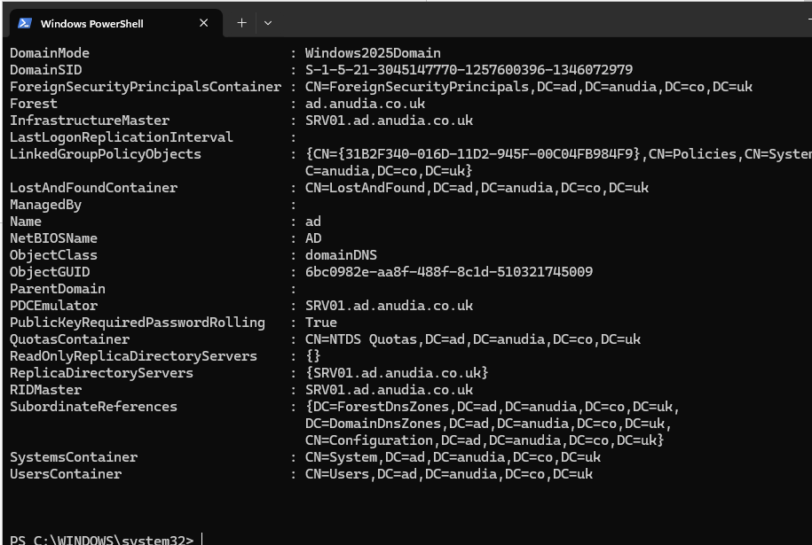

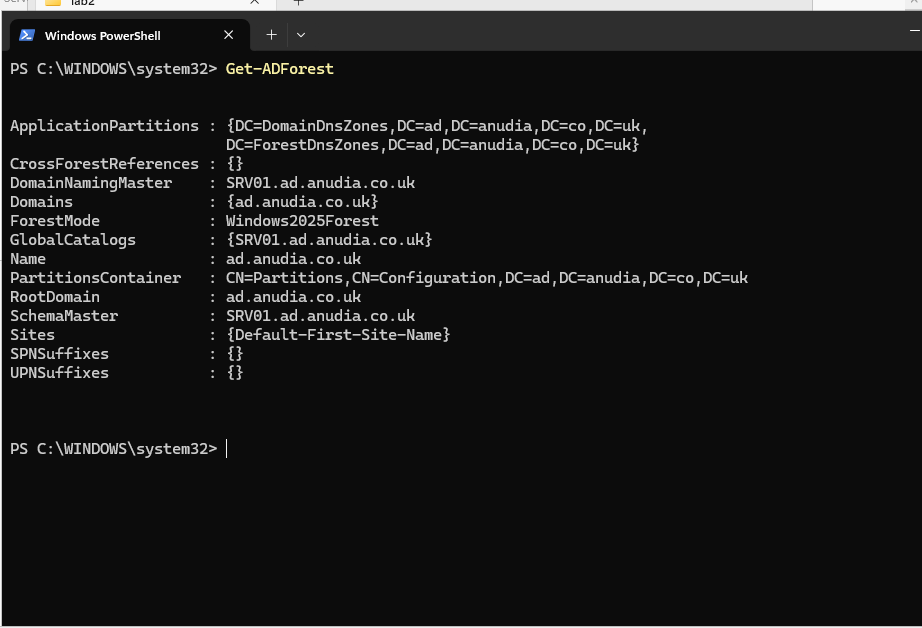

SRV01 is currently the domain controller and Global Catalog for the environment.

---

## Directory Design

I structured Active Directory around six business departments:

- IT
- HR
- Finance
- Sales
- Marketing
- Operations

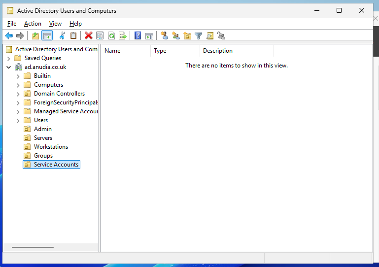

Department security groups provide the basis for access control rather than assigning permissions directly to individual users.

This structure can be reused later for Group Policy, file permissions and Joiner/Mover/Leaver processes.

---

## Administrative Access

I created separate administrative access and verified its privileged group membership.

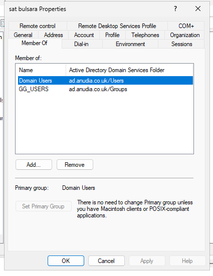

This keeps everyday user access separate from privileged administration.

---

## PowerShell Bulk Provisioning

Creating hundreds of users manually would be slow and inconsistent, so I moved the provisioning process to PowerShell.

Using CSV employee data, I provisioned users across all six departments and automated:

- Username creation
- OU placement
- Department group membership
- Existing-account checks
- Duplicate handling
- Password change at first logon

Passwords were not stored in the CSV or hard-coded into the script.

I audited the department groups afterwards to verify the results.

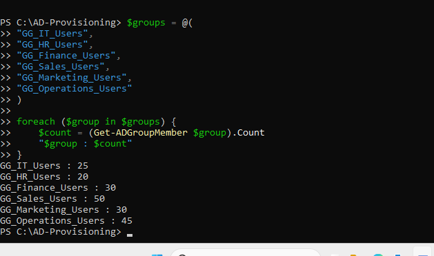

The bulk-created departmental groups contained 195 users, alongside accounts created manually earlier in the build.

---

## Security Validation

After bulk provisioning, I checked privileged groups including Domain Admins, Enterprise Admins and Schema Admins to make sure standard employee accounts had not received privileged access.

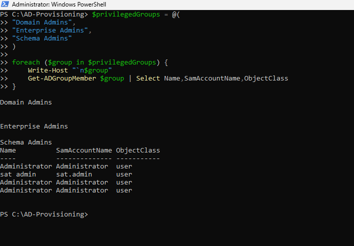

I also reviewed the domain password and account lockout configuration.

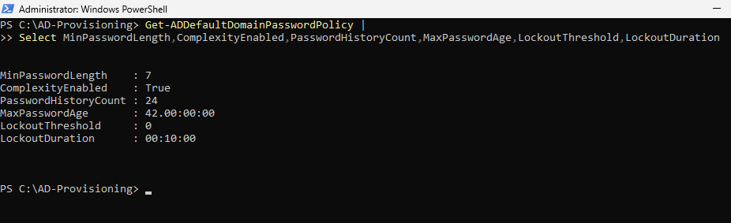

Failed authentication attempts were reviewed using Windows Security Event ID `4625`.

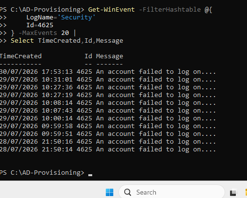

---

## AD Health

I ran `dcdiag` to check the health of the domain controller and its Active Directory services.

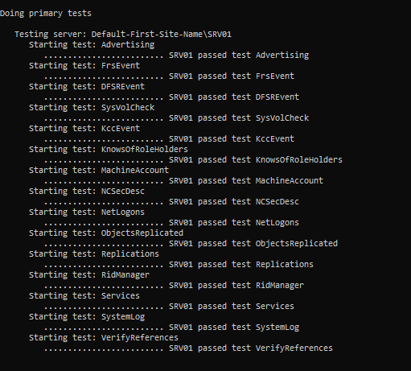

I also verified the five FSMO role holders.

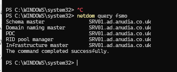

SRV01 currently holds all five roles, which is expected in this single-domain-controller environment.

---

## Break/Fix

I deliberately introduced configuration problems so I could practise identifying and correcting them.

### Incorrect OU Placement

I moved an IT employee into the HR OU while their department attribute still identified them as IT.

I identified the mismatch and returned the account to the correct OU.

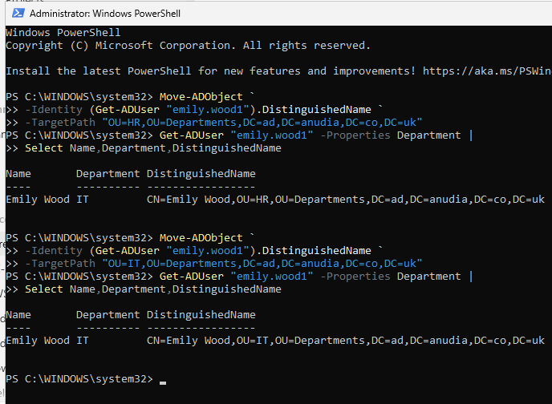

### Excessive Group Membership

I gave an IT employee Finance group membership, creating access outside their role.

I identified the incorrect membership, removed it and verified the user's groups again.

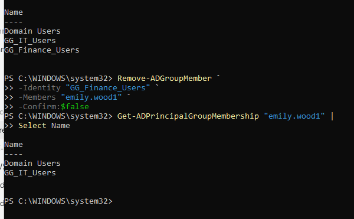

This demonstrated how simple identity-management mistakes can become security issues if group membership is not reviewed.

---

## Troubleshooting

Bulk provisioning exposed several problems that I had to work through:

- Malformed department data
- Incorrect OU paths
- Duplicate employee names
- Existing accounts during script reruns
- Insufficient administrative permissions

Rather than manually working around failed accounts, I corrected the provisioning workflow and verified the results before continuing.

This made the process safer and more repeatable.

---

## Outcome

I finished with a working Active Directory environment providing:

- Centralised identity management
- Departmental OU structure
- Group-based access control
- Separate privileged administration
- PowerShell user provisioning
- Privileged-access auditing
- Authentication monitoring
- AD health verification
- Break/fix troubleshooting

The domain will now act as the identity foundation for later Group Policy, DNS, DHCP, file services, PKI and hybrid identity projects.