# Joiner, Mover, Leaver Identity Lifecycle

A security-first Joiner, Mover and Leaver process built around Active Directory
and PowerShell.

The task was to manage a fictional employee through an on-premises identity
lifecycle: joining Sales, moving to Finance, and leaving the organisation.

The focus was not only changing an AD account. Each stage included access
control, verification, and safe handling of user data.

## Scope

This phase covers the on-premises Active Directory lifecycle:

- AD account creation and placement
- Departmental security-group membership
- Home-drive configuration and NTFS permissions
- Department transfer
- Account disablement and offboarding
- PowerShell automation and verification

Microsoft 365, Entra ID, Exchange Online, mailbox handling, licensing, and MFA
are reserved for a later hybrid-identity phase. A Windows client was used to
test domain authentication, but workstation domain joining is not automated in
this project.

## Environment

- Windows Server 2025
- Active Directory Domain Services
- PowerShell
- Domain: `ad.anudia.co.uk`
- Departmental OUs
- Role-based security groups
- Centralised user home folders

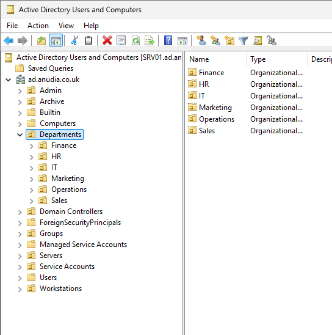

## Security approach

The process applied these principles:

- Grant access through security groups.
- Apply least privilege.
- Remove obsolete access during a department transfer.
- Disable a leaver before completing the remaining offboarding steps.
- Preserve business data instead of deleting it automatically.
- Keep passwords out of scripts and Git.
- Verify resulting state rather than trusting a success message.
- Test automation with a fictional account before wider use.
- Record limitations and manual review requirements.

## Joiner: Sales

A fictional employee, **Alex Carter**, joined Sales.

The account was created in the Sales OU and assigned the Sales security group.

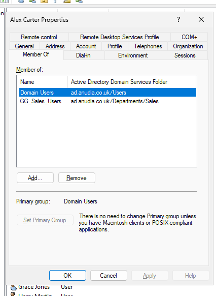

A personal home folder was configured through the hidden `Home$` share and
mapped as the employee's `H:` drive.

```text
\\SRV01\Home$\alex.carter
```

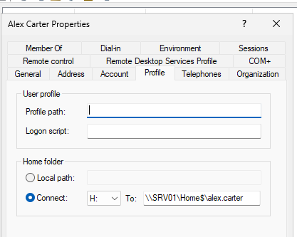

The employee received Modify access to their own folder, while administrative
and system access was retained.

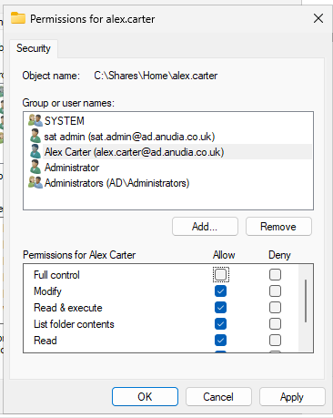

The account was also tested from a domain-joined Windows client.

### Home-share security finding

The `Home$` share currently grants `Authenticated Users` Full Control at the
share layer.

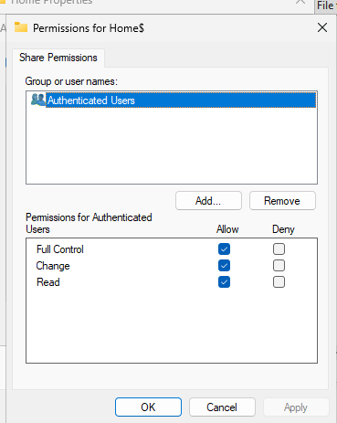

Per-user NTFS permissions restrict access to each employee folder, so effective
access depends on both permission layers. This is documented as a review item:
confirm whether Change permission at the share layer is sufficient while
retaining the required NTFS controls.

## Mover: Sales to Finance

Alex later transferred from Sales to Finance. The Department attribute was
updated and the account was moved into the Finance OU.

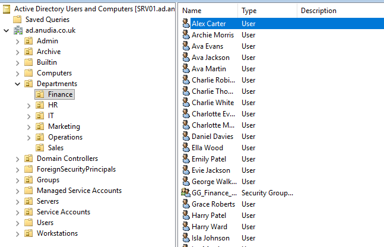

Moving an AD object and changing its Department attribute do not automatically
change group membership. Verification showed that Alex still retained the old
Sales group after the move.

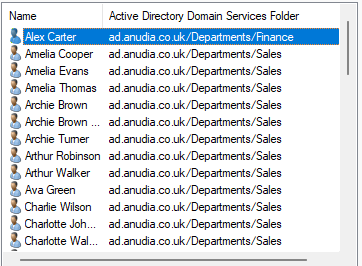

The obsolete Sales membership was then explicitly removed.

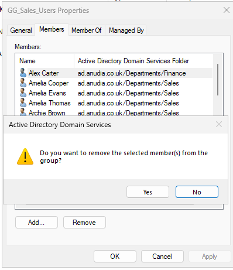

Alex was selected for assignment to the Finance security group.

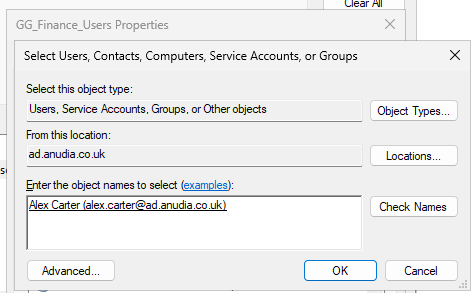

The later automated Mover test includes post-change verification showing the
test account in Finance with only the Finance departmental group.

The main lesson was:

**A department transfer is not complete until previous access has been checked
and removed.**

## Leaver: Offboarding

When Alex left the organisation, access was removed using a controlled
offboarding process.

The account was:

- Disabled first
- Removed from departmental access
- Moved to the Leavers OU
- Added to `GG_Leavers`
- Removed from the home-drive mapping
- Removed from direct home-folder access

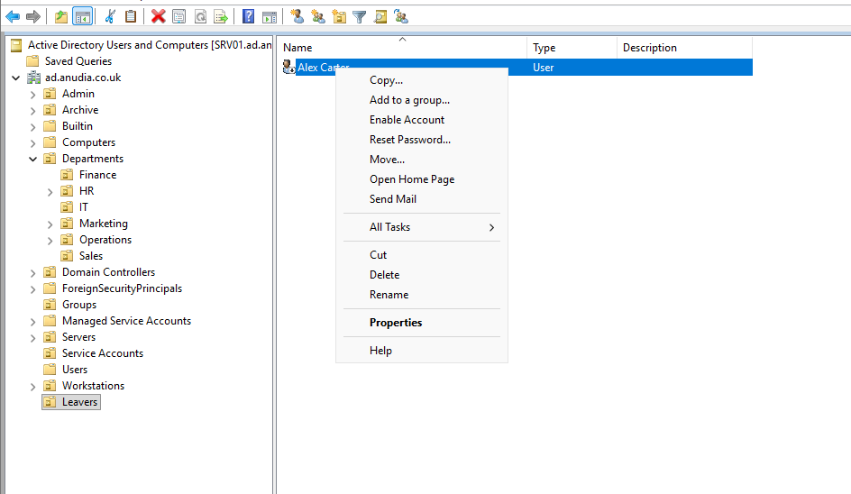

The employee's home-folder data was preserved rather than deleted. Direct
access to that data was removed after offboarding.

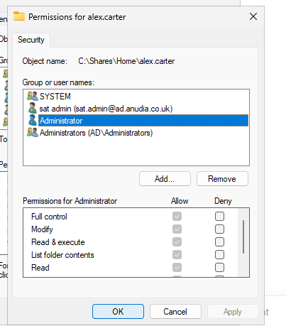

Account termination is kept separate from data-retention decisions. Deletion
should follow organisational retention, HR, legal, and compliance requirements
rather than occurring automatically during offboarding.

## PowerShell automation

After completing the lifecycle manually, I automated the repeatable AD tasks
with three PowerShell scripts.

The scripts now include:

- Prerequisite checks for users, OUs, and groups
- Terminating error handling
- `-WhatIf` support for state-changing operations
- Safe handling of existing or partially changed objects
- Independent post-change verification
- Structured result objects instead of unverified success messages

The screenshots record the original successful functional tests. The scripts
were hardened after that review and require one fresh Windows Server test run
before the revised versions are treated as fully validated.

### Joiner automation

[`New-JMLJoiner.ps1`](scripts/New-JMLJoiner.ps1) performs these actions:

- Validates the target OU and departmental group.
- Rejects an existing account.
- Prompts securely for the temporary password.
- Creates and enables the AD user.
- Requires a password change at first logon.
- Adds the departmental security group.
- Verifies the account, OU, department, enabled state, and membership.
- Disables a partially created account if a later step fails.

The script does not create the home folder or its ACL. Those tasks remain a
documented manual part of this learning phase.

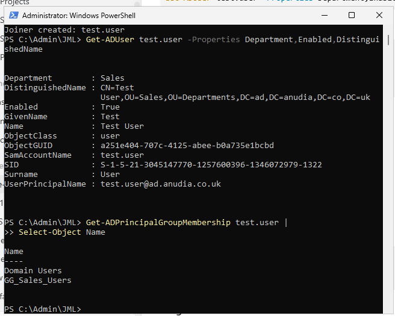

### Mover automation

[`Move-JMLUser.ps1`](scripts/Move-JMLUser.ps1) performs these actions:

- Validates the user, destination OU, and destination group.
- Adds the new departmental group when required.
- Removes every other recognised departmental group.
- Updates the Department attribute.
- Moves the account into the destination OU.
- Handles safe reruns when the intended state is already complete.
- Verifies the final OU, Department attribute, and group membership.

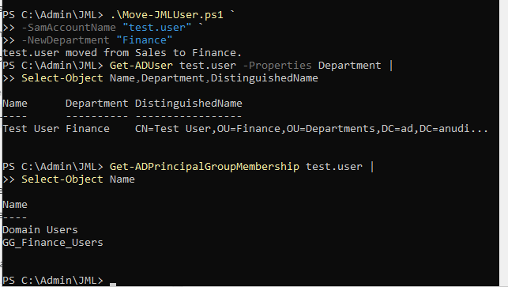

### Leaver automation

[`Disable-JMLLeaver.ps1`](scripts/Disable-JMLLeaver.ps1) performs these actions:

- Validates the account, Leavers OU, and `GG_Leavers` group.
- Disables the account before other changes.
- Removes recognised departmental groups.
- Adds `GG_Leavers`.
- Clears the AD home-drive mapping.
- Updates the Department attribute to `Leaver`.
- Moves the account into the Leavers OU.
- Preserves the original home-folder path for administrative review.
- Reports other remaining groups instead of silently treating them as safe.
- Verifies the final disabled state, OU, department, mapping, and memberships.

The script does not delete employee data or automatically remove NTFS access.
Retention and ACL changes remain controlled administrative decisions.

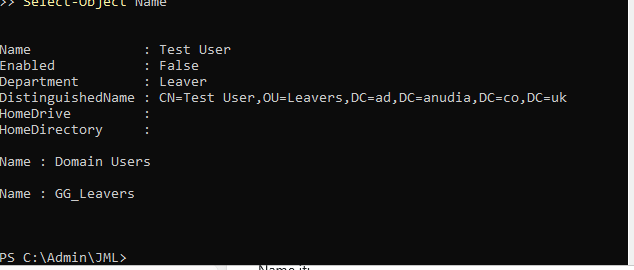

## Verification

The manual lifecycle was checked through both Active Directory Users and
Computers and PowerShell. Examples included:

```powershell
Get-ADUser
Get-ADPrincipalGroupMembership
Get-ADGroupMember
```

The original automation tests demonstrated:

- Joiner: Sales OU, enabled account, and `GG_Sales_Users`
- Mover: Finance OU, Finance attribute, and `GG_Finance_Users` without Sales
- Leaver: disabled account, Leavers OU, blank home mapping, and `GG_Leavers`

PowerShell syntax parsing now passes for all three hardened scripts. Runtime AD
testing of the revised versions is still required on the Windows Server lab.

## Troubleshooting

The most useful finding occurred during the Mover process. Moving Alex to the
Finance OU and changing the Department attribute did not remove the old Sales
group automatically. A separate group-membership check exposed the stale
access.

The correction was to remove the Sales membership explicitly, assign Finance,
and verify group membership separately from the user's OU and Department
attribute.

This demonstrated why a successful object move is not proof that access is
correct.

The automation was also tested with a fictional account. After review, the
scripts were changed to stop on errors, verify their final state, and avoid
printing success based only on reaching the end of the file.

## Outcome

The project demonstrates an on-premises identity lifecycle from initial access
through department transfer and eventual offboarding.

The main lesson is that JML administration is about controlling access over
time. Creating an account is straightforward. The more important work is
ensuring that users receive only their current access, obsolete permissions are
removed, leavers cannot authenticate, business data is preserved, and every
important change is verified.

## Project files

### PowerShell scripts

- [`New-JMLJoiner.ps1`](scripts/New-JMLJoiner.ps1)
- [`Move-JMLUser.ps1`](scripts/Move-JMLUser.ps1)
- [`Disable-JMLLeaver.ps1`](scripts/Disable-JMLLeaver.ps1)

### Documentation

- [`JML operations guide`](reference/jml-instructions.md)
- [`PowerShell cheat sheet`](reference/jml-powershell-cheatsheet.md)
