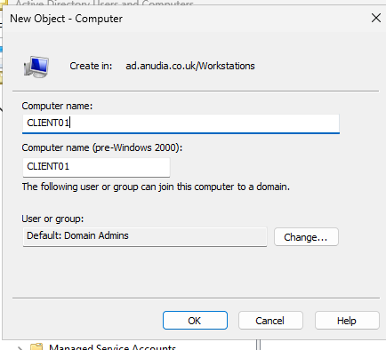
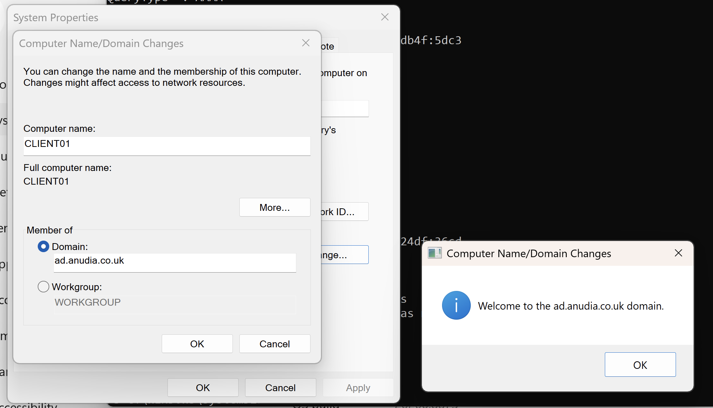
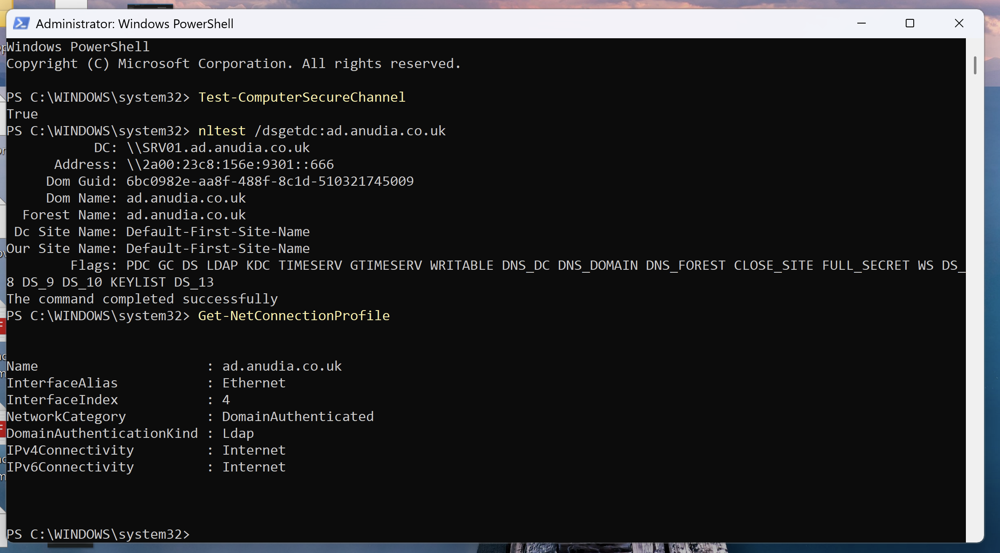
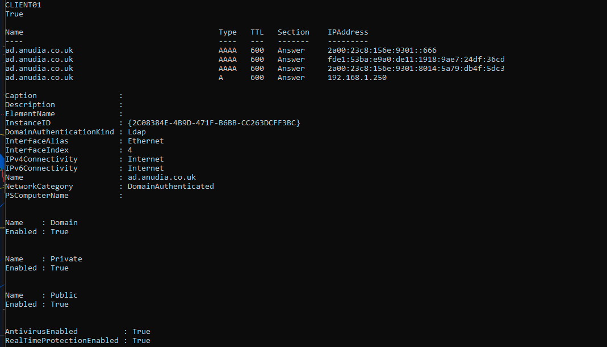
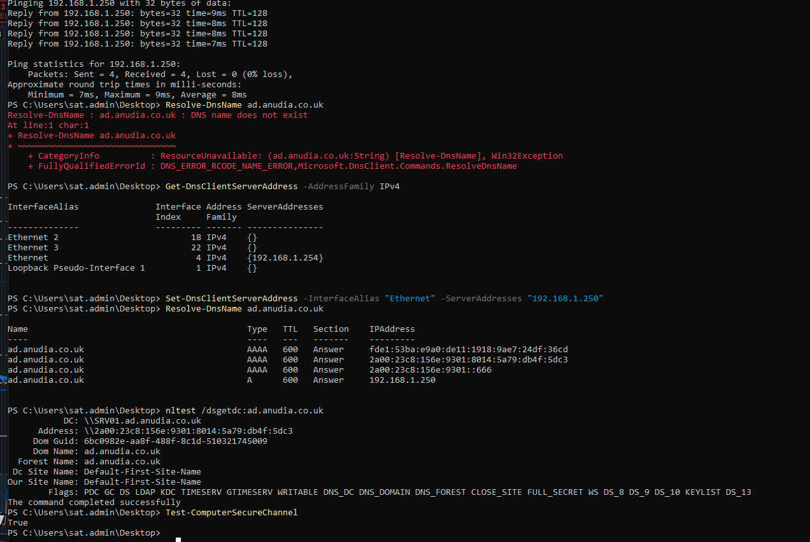

# Corporate Windows 11 Workstation | Active Directory Domain Join

A Windows 11 Pro workstation deployed and integrated into an Active Directory environment, with domain authentication, DNS, least-privilege checks, endpoint security verification, and a controlled DNS break/fix exercise.

## Project Overview

This project added the first corporate Windows client to my existing Active Directory lab.

The workstation was built as `CLIENT01` and joined to:

`ad.anudia.co.uk`

The aim was not simply to get a Windows machine onto the domain. I wanted to understand the dependencies behind a successful domain join and verify that the workstation could correctly discover, authenticate with, and communicate with the domain controller.

The project covered:

- Windows 11 Pro workstation deployment
- Network configuration
- Active Directory DNS
- Computer-account prestaging
- Domain joining
- Domain-user authentication
- Domain controller discovery
- Secure-channel verification
- Local administrator review
- Windows Firewall and Microsoft Defender checks
- BitLocker status review
- Controlled DNS break/fix troubleshooting

## Environment

| Component | Configuration |
|---|---|
| Client | Windows 11 Pro |
| Client hostname | CLIENT01 |
| Virtualisation | Parallels Desktop |
| Domain Controller | SRV01 |
| Domain | ad.anudia.co.uk |
| AD DNS server | 192.168.1.250 |
| Client network | Bridged Ethernet |
| Authentication | Active Directory |

The Windows 11 VM initially used Parallels Shared Networking.

This placed the client on a separate `10.211.55.0/24` virtual network and prevented direct communication with the physical Windows Server.

I changed the VM to bridged networking so that `CLIENT01` joined the same `192.168.1.0/24` network as `SRV01`.

This allowed the workstation to communicate directly with the domain controller.

## Active Directory DNS

One of the most important parts of the build was DNS.

Before joining the domain, `CLIENT01` was configured to use:

`192.168.1.250`

as its DNS server.

This is the address of `SRV01`, which hosts DNS for the Active Directory domain.

Using the AD DNS server allows the workstation to locate services such as domain controllers rather than relying on the home router for internal name resolution.

This dependency became particularly important during the later break/fix exercise.

## Computer Account Prestaging

Before joining the workstation, I prestaged the `CLIENT01` computer account inside the `Workstations` OU.



This gave the computer account a controlled location in Active Directory rather than allowing it to remain in the default `Computers` container.

It also prepares the environment for later Group Policy work where policies can be targeted at workstation OUs.

## Domain Join

`CLIENT01` was then joined to:

`ad.anudia.co.uk`

using a privileged administrative account rather than the employee account that would normally use the workstation.

The join completed successfully.



After restarting the workstation, Windows presented the domain sign-in interface and domain-user authentication was tested.

The standard domain user remained a standard user rather than being given unnecessary local administrative privileges.

## Domain Health Verification

Joining the domain successfully was not treated as proof that everything was working correctly.

I verified the workstation using:

```powershell
Test-ComputerSecureChannel
nltest /dsgetdc:ad.anudia.co.uk
Get-NetConnectionProfile
```



`Test-ComputerSecureChannel` returned `True`.

`nltest` successfully discovered `SRV01.ad.anudia.co.uk`.

The network profile also reported `DomainAuthenticated`.

Together these checks confirmed that the workstation could discover the domain controller and communicate with the domain correctly.

## Least Privilege

I reviewed the local `Administrators` group after the domain join.

The standard employee account was not a member of the local Administrators group.

I also tested the workstation while signed in as a standard domain user and confirmed that the account did not receive administrative privileges simply because the machine was domain joined.

Administrative work was performed using a separate privileged identity.

This maintains separation between normal user activity and administrative access.

## Endpoint Security Baseline

Before introducing a troubleshooting scenario, I established a healthy endpoint baseline.

The checks included:

```powershell
hostname
Test-ComputerSecureChannel
Resolve-DnsName ad.anudia.co.uk
Get-NetConnectionProfile
Get-NetFirewallProfile | Select-Object Name, Enabled
Get-MpComputerStatus | Select-Object AntivirusEnabled, RealTimeProtectionEnabled
```



The final checks confirmed:

- Hostname was `CLIENT01`
- Secure channel was healthy
- `ad.anudia.co.uk` resolved through DNS
- Network profile was `DomainAuthenticated`
- Windows Firewall was enabled
- Microsoft Defender Antivirus was enabled
- Real-time protection was enabled

BitLocker status was also reviewed as part of the endpoint assessment.

I did not enable BitLocker during this project because I first want a defined recovery-key storage process rather than enabling disk encryption without a recovery plan.

## Break/Fix Exercise - Active Directory DNS Failure

After confirming the healthy baseline, I introduced a controlled configuration fault without troubleshooting it in advance.

The simulated user reported that company/domain resources were unavailable while basic network connectivity still appeared to work.

I started by testing connectivity to the domain controller by IP:

```powershell
ping 192.168.1.250
```

The server responded successfully.

This showed that basic IP connectivity between `CLIENT01` and `SRV01` was still working.

I then tested internal DNS:

```powershell
Resolve-DnsName ad.anudia.co.uk
```

This failed.

Instead of immediately changing DNS settings, I checked which DNS server the workstation was currently using:

```powershell
Get-DnsClientServerAddress -AddressFamily IPv4
```

The Ethernet interface was configured with `192.168.1.254`.

This was the router rather than the Active Directory DNS server.

### Root Cause

`CLIENT01` had been configured to use the home router for DNS instead of `SRV01`.

The workstation could therefore still communicate with the server by IP, but it could not correctly resolve the internal Active Directory namespace.

### Resolution

I restored the correct DNS configuration:

```powershell
Set-DnsClientServerAddress `
    -InterfaceAlias "Ethernet" `
    -ServerAddresses "192.168.1.250"
```

I then verified the repair with:

```powershell
Resolve-DnsName ad.anudia.co.uk
nltest /dsgetdc:ad.anudia.co.uk
Test-ComputerSecureChannel
```



The results confirmed that:

- Internal DNS resolution worked again
- `CLIENT01` could discover `SRV01`
- The domain secure channel returned `True`

The workstation was returned to its known-good state.

## What I Learned

The biggest lesson from this project was that a domain join depends on more than network connectivity.

A workstation can successfully reach a domain controller by IP and still be unable to use Active Directory correctly if DNS is misconfigured.

The break/fix exercise made that much clearer.

Instead of changing settings immediately, I worked through the problem in stages:

`IP connectivity -> DNS resolution -> DNS client configuration -> DC discovery -> secure channel`

It also reinforced the importance of verifying configuration rather than assuming that a successful domain join means the workstation is completely healthy.

## Security Considerations

Security decisions made during the project included:

- Used Windows 11 Pro for Active Directory support
- Used the internal AD DNS server for domain services
- Prestaged the computer account in the Workstations OU
- Used a separate privileged identity for administration
- Kept the standard domain user out of local Administrators
- Verified Windows Firewall
- Verified Microsoft Defender Antivirus
- Verified real-time protection
- Reviewed BitLocker without enabling it before defining recovery-key storage
- Established a healthy baseline before break/fix testing
- Verified the environment after repairing the injected fault

## Outcome

`CLIENT01` is now a functioning corporate-style Windows workstation integrated with the `ad.anudia.co.uk` Active Directory environment.

The client can:

- Authenticate domain users
- Resolve the AD namespace
- Discover the domain controller
- Maintain a healthy secure channel
- Identify its network as domain authenticated
- Operate with Windows Firewall and Defender enabled
- Maintain separation between standard and privileged accounts

The controlled DNS failure was also successfully diagnosed, repaired, and verified.

This workstation now provides the client platform for the next stage of the lab: **Group Policy deployment and management**.
