# Group Policy Management \| Active Directory Learning Lab

A practical learning lab that extended an existing Active Directory environment
with centrally managed user and computer configuration.

The work covered GPO scope, user and computer policy, security filtering,
endpoint verification, troubleshooting, reporting, and configuration backup. The
lab is deliberately presented as a small learning environment, not as a
production or highly available Group Policy design.

## Project Overview

This project extended the `ad.anudia.co.uk` environment created in the earlier
Active Directory and Windows 11 builds. It used organisational units and security
groups to apply configuration centrally instead of changing individual
endpoints.

The lab covered:

- Domain password policy
- Endpoint restrictions
- Departmental drive mapping
- Documents Folder Redirection
- Windows Update policy
- Security Filtering
- User and computer Resultant Set of Policy checks
- GPO backup and reporting
- PowerShell and command-line verification

The central objective was to distinguish three different states:

1. A GPO is configured and linked.
2. Windows reports that the GPO was processed by the intended user or computer.
3. The expected behaviour is visible on the endpoint.

## Environment

| Component | Configuration |
| --- | --- |
| Domain controller | `SRV01` |
| Server operating system | Windows Server 2025 |
| Client | `CLIENT01` |
| Client operating system | Windows 11 Pro |
| Domain | `ad.anudia.co.uk` |
| AD DNS server | `192.168.1.250` |
| Test user | Thomas Williams |
| Test department | IT |
| Target security group | `GG_IT_Users` |
| Administration | Group Policy Management and PowerShell |
| Virtualisation | Parallels Desktop |

## Scope and Evidence Boundaries

This is a single-domain-controller, single-client learning lab. The retained
evidence supports the configured password policy, endpoint restriction,
departmental drive mapping, redirected Documents path, applied Windows Update
GPO, Security Filtering investigation, and presence of GPO backup data.

The exported [all-GPO report](reference/gpo-reports/all-gpos.html) and
[backup manifest](reference/gpo-backups/manifest.xml) are now retained. They add
useful final-state evidence and reveal that the final Security Filtering scope
was broader than the original group-only design.

The evidence has the following boundaries:

- The Windows Update screenshot proves that the GPO appeared in the computer's
  applied policy set. It does not prove update installation or patch compliance.
- The earlier Security Filtering screenshot shows only `GG_IT_Users`, but the
  later exported report lists both `GG_IT_Users` and `Authenticated Users` under
  Security Filtering. The report is treated as the later final-state evidence.
- The Folder Redirection evidence proves the share exists and the user's
  Documents path changed. The earlier settings screenshot shows exclusive
  rights enabled, while the later report shows the final value as disabled. It
  does not include a negative access test from a second user.
- The backup manifest identifies eight GPO backups and the backup structure is
  retained, but a restore test was not performed.

## Security Considerations

Security decisions and limitations included:

- Used separate standard and privileged identities.
- Scoped policy through OUs and security groups rather than configuring
  individual users or endpoints.
- Attempted to use `GG_IT_Users` for policy application while retaining read-only
  access for the computer security context. The exported report shows that
  `Authenticated Users` retained Apply Group Policy permission. The final scope
  was therefore the eligible authenticated users within the linked IT OU, not
  exclusive membership in `GG_IT_Users`.
- Disabled exclusive rights in the final Folder Redirection configuration. This
  makes correct share and NTFS isolation especially important; a second-user
  denial test was not retained.
- Used a hidden SMB share to reduce casual browsing. The trailing `$` is not an
  access-control boundary; access still depends on share and NTFS permissions.
- Verified applied policy with `gpresult` and then tested observable endpoint
  behaviour where evidence was retained.
- Backed up the GPO configuration after validation. The backup remained on the
  same lab server, so it is not a resilient off-host backup.
- Avoided changing unrelated working GPOs while investigating the targeted test
  policy.

## Evidence Summary

| Control | Configuration evidence | Processing evidence | Behaviour or result |
| --- | --- | --- | --- |
| Domain password policy | [Password settings](screenshots/01-domain-password-policy.png) | Not separately captured | GPMC shows the configured domain values |
| Control Panel restriction | [Policy list](screenshots/02-control-panel-policy-enabled.png) and [setting detail](screenshots/04-prohibit-control-panel-policy.png) | [`gpupdate`](screenshots/03-gpupdate-success.png) and [`gpresult`](screenshots/05-endpoint-restrictions-gpresult.png) | [Control Panel blocked](screenshots/06-control-panel-blocked.png) |
| IT drive mapping | [Exported GPO report](reference/gpo-reports/all-gpos.html) | Not separately retained | [`I:` drive present](screenshots/07-it-drive-mapping.png) |
| Folder Redirection | [Share](screenshots/09-redirected-folders-share-verified.png) and [exported final report](reference/gpo-reports/all-gpos.html) | Not separately retained | [Documents path redirected](screenshots/11-documents-redirection-verified.png) |
| Windows Update | [Exported GPO report](reference/gpo-reports/all-gpos.html) | [Computer-scope `gpresult`](screenshots/12-workstation-windows-update-gpresult.png) | Update installation not tested |
| Security Filtering | [Earlier group-only configuration](screenshots/13-security-filtering-gg-it-users.png) and [later final-state report](reference/gpo-reports/all-gpos.html) | Applied GPO is partially visible in the combined endpoint capture | [Run restriction enforced for the IT test user](screenshots/14-security-filtered-policy-verified.png); the report confirms broader OU-based scope |
| GPO backup | [Backup manifest](reference/gpo-backups/manifest.xml) | [Backup directory inventory](screenshots/15-gpo-backup-verification.png) | Eight GPO backup sets retained; restore not tested |

## Security Filtering Result

The exported report shows both of these principals under Security Filtering for
`GPO-IT-Security-Filtered`:

```text
AD\GG_IT_Users
NT AUTHORITY\Authenticated Users
```

This means the final policy was available to eligible authenticated users within
the linked IT OU, rather than only members of `GG_IT_Users`. The likely cause is
visible in the original PowerShell workflow:
`Set-GPPermission` attempted to change `Authenticated Users` from `GpoApply` to
the lower `GpoRead` level without `-Replace`. Microsoft documents that a lower
permission is not applied over an existing higher permission unless `-Replace`
is specified.

This does not prevent the lab from demonstrating Security Filtering inspection,
policy processing, or endpoint enforcement. It does mean that the retained
evidence must not be described as proof of exclusive group targeting.

A narrower optional future configuration would be:

```text
Security Filtering:
  GG_IT_Users

Delegation:
  GG_IT_Users          Read (from Security Filtering)
  Authenticated Users  Read
```

The [operations guide](reference/group-policy-instructions.md) contains a
protected change and verification sequence for implementing that narrower
model. It was not performed as part of this completed learning lab.

## Domain Password Policy

The domain password policy was reviewed in the Default Domain Policy. The
retained screenshot shows:

| Setting | Value shown |
| --- | --- |
| Enforce password history | 24 passwords remembered |
| Maximum password age | 42 days |
| Minimum password age | 1 day |
| Minimum password length | 14 characters |
| Password complexity requirements | Enabled |
| Store passwords using reversible encryption | Disabled |

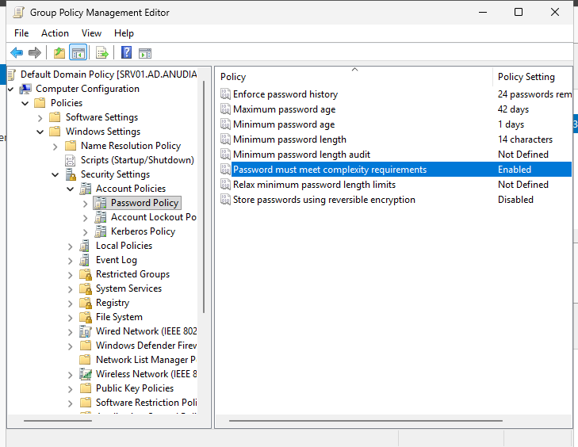

Domain-account password policy is applied at domain scope because domain
controllers share the domain account database. Fine-grained password policies
were outside this lab.

## Endpoint Restrictions

I created `GPO-Endpoint-Restrictions` as a user-side GPO and enabled **Prohibit
access to Control Panel and PC settings**.

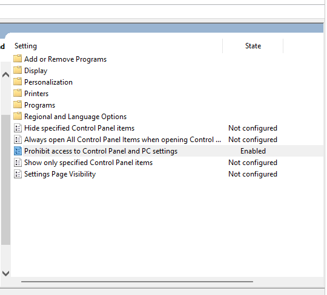

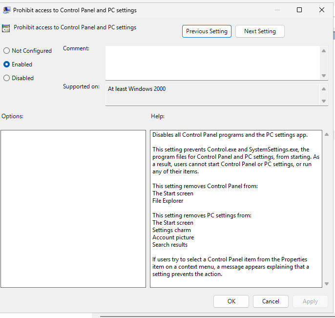

I refreshed policy on `CLIENT01`:

```powershell
gpupdate /force
```

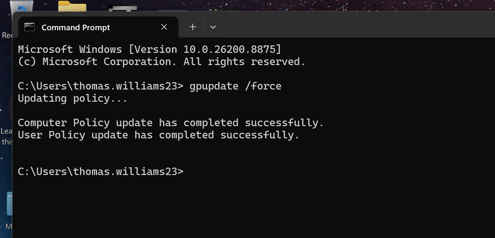

A successful refresh only confirms that policy processing completed. I therefore
checked the user Resultant Set of Policy:

```powershell
gpresult /scope user /r
```

`GPO-Endpoint-Restrictions` appeared under Applied Group Policy Objects.

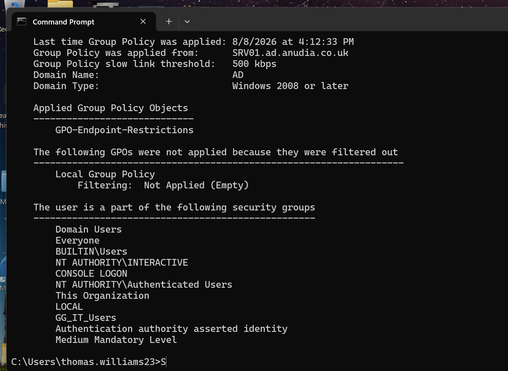

I then attempted to open the restricted feature from the standard user's
session. Windows blocked the operation.

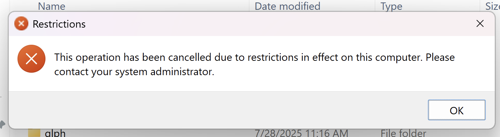

Together, the configuration, RSoP, and endpoint evidence show that this policy
was configured, processed, and enforced for the test user.

## Departmental Drive Mapping

The IT user received a departmental drive through Group Policy Preferences. On
`CLIENT01`, the mapping appeared as `IT Department (I:)`.

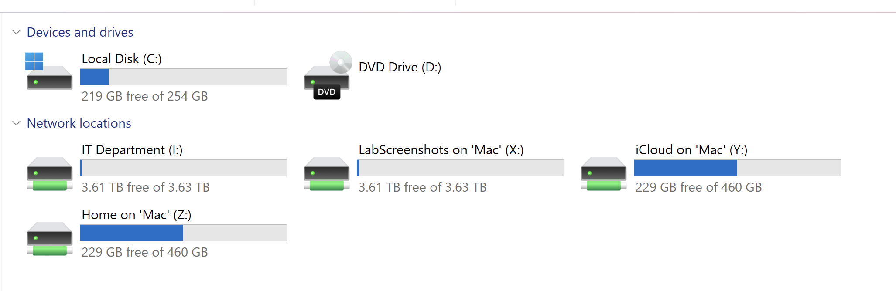

This demonstrates automatic delivery of a departmental resource. The screenshot
does not prove the underlying share and NTFS permission model or denial of access
to a non-IT user, so those checks remain future evidence improvements.

## Folder Redirection

I configured the user's Documents folder to be stored centrally on `SRV01`.

The server-side directory was created at:

```text
C:\Shares\RedirectedFolders
```

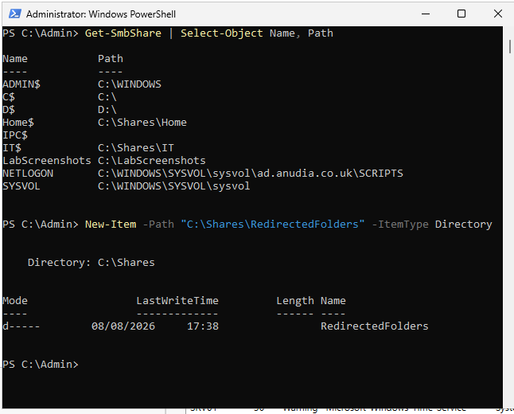

It was published as the hidden SMB share:

```text
\\SRV01\RedirectedFolders$
```

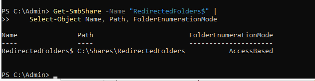

The Documents policy created a per-user folder under the root, moved existing
Documents content, and left the folder in its new location if the policy was
later removed.

The screenshot below captures an earlier configuration with **Grant the user
exclusive rights** enabled. The later exported report records the final setting
as **Disabled**, so the report is the final-state evidence for this option.

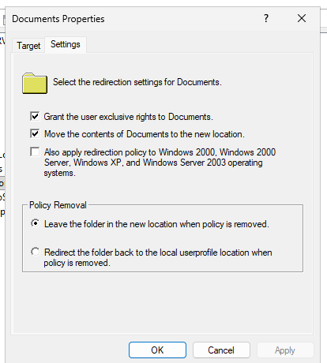

After Group Policy processing, PowerShell returned the server-hosted Documents
path:

```text
\\SRV01\RedirectedFolders$\thomas.williams23\Documents
```

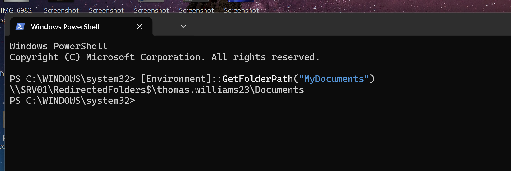

### Folder Redirection Troubleshooting

Parallels was integrating Mac folders into the Windows VM. This introduced a
second mechanism that could change Windows known-folder behaviour and made the
initial result harder to interpret.

I separated the host folder integration from the Windows profile, checked the
Folder Redirection operational log and server-side path, disabled exclusive
rights during troubleshooting, refreshed policy, and tested the Documents path
again. The final result resolved to the expected UNC location.

This demonstrated that virtualisation features can affect Windows known folders
independently of Active Directory. It also reinforced the value of separating
external variables before changing a working GPO.

## Windows Update Policy

I configured the computer-side `GPO-Workstations-Windows-Update` policy and
linked it to the workstation scope. The exported report confirms **4 - Auto
download and schedule the install**, with every day selected and a 03:00
schedule.

I checked computer-side RSoP with:

```powershell
gpresult /scope computer /r
```

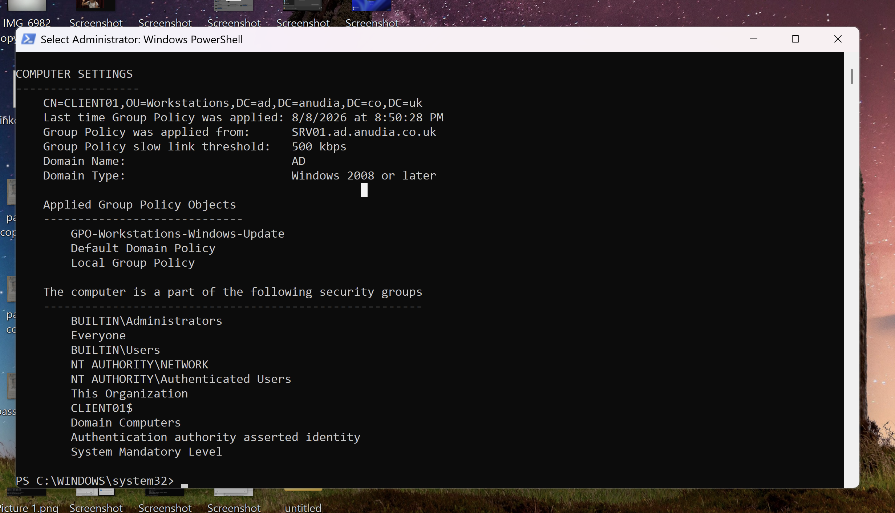

This verifies that the computer processed the named GPO. It does not verify
successful download, installation, restart, or patch level. The exported report
proves the configured GPO values, while `gpresult` proves processing. Windows
Update status evidence is still required to demonstrate patch compliance.

## Security Filtering

I created `GPO-IT-Security-Filtered`, linked it to the IT OU, and attempted to
target policy application to `GG_IT_Users`.

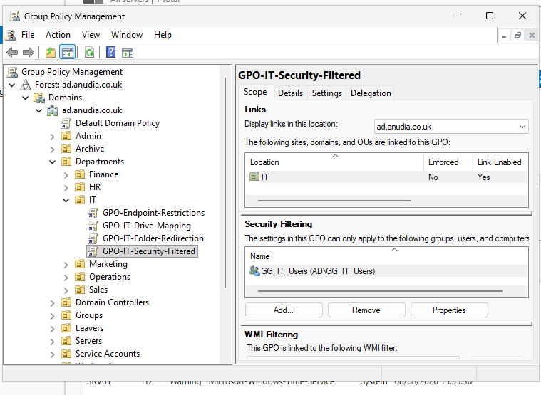

The test policy removed access to the Windows Run command. During the first
attempt, the GPO did not appear in Thomas Williams' user RSoP even though the OU
link was enabled, the setting was configured, and the user belonged to
`GG_IT_Users`.

I checked the current logon token and policy result with:

```powershell
whoami /groups
gpresult /scope user /r
```

For a user-side GPO, the target user or group requires **Read** and **Apply Group
Policy**. The computer account that retrieves the user policy also needs **Read**
permission. The intended model was:

```text
GG_IT_Users          Read + Apply Group Policy
Authenticated Users  Read only
```

The target GPO was recreated and its filtering and permissions were configured
again. A new user session and policy refresh produced the expected endpoint
restriction for Thomas Williams.

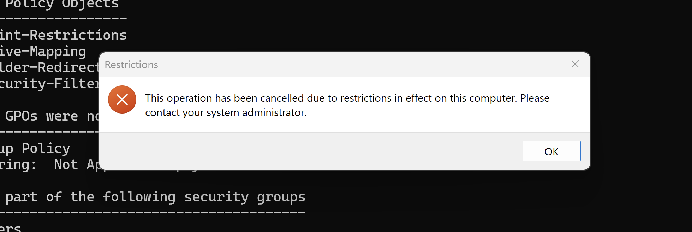

The later exported report revealed that `Authenticated Users` still appeared in
Security Filtering. The endpoint test therefore proves that the policy applied
to Thomas, but it does not prove that non-members of `GG_IT_Users` were excluded.
The final lab records this as broader OU-based scope rather than claiming
exclusive group targeting. Refining the permission and running a non-member
test remain optional follow-up work.

## Verification Workflow

The main endpoint commands were:

```powershell
gpupdate /force
gpresult /scope user /r
gpresult /scope computer /r
whoami /groups
```

They answer different questions:

| Check | What it proves |
| --- | --- |
| GPMC configuration | The setting and link exist in Active Directory |
| `whoami /groups` | The expected group exists in the current logon token |
| `gpupdate /force` | User and computer policy processing completed |
| `gpresult` | A named GPO appears in the applied policy set for that scope |
| Functional test | The expected user or computer behaviour occurred |

No single check proves the entire chain.

## PowerShell Administration, Backup, and Reporting

The lab used Group Policy cmdlets for inspection and administration:

```powershell
Get-GPO
Get-GPInheritance
Set-GPRegistryValue
Set-GPPermission
Backup-GPO
Get-GPOReport
```

After validation, I backed up the domain GPOs to:

```text
C:\Admin\GPO-Backups
```

The retained inventory and manifest show eight GUID-named backup directories
created at the same time.

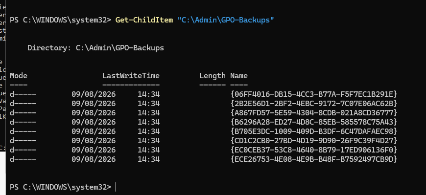

The [backup manifest](reference/gpo-backups/manifest.xml) maps those directories
to eight GPOs, and the [raw backup set](reference/gpo-backups/) is retained. This
proves that GPO backup data was created and exported from the lab server. It does
not prove restoration succeeds.

The [HTML report](reference/gpo-reports/all-gpos.html) is also retained. It
records GPO details, links, settings, filtering, and delegation. Its value is not
only positive evidence: it identified the Folder Redirection final state and the
broader-than-intended Security Filtering scope.

The export contains lab-only domain names, hostnames, GUIDs, SIDs, UNC paths,
policy configuration, and EFS public-certificate material. No `cpassword`,
embedded credential, token, private-key file, or personal host-user string was
found during the local review. The [artifact review notes](reference/README.md)
record these boundaries.

## Troubleshooting Summary

### Parallels Folder Integration

- **Symptom:** Documents did not initially resolve cleanly to the intended UNC
  path.
- **Investigation:** Checked the Folder Redirection event log, server-side path,
  and competing Parallels folder integration.
- **Change:** Separated Mac folder sharing from the Windows profile.
- **Verification:** `[Environment]::GetFolderPath("MyDocuments")` returned the
  expected server path.
- **Lesson:** Virtualisation integration can change endpoint folder behaviour
  outside Group Policy.

### Security-Filtered GPO Not Applying

- **Symptom:** `GPO-IT-Security-Filtered` did not appear in the user's applied
  policies.
- **Investigation:** Checked the link, GPO status, configured setting, security
  filter, permissions, current group token, and user RSoP.
- **Change:** Recreated only the target test GPO and configured its final
  filtering and permissions.
- **Verification:** The GPO appeared in the applied set and Windows blocked the
  Run command.
- **Later evidence:** The exported report showed that `Authenticated Users`
  remained in Security Filtering because the attempted permission downgrade did
  not use `-Replace`.
- **Limitation:** The current endpoint evidence proves application for the test
  user and OU-scoped processing, not exclusive group targeting.
- **Lesson:** Troubleshooting should preserve evidence and change one variable at
  a time wherever possible.

## What I Learned

Creating and linking a GPO is only the beginning. The effective result depends
on a processing chain:

```text
GPO configuration
-> Link location and state
-> User or computer scope
-> Security filtering and permissions
-> Current security token
-> Client policy processing
-> Resultant Set of Policy
-> Endpoint behaviour
```

The lab also clarified the difference between user and computer policy scope,
the role of the computer account when retrieving user-side GPOs, and the limits
of a success message as verification evidence.

## Limitations and Next Improvements

- One domain controller and one Windows client only
- No replication, multi-site processing, or production change control
- No separate demonstrations of loopback processing, WMI Filtering, inheritance,
  enforcement, or slow-link behaviour
- No second-user denial test for drive or redirected-folder permissions
- Security Filtering includes `Authenticated Users`, so the final policy scope
  is broader than the original group-only design; a narrower filter and
  non-member test are possible future improvements
- No Windows Update installation or compliance evidence
- No tested GPO restore or off-host backup

These are evidence and scope boundaries, not claims that the completed lab did
more than it demonstrates.

## Project Files

- [Group Policy operations guide](reference/group-policy-instructions.md)
- [Group Policy PowerShell cheat sheet](reference/group-policy-powershell-cheatsheet.md)
- [Reference artifact review and inventory](reference/README.md)
- [Exported all-GPO HTML report](reference/gpo-reports/all-gpos.html)
- [GPO backup manifest](reference/gpo-backups/manifest.xml)
- [Raw GPO backup set](reference/gpo-backups/)
- [`screenshots/`](screenshots/) containing the retained implementation and
  verification evidence

## Official References

- [Microsoft guidance for domain password-policy application](https://learn.microsoft.com/en-us/troubleshoot/windows-server/group-policy/password-policy-changes-not-applied)
- [Group Policy security filtering and computer read permissions](https://learn.microsoft.com/en-us/troubleshoot/windows-server/group-policy/cannot-apply-user-gpo-when-computer-objects-dont-have-read-permissions)
- [Configure Folder Redirection with Group Policy](https://learn.microsoft.com/en-us/windows-server/storage/folder-redirection/folder-redirection-using-group-policy)
- [Configure Group Policy settings for Automatic Updates](https://learn.microsoft.com/en-us/windows-server/administration/windows-server-update-services/deploy/4-configure-group-policy-settings-for-automatic-updates)
- [`Backup-GPO` PowerShell documentation](https://learn.microsoft.com/en-us/powershell/module/grouppolicy/backup-gpo?view=windowsserver2025-ps)
- [`Get-GPOReport` PowerShell documentation](https://learn.microsoft.com/en-us/powershell/module/grouppolicy/get-gporeport?view=windowsserver2025-ps)
- [`Set-GPPermission` PowerShell documentation](https://learn.microsoft.com/en-us/powershell/module/grouppolicy/set-gppermission?view=windowsserver2025-ps)

## Outcome

The lab established central Group Policy administration for the existing Active
Directory environment. It demonstrates domain-level password policy, user and
computer GPO scope, endpoint restrictions, departmental resource delivery,
Folder Redirection, RSoP verification, GPO reporting, GPO backup, and practical
troubleshooting. The report also identifies a remaining Security Filtering
scope difference, so the lab accurately presents OU-based application rather
than claiming exclusive group targeting.

Most importantly, it records what each piece of evidence proves and where the
current evidence stops.
