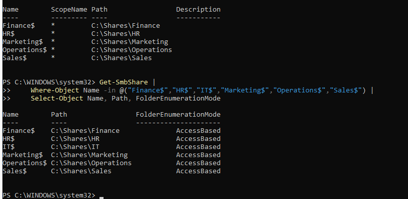
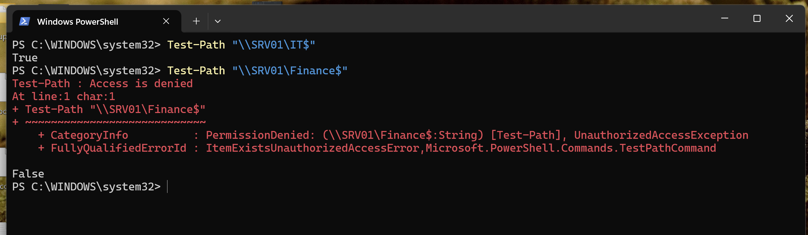
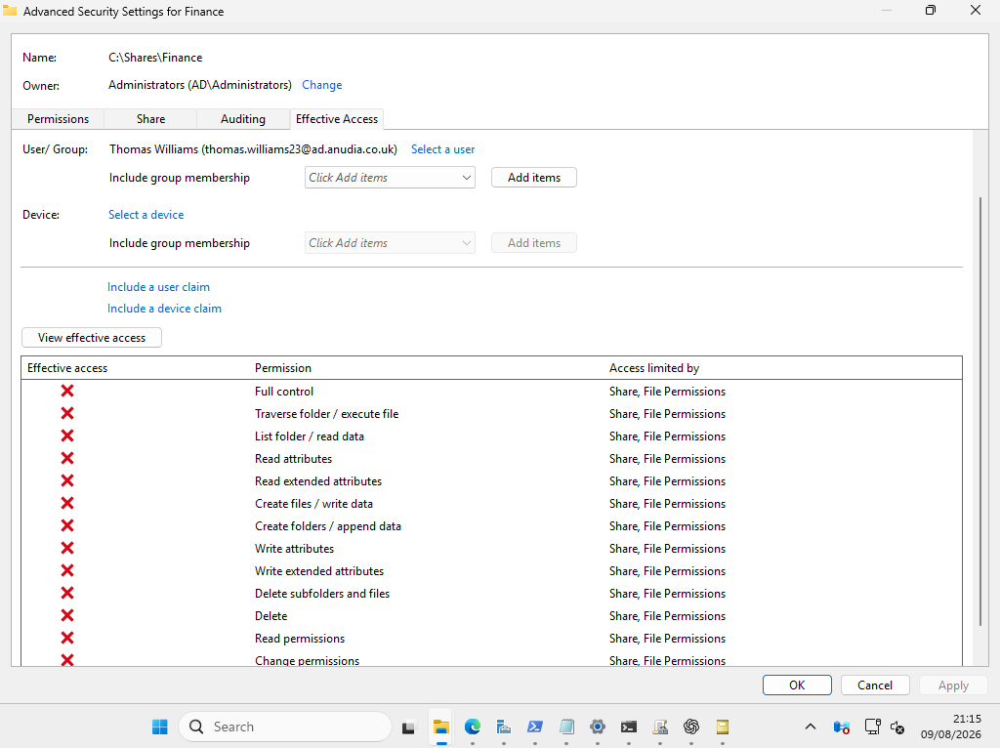
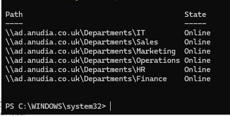
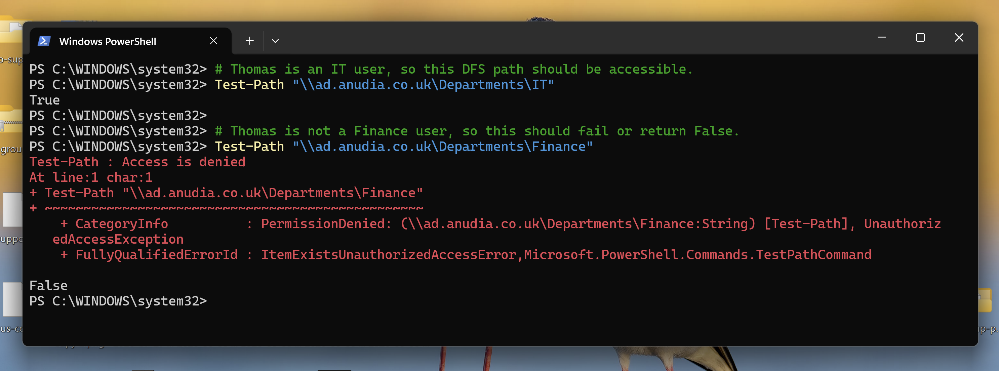
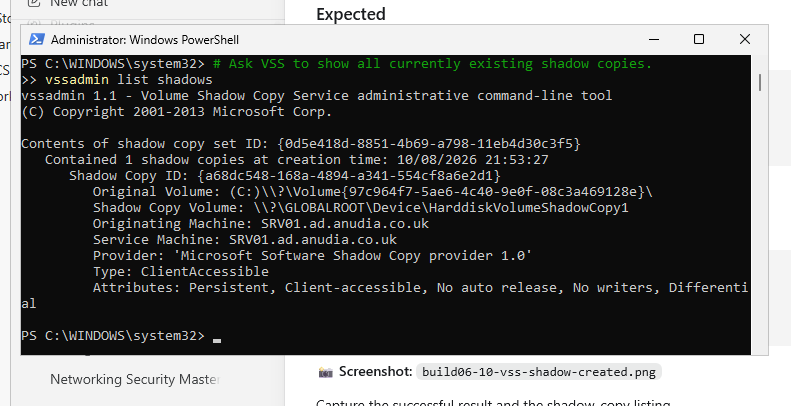
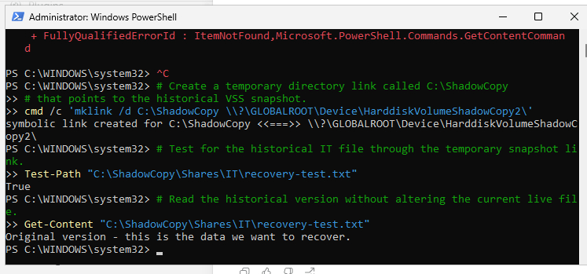
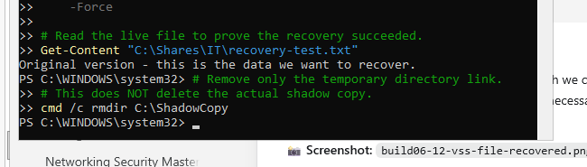
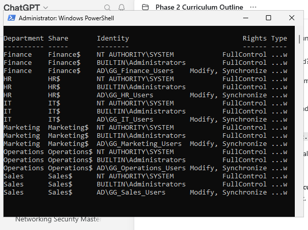

# Enterprise File Services | SMB, NTFS, DFS, and VSS

A practical Windows Server file-services learning lab built on an existing
Active Directory environment.

The project focused on building a consistent departmental storage model,
separating SMB and NTFS permissions, validating effective access,
enabling Access-Based Enumeration, introducing a domain-based DFS
namespace, testing departmental isolation, and recovering an overwritten
file with Volume Shadow Copy Service.

## Project Overview

This project extended the `ad.anudia.co.uk` environment with centrally
administered departmental file services on `SRV01`.

The environment already contained Active Directory, DNS, departmental
OUs and security groups, a domain-joined Windows 11 client, and an
existing IT share.

The project added and validated:

-   Departmental folders and hidden SMB shares
-   Group-based SMB and NTFS permissions
-   Access-Based Enumeration
-   Effective Access testing
-   Departmental access isolation
-   A domain-based DFS Namespace
-   Six departmental DFS namespace folders
-   A VSS point-in-time snapshot
-   Single-file recovery from a shadow copy
-   PowerShell permission auditing
-   Final service verification

## Environment

| Component | Configuration |
| --- | --- |
| File server and domain controller | `SRV01` |
| Server operating system | Windows Server 2025 |
| Client | `CLIENT01` |
| Domain | `ad.anudia.co.uk` |
| Share root | `C:\Shares` |
| DFS namespace | `\\ad.anudia.co.uk\Departments` |
| Test user | Thomas Williams |
| Test group | `GG_IT_Users` |
| Administration | Server Manager, DFS Management, and PowerShell |

## Scope and Evidence Boundaries

This is a single-server, single-client learning environment. `SRV01` performs
both domain-controller and file-server roles, which keeps the lab small but is
not a recommended production separation of duties.

The retained evidence supports these results:

- Six departmental folders and hidden SMB shares were present.
- Access-Based Enumeration was configured on all six shares.
- The later permission report shows Administrators and SYSTEM with Full Control
  and each matching departmental group with Modify across all six folders.
- An IT user could reach IT and was denied Finance through both the direct SMB
  path and the DFS path.
- Six DFS namespace folders appeared Online.
- A disposable file was recovered from a VSS snapshot and the temporary link
  was removed.

The retained screenshots do not show the complete SMB ACL output, a separate
user-context command such as `whoami` beside the client access tests, an ABE
visibility test, every DFS target path, or a client-side Previous Versions
restore. Those items are not claimed as independently proven.

## Security Considerations

The file-services design followed several security principles:

-   Access was assigned to departmental AD security groups rather than
    individual users.
-   Department users received `Modify` at NTFS and `Change` at the SMB
    layer rather than unnecessary Full Control.
-   Administrators and SYSTEM retained Full Control where required.
-   The later permission report was used as final-state evidence after an
    earlier Finance ACL check showed both inherited and explicit
    Administrators entries.
-   Access-Based Enumeration was enabled on departmental SMB shares.
-   Cross-department access was tested from a standard user session.
-   Effective Access was checked from the server to validate the
    resulting permissions.
-   Hidden share names were used for departmental shares, while
    recognising that `$` is not a security control.
-   DFS was introduced as a namespace layer without weakening the
    underlying SMB or NTFS permissions.
-   VSS recovery was tested with a disposable file rather than
    production data.
-   The domain, users, groups, hostnames, addresses, and identifiers shown in
    the evidence belong to the isolated learning lab.

## Evidence Summary

| Control | Configuration evidence | Functional evidence | Boundary |
| --- | --- | --- | --- |
| Department folders | [Folder inventory](screenshots/01-department-share-folders.png) | Not applicable | The share root also contains non-departmental folders from earlier labs |
| NTFS permissions | [Earlier Finance ACL check](screenshots/02-finance-ntfs-permissions.png) and [later six-department report](screenshots/14-permission-report.png) | [Finance Effective Access](screenshots/05-finance-user-effective-access.png) and [IT user denied Finance](screenshots/06-thomas-finance-access-denied.png) | The later report is treated as final-state evidence |
| SMB and ABE | [Six shares with ABE enabled](screenshots/03-department-shares-abe-enabled.png) | [Direct-path isolation test](screenshots/04-department-access-isolation.png) | Exact SMB ACL output and ABE hiding behaviour were not separately retained |
| DFS Namespace | [Six Online namespace folders](screenshots/09-dfs-department-namespace.png) | [IT path reachable](screenshots/08-dfs-it-client-verification.png) and [Finance denied](screenshots/10-dfs-security-verification.png) | Exact target output for every folder was not retained; DFS Replication was not deployed |
| VSS recovery | [Client-accessible shadow copy](screenshots/11-vss-shadow-created.png) | [Historical content found](screenshots/12-vss-original-version-found.png) and [live file restored](screenshots/13-vss-file-recovered.png) | This was a server-side single-file recovery test, not an independent backup or client self-service restore |

## Departmental Storage Structure

Department folders were created beneath:

``` text
C:\Shares
```

The resulting structure included Finance, HR, IT, Marketing, Operations
and Sales.

[View the complete department folder inventory.](screenshots/01-department-share-folders.png)

Each department was mapped to an existing Active Directory security
group:

``` text
Finance     → GG_Finance_Users
HR          → GG_HR_Users
IT          → GG_IT_Users
Marketing   → GG_Marketing_Users
Operations  → GG_Operations_Users
Sales       → GG_Sales_Users
```

## NTFS Permissions

The departmental folders used a consistent final NTFS model.

Example for Finance:

``` text
BUILTIN\Administrators  → Full Control
NT AUTHORITY\SYSTEM     → Full Control
AD\GG_Finance_Users     → Modify
```

The `(OI)(CI)` flags in the earlier Finance check show that the departmental
permission was configured to propagate to files and subfolders.

[View the earlier Finance NTFS permission check.](screenshots/02-finance-ntfs-permissions.png)

That earlier check also displayed both inherited and explicit Administrators
entries. The later six-department permission report is treated as final-state
evidence and shows one Administrators entry, one SYSTEM entry, and one matching
departmental group entry for each folder.

This separated administrative control from normal departmental file
access.

## SMB Shares and Access-Based Enumeration

Each department was published as a hidden SMB share:

``` text
\\SRV01\Finance$
\\SRV01\HR$
\\SRV01\IT$
\\SRV01\Marketing$
\\SRV01\Operations$
\\SRV01\Sales$
```

The configured share model was:

``` text
Domain Admins          → Full
GG_<Department>_Users  → Change
```

Access-Based Enumeration was enabled on all six shares. The retained screenshot
shows the six share names, paths, and `AccessBased` configuration. It does not
show the complete output of `Get-SmbShareAccess`, so the exact share ACL remains
a documented configuration statement rather than independently retained output.



ABE reduces unnecessary visibility by hiding resources a user cannot
access. It does not replace the SMB or NTFS ACLs. This lab verified the ABE
setting but did not retain a separate before-and-after visibility test.

## Departmental Isolation

The permissions were tested from `CLIENT01` as Thomas Williams, an IT
user.

The IT share was reachable:

``` text
\\SRV01\IT$ → True
```

The Finance share returned Access Denied:

``` text
\\SRV01\Finance$ → False / Access Denied
```



This proved that simply knowing a share path did not grant access.

## Effective Access

Windows Effective Access was used to inspect the resulting NTFS
permissions for individual identities.

An authorised Finance user received the expected access to the Finance
folder.

[View the authorised Finance user's Effective Access result.](screenshots/05-finance-user-effective-access.png)

Thomas Williams, who belonged to IT rather than Finance, did not receive
the Finance permissions.



This provided a server-side troubleshooting method in addition to the
client-side access test.

## DFS Namespace

DFS Namespaces was installed on `SRV01`.

A domain-based namespace was created:

``` text
\\ad.anudia.co.uk\Departments
```

[View the DFS namespace creation confirmation.](screenshots/07-dfs-namespace-created.png)

The IT folder was first configured manually and pointed to the existing
SMB target:

``` text
\\ad.anudia.co.uk\Departments\IT
        ↓
\\SRV01\IT$
```

The new DFS path was tested from `CLIENT01`.

[View the initial CLIENT01 test of the IT DFS path.](screenshots/08-dfs-it-client-verification.png)

The remaining departmental folders were then added with PowerShell. The final
inventory showed six namespace folders in the Online state.



The final namespace provided:

``` text
\\ad.anudia.co.uk\Departments\Finance
\\ad.anudia.co.uk\Departments\HR
\\ad.anudia.co.uk\Departments\IT
\\ad.anudia.co.uk\Departments\Marketing
\\ad.anudia.co.uk\Departments\Operations
\\ad.anudia.co.uk\Departments\Sales
```

The underlying data remained on the existing SMB shares. DFS provided a
logical access layer rather than moving the files.

## DFS Security Verification

The DFS namespace was tested using the same IT account.

Thomas could reach the IT DFS path but was denied access to Finance.



This demonstrated that DFS did not bypass the existing access-control
model:

``` text
User
→ AD security group
→ DFS referral
→ SMB permissions
→ NTFS permissions
→ Effective access
```

## Volume Shadow Copy Service

VSS was used to create a point-in-time snapshot of the `C:` volume, which
contains `C:\Shares`.

The server successfully created a client-accessible shadow copy.



Shadow Copies were treated as a fast recovery mechanism rather than a
replacement for independent backups.

## File Recovery Test

A disposable file was created in the IT folder:

``` text
C:\Shares\IT\recovery-test.txt
```

The original contents were:

``` text
Original version - this is the data we want to recover.
```

A VSS snapshot was taken and the live file was deliberately overwritten.

An initial attempt to read the raw shadow-copy path failed because it did not
behave like a normal PowerShell filesystem path. The shadow copy was then
exposed temporarily through a directory link:

``` text
C:\ShadowCopy
```

The historical copy was then read directly from the snapshot.



The good copy was restored over the overwritten live file and verified.



This completed the recovery workflow:

``` text
Original file
→ snapshot
→ accidental overwrite
→ identify recovery point
→ verify historical version
→ restore one file
→ verify recovery
```

## PowerShell Permission Reporting

PowerShell was used to collect NTFS ACL information across all
departmental folders into a structured permission report.



This provided a faster way to audit multiple folders and identify
inconsistent permissions or configuration drift.

## Final Verification

The final health check reviewed:

-   All six departmental SMB shares
-   Access-Based Enumeration
-   DFS namespace folders
-   The VSS inventory command

The retained final screenshot visibly shows the six SMB shares with ABE enabled
and six DFS namespace rows. The earlier VSS inventory screenshot separately
proves that the recovery snapshot existed.

[View the combined final file-services verification output.](screenshots/15-final-file-services-verification.png)

Earlier endpoint tests had already separately confirmed departmental
isolation and VSS recovery, so those destructive/recovery tests were not
unnecessarily repeated.

## What I Learned

This project clarified that Windows file access is the result of
multiple layers rather than a single permission setting.

For network access, I had to consider:

``` text
Identity and group membership
→ DFS namespace
→ SMB share permissions
→ NTFS permissions
→ Effective access
```

The Effective Access tests were useful because they showed the resulting
permissions for a specific identity rather than only displaying
individual ACL entries.

DFS also demonstrated the value of separating the path users know from
the server that physically hosts the data. The namespace can remain
stable while backend targets change.

The VSS exercise reinforced a different operational lesson: creating a
recovery feature is not enough. I needed to prove that a known-good
historical file could actually be located, read and restored.

## Scope and Limitations

This is a learning environment built around one Windows Server and one
Windows 11 client.

The file-server and domain-controller roles share `SRV01`. A production design
would normally separate those roles, store file data on a dedicated data
volume, and use independent backup and recovery controls.

DFS Namespace was implemented, but DFS Replication was not deployed
because the environment did not contain a second file server with a
meaningful replica target.

VSS snapshots were demonstrated for point-in-time file recovery. They
are stored with the source volume and are not a substitute for an independent
server backup strategy. Client-side Previous Versions recovery was not tested.

The project focused on departmental access and did not implement
production storage quotas, FSRM classification, high availability or
multi-site DFS.

The exact SMB ACL output, ABE visibility behaviour, and every DFS folder target
were not retained as separate evidence. The access tests demonstrate the
observed authorised and denied outcomes, but a future iteration should retain
those configuration reports as well.

## Project Files

### Documentation

-   [File Services operations
    guide](reference/file-services-instructions.md)
-   [File Services PowerShell cheat
    sheet](reference/file-services-powershell-cheatsheet.md)

### Evidence

-   [`screenshots/`](screenshots/) - screenshots from the build,
    security verification, DFS deployment, VSS recovery and final
    validation.

## Official References

- [Microsoft `icacls` command reference](https://learn.microsoft.com/en-us/windows-server/administration/windows-commands/icacls)
- [Microsoft `New-SmbShare` PowerShell reference](https://learn.microsoft.com/en-us/powershell/module/smbshare/new-smbshare?view=windowsserver2025-ps)
- [Microsoft `Set-SmbShare` PowerShell reference](https://learn.microsoft.com/en-us/powershell/module/smbshare/set-smbshare?view=windowsserver2025-ps)
- [Microsoft DFS Namespaces overview](https://learn.microsoft.com/en-us/windows-server/storage/dfs-namespaces/dfs-overview)
- [Microsoft Volume Shadow Copy Service overview](https://learn.microsoft.com/en-us/windows-server/storage/file-server/volume-shadow-copy-service)

## Outcome

The project moved the environment from individual SMB shares toward a
more structured Windows file-services design.

The final environment demonstrates:

-   Consistent departmental storage
-   Group-based SMB and NTFS access
-   Access-Based Enumeration
-   Effective Access troubleshooting
-   Cross-department isolation
-   Domain-based DFS paths
-   VSS point-in-time recovery
-   PowerShell permission auditing
-   Server-side and client-side verification of the retained test cases

The lab demonstrates a working departmental file-services design at learning
scale. It does not claim production resilience, independent backup, or highly
available storage.
