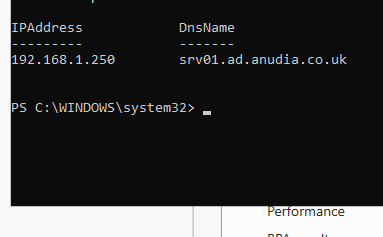
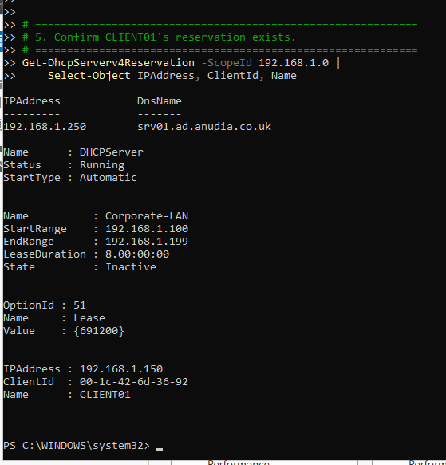
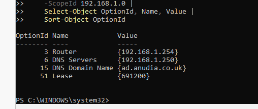
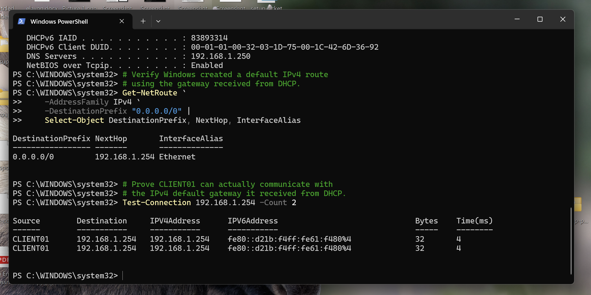
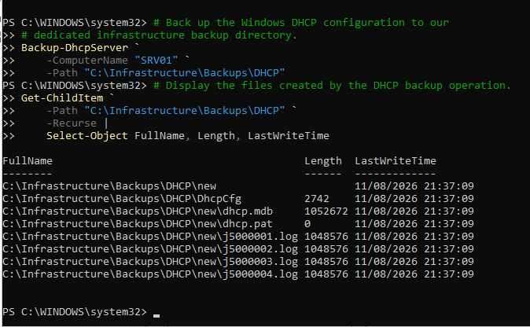

# Windows DHCP Infrastructure | Controlled DHCP Cutover

This learning lab moved IPv4 address allocation from a home router to an
Active Directory-authorised Windows Server DHCP service.

The router remained the default gateway, while `SRV01` provided Active
Directory, DNS, and DHCP for the lab subnet. The project focused on controlled
service migration, server-side configuration, endpoint verification, and
troubleshooting an incomplete DHCP option set.

## Project Objectives

- Install and configure the Windows Server DHCP role.
- Authorise the DHCP server in Active Directory.
- Create and validate an IPv4 scope before activation.
- Deliver the correct gateway, DNS server, and DNS domain to clients.
- Reserve a predictable address for `CLIENT01` without using a client-side
  static configuration.
- Move DHCP responsibility without deliberately running two competing IPv4
  DHCP services.
- Verify the result from both the server and client.
- Back up the final DHCP configuration.

## Architecture

```text
192.168.1.0/24 lab subnet
|
|-- Router: 192.168.1.254
|   `-- IPv4 default gateway
|
|-- SRV01: 192.168.1.250
|   |-- Active Directory Domain Services
|   |-- Active Directory-integrated DNS
|   `-- Authorised Windows DHCP Server
|       `-- Corporate-LAN scope
|           |-- Dynamic pool: 192.168.1.100-192.168.1.199
|           |-- Router option: 192.168.1.254
|           |-- DNS option: 192.168.1.250
|           |-- DNS domain: ad.anudia.co.uk
|           `-- CLIENT01 reservation: 192.168.1.150
|
`-- CLIENT01
    `-- DHCP-enabled Windows 11 domain workstation
```

## Environment

| Component | Configuration |
| --- | --- |
| DHCP server | `SRV01` |
| Server operating system | Windows Server 2025 |
| Domain | `ad.anudia.co.uk` |
| Server address | `192.168.1.250` |
| Scope | `Corporate-LAN` |
| Scope network | `192.168.1.0/24` |
| Dynamic range | `192.168.1.100-192.168.1.199` |
| Lease duration | 8 days |
| Default gateway | `192.168.1.254` |
| DNS server | `192.168.1.250` |
| Test client | `CLIENT01`, Windows 11 Pro |
| Reserved address | `192.168.1.150` |

This is a small learning environment. DHCP is co-located with AD DS and DNS on
`SRV01`; Microsoft permits this in a constrained test lab but does not
recommend the combined role placement for production.

## Design and Security Decisions

- Configured `SRV01` with a static IPv4 address before enabling DHCP.
- Authorised `SRV01` in Active Directory before serving domain clients.
- Completed the DHCP post-install group configuration and restarted the DHCP
  service.
- Created the new scope in an inactive state while the router still provided
  DHCP.
- Kept the default gateway role on the router and the AD DNS role on `SRV01`.
- Used a DHCP reservation for `CLIENT01` instead of a client-side static
  address.
- Disabled the router's IPv4 DHCP service before activating `Corporate-LAN`.
- Verified the client's effective route and gateway reachability after renewal.
- Backed up the final DHCP database and configuration.

Active Directory authorisation helps prevent unauthorised Windows DHCP servers
in the domain from leasing incorrect configuration. It is not a general defence
against every rogue DHCP implementation on the network.

## Controlled Cutover Plan

The migration followed this sequence:

```text
Discover existing client configuration
-> Install and authorise Windows DHCP
-> Build the new scope while inactive
-> Validate scope, options, and reservation
-> Disable router DHCP
-> Activate the Windows scope
-> Renew CLIENT01
-> Verify address, route, DNS, lease, and reservation
-> Back up the healthy configuration
```

The planned rollback was to deactivate the Windows scope, re-enable DHCP on the
router, and renew the affected clients.

## Implementation and Evidence

### 1. DHCP installation and AD authorisation

The DHCP role was installed on `SRV01`, the post-install configuration was
completed, and the server was added to the list of authorised DHCP servers in
Active Directory.



### 2. Scope and reservation

`Corporate-LAN` was created for `192.168.1.0/24` with a dynamic range of
`192.168.1.100-192.168.1.199`. It was deliberately left inactive until the
old DHCP service could be disabled.

`CLIENT01` received a reservation for `192.168.1.150`, keyed to its lab
network adapter client identifier.

Evidence:

- [Inactive scope configuration](screenshots/02-corporate-lan-scope-created-inactive.png)
- [CLIENT01 reservation](screenshots/03-client01-dhcp-reservation.png)
- [Scope activated after cutover](screenshots/05-corporate-lan-scope-active.png)

### 3. Pre-cutover audit and missed stop condition

I queried the DHCP service, AD authorisation, scope, scope options, and
reservation before cutover.

The retained audit output revealed an important problem: only Option 051
`Lease` was present. Options 003 `Router`, 006 `DNS Servers`, and 015
`DNS Domain Name` were absent.



I proceeded with the cutover instead of treating this as a failed readiness
check. As a result, `CLIENT01` obtained its reserved IPv4 address but did not
receive a default gateway.

This was both a configuration issue and a process issue:

- Immediate cause: the required scope options were missing.
- Process failure: the audit exposed the issue, but the cutover was not stopped.
- Prevention: use an explicit go or no-go checklist and require every critical
  option to be present before disabling the old DHCP service.

The evidence proves that the options were absent before scope activation. It
does not establish why the earlier option configuration was not present, so the
README does not claim a deeper cause that was not demonstrated.

### 4. Corrected DHCP options

I configured the missing options centrally on the DHCP server:

```powershell
Set-DhcpServerv4OptionValue `
    -ScopeId 192.168.1.0 `
    -OptionId 3 `
    -Value 192.168.1.254

Set-DhcpServerv4OptionValue `
    -ScopeId 192.168.1.0 `
    -OptionId 6 `
    -Value 192.168.1.250

Set-DhcpServerv4OptionValue `
    -ScopeId 192.168.1.0 `
    -OptionId 15 `
    -Value "ad.anudia.co.uk"
```

The final server-side query showed the gateway, DNS server, DNS domain, and
eight-day lease value.



### 5. Client renewal and endpoint verification

After renewing the lease on `CLIENT01`, I checked:

- the reserved address;
- DHCP server;
- AD DNS server;
- IPv4 default route;
- next-hop address; and
- gateway reachability.

The route table showed `192.168.1.254` as the next hop for
`0.0.0.0/0`, and the gateway responded to the connectivity test.



This demonstrates delivery and use of the router option. Gateway reachability
does not by itself prove Internet access or end-to-end application
connectivity.

### 6. Lease state and utilisation

I queried leases and reservations separately because they represent different
states:

- A reservation records the address intended for a client identifier.
- A lease records an address currently allocated by the DHCP server.

The final reservation query showed `CLIENT01` at `192.168.1.150` and the
lease state as `ActiveReservation`. Scope statistics showed 98 free addresses,
2 in use, and 1 reserved at the time of capture. Only `CLIENT01` was part of
this project's endpoint validation.

Evidence:

- [Lease and reservation output](screenshots/08-client01-lease-and-reservation.png)
- [Scope statistics and final scope state](screenshots/09-dhcp-scope-statistics.png)
- [Final server-side verification](screenshots/12-final-dhcp-verification.png)

### 7. Backup

After verification, I backed up the DHCP database and configuration to:

```text
C:\Infrastructure\Backups\DHCP
```



This proves that backup files were created. The backup was retained on the same
server and a restore test was not performed, so it is not evidence of a
resilient or tested recovery solution.

The DHCP console was also used to review the final scope structure and options:
[DHCP Manager evidence](screenshots/11-dhcp-manager-scope-options.png).

## Verification Summary

| Requirement | Verification | Result |
| --- | --- | --- |
| DHCP server authorised in AD | `Get-DhcpServerInDC` | `SRV01` listed at `192.168.1.250` |
| Scope configured safely | `Get-DhcpServerv4Scope` before cutover | Scope initially inactive |
| Scope active after cutover | `Get-DhcpServerv4Scope` | `Corporate-LAN` active |
| Gateway delivered centrally | Scope option query | Option 003 set to `192.168.1.254` |
| AD DNS delivered centrally | Scope option query | Option 006 set to `192.168.1.250` |
| DNS suffix delivered | Scope option query | Option 015 set to `ad.anudia.co.uk` |
| Reservation configured | Reservation query | `CLIENT01` reserved at `192.168.1.150` |
| Client route created | `Get-NetRoute` on `CLIENT01` | Default route uses `192.168.1.254` |
| Gateway reachable | `Test-Connection` from `CLIENT01` | Two responses received |
| Lease active | Lease query | `CLIENT01` recorded as `ActiveReservation` |
| Backup created | Recursive backup directory inventory | DHCP database and supporting files present |

## What I Learned

A valid DHCP lease does not prove that a client received every required
network setting. Address allocation, gateway delivery, DNS delivery, routing,
and application connectivity must be checked separately.

The lab also changed how I think about pre-change checks. An audit should not
just be collected; its result must control whether the change proceeds. The
missing options were visible before cutover, so a stricter stop condition would
have prevented the client fault.

The most useful administration pattern from this project was:

```text
Discover -> configure inactive -> verify -> decide -> cut over
-> verify server state -> verify client state -> back up
```

## Evidence Boundaries and Limitations

- One Windows DHCP server and one IPv4 subnet were used.
- DHCP, AD DS, and DNS were co-located on one server for the learning lab.
- The router DHCP setting was changed manually, but its disabled state was not
  captured as retained evidence.
- The endpoint evidence proves a valid default route and gateway reachability;
  it does not prove Internet or application availability.
- DNS server delivery was observed, but dynamic DNS registration behaviour was
  not separately tested.
- DHCP failover, split scopes, relays, multiple VLANs, IPv6 DHCP, and production
  monitoring were outside scope.
- The backup remained on the DHCP server and was not restore-tested.
- The lab did not demonstrate high availability or production change control.

These limitations are proportionate for a single-subnet learning lab and are
not presented as production readiness.

## Sensible Next Improvements

1. Restore the DHCP backup in a disposable recovery test.
2. Move a copy of the backup off the DHCP server.
3. Test secure dynamic DNS registration and record ownership behaviour.
4. Add a second DHCP server and practise IPv4 DHCP failover.
5. Add another subnet and use a DHCP relay or IP helper.

## Project Files

- [DHCP operations guide](reference/dhcp-instructions.md)
- [DHCP PowerShell cheat sheet](reference/dhcp-powershell-cheatsheet.md)
- [Complete screenshot evidence set](screenshots/)

## Official References

- [Deploy DHCP using Windows PowerShell](https://learn.microsoft.com/en-us/windows-server/networking/technologies/dhcp/dhcp-deploy-wps)
- [DHCP Server PowerShell module](https://learn.microsoft.com/en-us/powershell/module/dhcpserver/)
- [Backup-DhcpServer](https://learn.microsoft.com/en-us/powershell/module/dhcpserver/backup-dhcpserver)
- [DHCP failover in Windows Server](https://learn.microsoft.com/en-us/windows-server/networking/technologies/dhcp/dhcp-failover)

## Outcome

The lab moved IPv4 address allocation and DHCP option delivery from the router
to an Active Directory-authorised Windows DHCP service.

`SRV01` now manages the `Corporate-LAN` scope, reservation, active leases,
gateway and DNS options, utilisation data, and DHCP backup. The missing gateway
incident also demonstrated why a controlled cutover needs both server-side
validation and endpoint verification, with failed readiness checks treated as
stop conditions.
