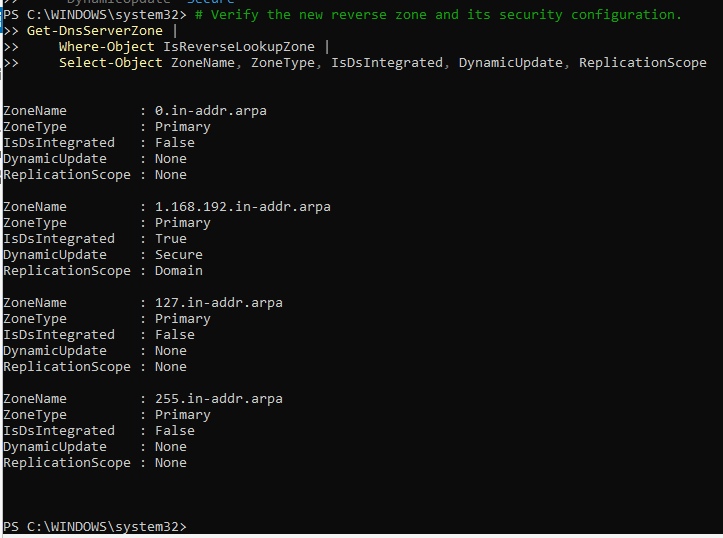
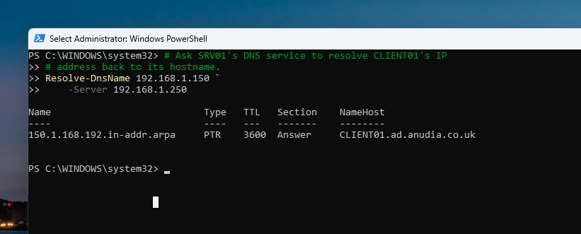
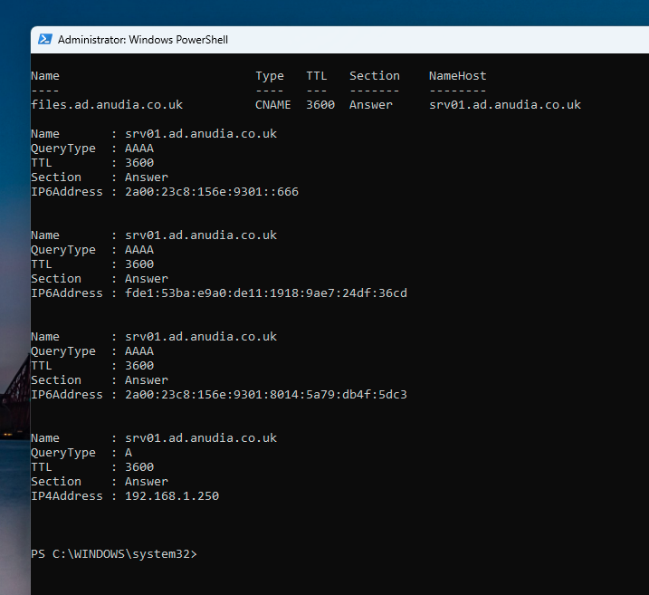
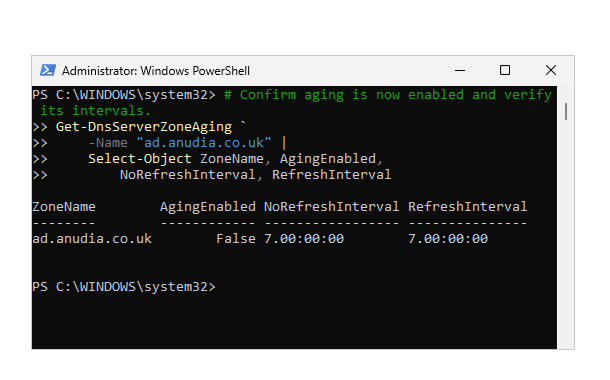
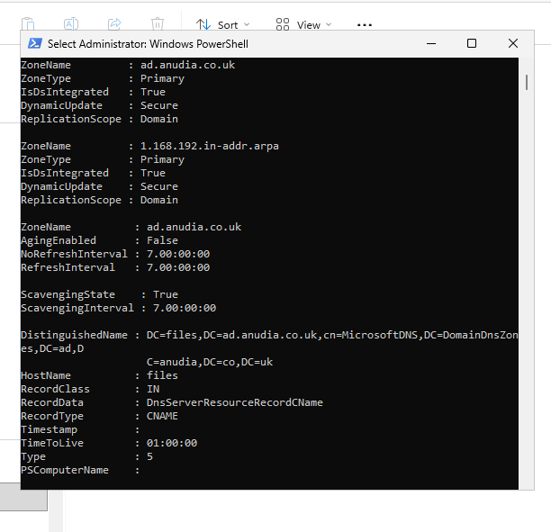

# Enterprise DNS Administration | Windows Server and Active Directory

This learning lab extends the existing `ad.anudia.co.uk` Active Directory DNS environment with reverse resolution, secure dynamic updates and a service alias. It also investigates DNS caching, dynamic registration, zone aging and server-level scavenging.

The final audit confirms the core DNS configuration. It also identifies an important incomplete control: server scavenging is enabled, but aging remains disabled on the forward zone. Automatic stale-record cleanup is therefore not active for that zone.

## Project Scope

The lab covered:

- Inspecting the existing AD-integrated DNS configuration before making changes
- Creating an AD-integrated reverse lookup zone for `192.168.1.0/24`
- Configuring secure dynamic updates on the reverse zone
- Creating and testing PTR resolution for `CLIENT01`
- Creating and resolving the `files.ad.anudia.co.uk` CNAME
- Comparing client-side and server-side DNS caching
- Refreshing client dynamic DNS registration
- Inspecting zone aging and server scavenging as separate controls
- Producing a final PowerShell configuration audit

## Environment

| Component | Configuration |
|---|---|
| DNS and domain controller | `SRV01` |
| DNS server address | `192.168.1.250` |
| Active Directory domain | `ad.anudia.co.uk` |
| Domain client | `CLIENT01` |
| Client address | `192.168.1.150` |
| Forward lookup zone | `ad.anudia.co.uk` |
| Reverse lookup zone | `1.168.192.in-addr.arpa` |
| Service alias | `files.ad.anudia.co.uk` |

## Design Decisions

### AD-integrated zones

The existing forward zone was preserved as an AD-integrated primary zone with secure dynamic updates and domain replication. The reverse zone was created with the same security and replication model.

This keeps DNS data in Active Directory and avoids an additional file-backed zone on the domain controller.

### Service alias

The `files` service uses a CNAME rather than another manually maintained A record:

```text
files.ad.anudia.co.uk
        |
        | CNAME
        v
srv01.ad.anudia.co.uk
        |
        | A and AAAA records
        v
SRV01 network addresses
```

The alias separates the service name from the current host. If the service moves later, the CNAME can be repointed without changing the name used by clients.

### Aging and scavenging

Zone aging and server scavenging were treated as separate settings. Both must be configured correctly before stale dynamic records can be removed automatically from a zone.

The verified state at the end of this lab is intentionally reported as incomplete rather than hardened or production-ready.

## Security-First Approach

- Inspected the current DNS zones and records before changing configuration.
- Preserved secure-only dynamic updates on the AD-integrated zones.
- Kept the domain client pointed at the AD DNS server rather than the router or a public resolver.
- Avoided changing AD-generated LDAP, Kerberos, Global Catalog, `_msdcs`, `_tcp`, `_udp` and site records.
- Used a CNAME to avoid maintaining duplicate address records for one service.
- Verified the reverse zone's integration, update policy and replication scope after creation.
- Verified aging and scavenging independently instead of assuming one setting enabled the other.
- Did not claim that stale-record cleanup was operational when the final evidence showed zone aging disabled.

## Implementation and Evidence

### 1. Reverse lookup zone

The reverse zone was created for `192.168.1.0/24`:

```text
1.168.192.in-addr.arpa
```

The verification output confirms that it is a primary AD-integrated reverse zone using secure dynamic updates and domain replication.



### 2. PTR record and reverse resolution

The retained test proves this reverse mapping:

```text
192.168.1.150 -> CLIENT01.ad.anudia.co.uk
```

`Resolve-DnsName` queried `SRV01` directly, which avoids relying on an unspecified resolver during verification.



### 3. CNAME service alias

The `files` CNAME was configured to reference `srv01.ad.anudia.co.uk`. Client-side resolution returned the CNAME and then the target host's address records.



### 4. External resolution and caching

The lab compared three stages of name resolution:

```text
Windows client DNS cache
        |
        v
Windows DNS server cache
        |
        v
Forwarder or root-hint recursion
```

The operations guide records the commands used to inspect forwarders, root hints and both cache layers. Dedicated cache output was not retained in the final five-image evidence set, so caching is recorded as investigated rather than used as a central completion claim.

### 5. Dynamic registration

`CLIENT01` requested a fresh dynamic registration using:

```powershell
Register-DnsClient
```

Record timestamps were then considered in the context of aging and scavenging. Dynamic registration and record cleanup are related, but they are not the same operation.

### 6. Aging and scavenging finding

The configured intervals were visible as seven days each:

```text
No-refresh interval: 7 days
Refresh interval:    7 days
```

However, the same output returned:

```text
AgingEnabled : False
```



Server-level automatic scavenging was enabled with a seven-day interval, but this does not compensate for aging being disabled on the zone.

## Verified Final State

| Check | Result | Evidence |
|---|---|---|
| Forward zone is AD-integrated | Passed | Final audit |
| Forward zone uses secure dynamic updates | Passed | Final audit |
| Reverse zone is AD-integrated | Passed | Reverse-zone verification and final audit |
| Reverse zone uses secure dynamic updates | Passed | Reverse-zone verification and final audit |
| `CLIENT01` PTR resolution | Passed | Direct reverse lookup against `SRV01` |
| `files` CNAME exists and resolves | Passed | Client resolution and final audit |
| Server scavenging enabled | Passed | Final audit |
| Forward-zone aging enabled | **Not passed** | `AgingEnabled : False` |
| Automatic stale-record cleanup for the forward zone | **Not operational** | Requires both zone aging and server scavenging |



## Troubleshooting and Learning

### Expected result

The aging verification step was intended to confirm that aging was enabled on `ad.anudia.co.uk`.

### Observed result

PowerShell returned `AgingEnabled : False`, while server scavenging returned `ScavengingState : True`.

### Conclusion

The evidence does not establish why the earlier aging change failed or was not applied, so this README does not invent a cause. The final state is recorded accurately: server scavenging is enabled, but the forward zone is not eligible for automatic stale-record cleanup.

### Lesson

A successful configuration command or an enabled server setting is not sufficient evidence of the complete outcome. Each dependent control must be queried independently.

## PowerShell Used

The lab used the `DnsServer` module and PowerShell object pipeline for discovery, change and verification:

- `Get-DnsServerZone`
- `Add-DnsServerPrimaryZone`
- `Get-DnsServerResourceRecord`
- `Add-DnsServerResourceRecordPtr`
- `Add-DnsServerResourceRecordCName`
- `Resolve-DnsName`
- `Get-DnsServerZoneAging`
- `Get-DnsServerScavenging`
- `Set-DnsServerScavenging`
- `Register-DnsClient`
- `Where-Object` and `Select-Object`

The reusable commands and syntax notes are documented separately:

- [DNS Operations Guide](reference/dns-operations-guide.md)
- [DNS PowerShell Cheat Sheet](reference/dns-powershell-cheatsheet.md)

## Limitations and Next Steps

- Zone aging remains disabled on `ad.anudia.co.uk`.
- The retained screenshot set does not independently prove the external cache inspection or the cause of the aging result.
- This is a single-DNS-server learning environment, so DNS redundancy and failover were outside scope.
- DNSSEC, conditional forwarding, response policies and centralised DNS logging were outside scope.

The next controlled change is to review record timestamps and static records, establish a rollback record, enable aging deliberately on the intended zone, and verify the zone and server settings again before waiting for any scavenging cycle. No immediate forced scavenging should be used as a shortcut.

## References

- [DNS aging and scavenging in Windows Server](https://learn.microsoft.com/en-us/windows-server/networking/dns/aging-scavenging)
- [Add-DnsServerPrimaryZone](https://learn.microsoft.com/en-us/powershell/module/dnsserver/add-dnsserverprimaryzone?view=windowsserver2025-ps)
- [Set-DnsServerZoneAging](https://learn.microsoft.com/en-us/powershell/module/dnsserver/set-dnsserverzoneaging?view=windowsserver2025-ps)
- [DnsServer PowerShell module](https://learn.microsoft.com/en-us/powershell/module/dnsserver/?view=windowsserver2025-ps)

## Outcome

The lab successfully extended the Active Directory DNS environment with a secure AD-integrated reverse lookup zone, verified PTR resolution for `CLIENT01`, and created a reusable `files` service alias.

It also produced a useful operational finding: server scavenging and zone aging are separate dependencies. The final evidence confirms that scavenging is enabled at server level while aging remains disabled on the forward zone, so automatic stale-record cleanup is not yet active there.
