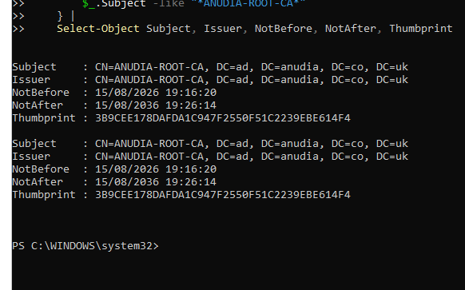
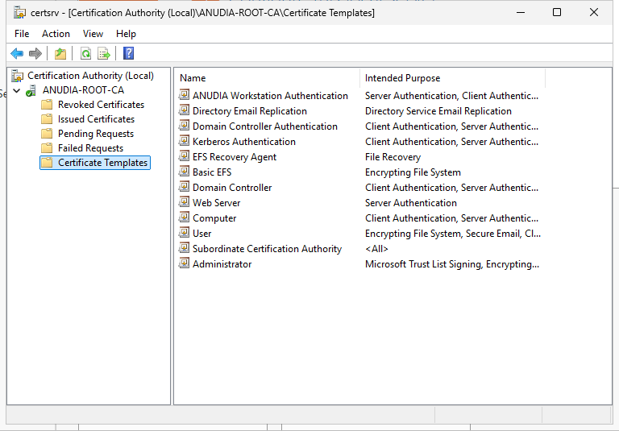
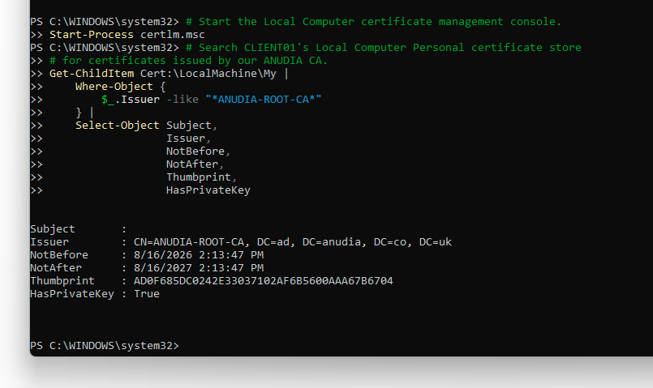
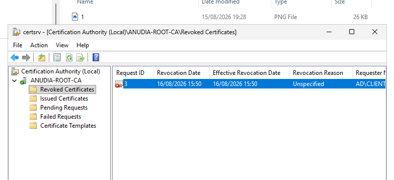
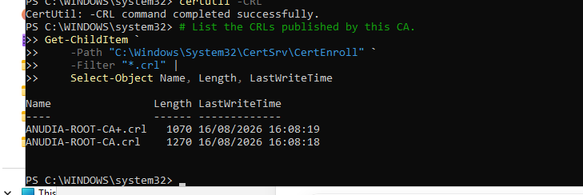

# Windows PKI and Active Directory Certificate Services

This learning lab adds Active Directory Certificate Services to the existing `ad.anudia.co.uk` Windows domain. I built a small one-tier PKI, published a custom workstation certificate template, enrolled `CLIENT01`, checked the trust chain, revoked the test certificate and published updated revocation information.

The build helped connect the technical steps to the wider certificate lifecycle. A certificate can be issued successfully and still be operationally weak if its private key, template permissions, trust chain, revocation data or recovery process are not handled properly.

## What I Built

- Installed the AD CS Certification Authority role service on `SRV01`.
- Configured `ANUDIA-ROOT-CA` as an enterprise root CA.
- Created and published the `ANUDIA Workstation Authentication` template.
- Enrolled a Local Computer certificate on `CLIENT01`.
- Confirmed the certificate had an associated private key.
- Exported only the public certificate for chain verification.
- Verified the chain to the self-signed root and checked revocation data.
- Revoked the test certificate.
- Published new base and delta certificate revocation lists.
- Investigated a Windows servicing timeout during role installation.

## Environment

| Component | Configuration |
|---|---|
| Server | `SRV01` |
| Operating system | Windows Server 2025 Standard Evaluation |
| Domain | `ad.anudia.co.uk` |
| Client | `CLIENT01` |
| Certification authority | `ANUDIA-ROOT-CA` |
| CA type | Enterprise root CA |
| CA cryptography | RSA 4096 with SHA-256 |
| CA validity | 10 years |
| Certificate template | `ANUDIA Workstation Authentication` |
| Workstation certificate validity | 1 year |
| Enrollment method | Manual through Active Directory Enrollment Policy |

## Architecture and Trade-Off

```text
SRV01
|-- Active Directory Domain Services
|-- DNS
|-- DHCP
`-- AD CS: ANUDIA-ROOT-CA
             `-- CLIENT01 workstation certificate
```

This is a one-tier PKI built for learning. The enterprise root CA remains online and issues certificates directly. It is also hosted on the same server as AD DS, DNS and DHCP.

That kept the environment small enough to understand, but it also increased the blast radius. Compromise or loss of `SRV01` would affect both the domain and its certificate trust anchor. A stronger design would normally separate an offline standalone root CA from one or more online enterprise issuing CAs.

## Implementation and Evidence

### 1. Install and configure the CA

The Certification Authority role and management tools were installed with PowerShell:

```powershell
Install-WindowsFeature `
    -Name ADCS-Cert-Authority `
    -IncludeManagementTools
```

The enterprise root CA was then configured using a splatted parameter set:

```powershell
$CaParameters = @{
    CAType              = "EnterpriseRootCA"
    CACommonName        = "ANUDIA-ROOT-CA"
    KeyLength           = 4096
    HashAlgorithmName   = "SHA256"
    CryptoProviderName  = "RSA#Microsoft Software Key Storage Provider"
    ValidityPeriod      = "Years"
    ValidityPeriodUnits = 10
}

Install-AdcsCertificationAuthority @CaParameters
```

The root certificate evidence shows matching Subject and Issuer values, confirming that it is self-signed. Its validity runs from 15 August 2026 to 15 August 2036.



The separate role check confirms that the Certification Authority feature is installed:

- [View AD CS role verification](screenshots/10-adcs-role-verification.png)

### 2. Create and publish the workstation template

The built-in Computer template was duplicated as `ANUDIA Workstation Authentication`. The recorded configuration used a one-year validity period and left autoenrollment disabled for the initial manual test.

The CA console proves that the custom template was published. It also shows both Server Authentication and Client Authentication in its intended purposes.



The lab notes record `Domain Computers` with Read and Enroll permission. Those security permissions are not visible in the supplied screenshots, so they remain a documented configuration rather than independently reviewable evidence.

### 3. Enrol and inspect the CLIENT01 certificate

`CLIENT01` used Active Directory Enrollment Policy to request the custom certificate into the Local Computer Personal store.

- [View the successful enrollment result](screenshots/03-client01-enrollment-success.png)
- [View the issued certificate record on the CA](screenshots/06-issued-certificate-record.png)

PowerShell then confirmed the issuer, one-year validity, thumbprint and `HasPrivateKey : True`.



The Subject field is empty in the PowerShell output. The detailed verification output shows the computer identity in the Subject Alternative Name as `DNS Name=CLIENT01.ad.anudia.co.uk`. This is recorded as an observed certificate property rather than hidden from the write-up.

### 4. Verify the chain and revocation data

The exported `.cer` contained only the public certificate. `certutil -verify` built the chain from the workstation certificate to `ANUDIA-ROOT-CA` and returned `dwErrorStatus=0` for the displayed chain elements. It also reported that the leaf certificate revocation check passed at the time of that test.

The same output confirms that the certificate contains both Server Authentication and Client Authentication application policies.

- [View certificate-chain and revocation-check evidence](screenshots/05-certificate-chain-and-revocation-check.png)

This check happened before the final revocation evidence. It therefore proves that the original chain and revocation lookup worked, not that the later revoked state was detected by `CLIENT01`.

### 5. Revoke the certificate and publish CRLs

The CA console shows request ID 3 moved into Revoked Certificates. The recorded revocation reason is `Unspecified`.



This corrects the earlier project note that described the reason as Key Compromise. The evidence takes priority over the intended value.

`certutil -CRL` completed successfully and new CRL files were written to the CA publication directory.



Additional retained evidence identifies the newest delta CRL and lists the publication timestamps:

- [View the newest delta CRL file](screenshots/09-newest-delta-crl-file.png)
- [View CRL files and timestamps](screenshots/11-crl-files-and-timestamps.png)

The screenshots do not show a second client-side verification after publication of the new CRLs. The project therefore does not claim that `CLIENT01` detected the newly revoked certificate.

## Troubleshooting: Windows Servicing Timeout

During installation, `Install-WindowsFeature` remained at 24 percent and eventually timed out. Retrying immediately or terminating servicing processes could have left Windows in a worse state, so I checked what the operating system was doing first.

The investigation found:

- Active `TiWorker` and `TrustedInstaller` processes
- Continuing activity in `C:\Windows\Logs\CBS\CBS.log`
- A Component Based Servicing pending-reboot state

A controlled restart allowed servicing to finish. The later feature query confirmed that the Certification Authority role was installed.

The lesson was that a management command timing out does not prove the underlying Windows servicing operation has stopped. Checking processes, logs, reboot state and final feature status was safer than repeatedly running the installer.

## Verified Final State

| Check | Result | Evidence |
|---|---|---|
| Certification Authority role installed | Passed | AD CS role verification |
| Enterprise root certificate present | Passed | Root certificate query |
| Root certificate self-signed | Passed | Subject matches Issuer |
| Root certificate validity is 10 years | Passed | 15 August 2026 to 15 August 2036 |
| Custom workstation template published | Passed | Certification Authority console |
| Template includes Client Authentication | Passed | Published-template and certificate verification output |
| Template includes Server Authentication | Passed, but broader than a client-only use case | Published-template and certificate verification output |
| Template enrollment permissions | Recorded in lab notes | Not shown in screenshots |
| `CLIENT01` enrollment succeeded | Passed | Enrollment wizard and issued-certificate record |
| Client private key present | Passed | `HasPrivateKey : True` |
| Certificate chain built successfully | Passed before final revocation | `dwErrorStatus=0` |
| Initial leaf revocation check | Passed before final revocation | `certutil -verify` output |
| Certificate revoked | Passed | Revoked Certificates console |
| Revocation reason | `Unspecified` | Revoked Certificates console |
| New CRLs published | Passed | `certutil -CRL` completion and timestamps |
| Post-revocation client detection | Not evidenced | Follow-up verification required |
| `CertSvc` automatic start state | Not evidenced | Follow-up verification required |
| CA recovery backup | Not evidenced | Follow-up required outside Git |

## Security Review

| Area | Current position | Improvement |
|---|---|---|
| CA hierarchy | Online one-tier root CA on a multi-role domain controller | Use an offline root and separate online issuing CA in a later advanced lab |
| CA private key | Software-protected on `SRV01` | Protect the host, restrict CA administration and create a secured recovery backup |
| Template management | Custom template used instead of changing the built-in template | Retain this separation and version future template changes |
| Enrollment scope | `Domain Computers` recorded with Read and Enroll | Use a dedicated security group if only selected workstations need certificates |
| EKUs | Client and Server Authentication are both present | Remove Server Authentication from a new template version if the certificate is only for client authentication |
| Subject identity | Subject is empty; DNS identity is in SAN | Confirm this matches every intended relying application's identity requirements |
| Autoenrollment | Disabled during manual testing | Enable only after permission and template testing |
| Revocation | CA record and new CRLs are evidenced | Run a fresh client-side verification and confirm the revoked result is detected |
| AIA and CDP | Earlier revocation lookup succeeded | Verify the exact locations remain reachable after the updated CRLs are published |
| CA recovery | No backup evidence is stored | Back up the CA database, certificate, private key and configuration to protected storage outside Git |

## Reusable Project Files

- [Read-only PKI health audit](scripts/test-pki-lab-health.ps1)
- [PKI Cheatsheet](reference/pki-cheatsheet.md)
- [PKI Study Guide](reference/pki-study-guide.md)
- [PowerShell Snippets](reference/powershell-snippets-cheatsheet.md)
- [Screenshot evidence index](screenshots/README.md)

## Limitations and Next Steps

- Run the read-only health audit on `SRV01` to capture `CertSvc`, CA identity, template and CRL state in one labelled output.
- Re-run certificate verification from `CLIENT01` after clearing cached revocation data and confirm the revoked certificate is rejected using the current CRL.
- Capture the custom template Security and Request Handling settings, including enrollment permissions and private-key exportability.
- Decide whether Server Authentication is needed. If not, issue from a narrower template rather than changing the meaning of existing certificates.
- Create and test a protected CA backup. Do not commit the backup, private key or password to this repository.
- Record the CA renewal date and recovery procedure.

## Trusted References

- [Active Directory Certificate Services overview](https://learn.microsoft.com/en-us/windows-server/identity/ad-cs/active-directory-certificate-services-overview)
- [Install the Certification Authority](https://learn.microsoft.com/en-us/windows-server/networking/core-network-guide/cncg/server-certs/install-the-certification-authority)
- [Certificate template concepts](https://learn.microsoft.com/en-us/windows-server/identity/ad-cs/certificate-template-concepts)
- [Manage certificate templates](https://learn.microsoft.com/en-us/windows-server/identity/ad-cs/manage-certificate-templates)
- [PKI design considerations](https://learn.microsoft.com/en-us/windows-server/identity/ad-cs/pki-design-considerations)
- [certutil reference](https://learn.microsoft.com/en-us/windows-server/administration/windows-commands/certutil)

## Outcome

This project established the core certificate lifecycle in a small Windows domain: CA deployment, template publication, computer enrollment, private-key association, trust-chain verification, revocation and CRL publication.

The screenshots now support most of that lifecycle. They also improved the write-up by exposing two details that needed to be reported honestly: the revoked certificate used the reason `Unspecified`, and a final client-side check after CRL publication was not captured. Those findings make the project more credible than claiming a result the evidence does not show.
