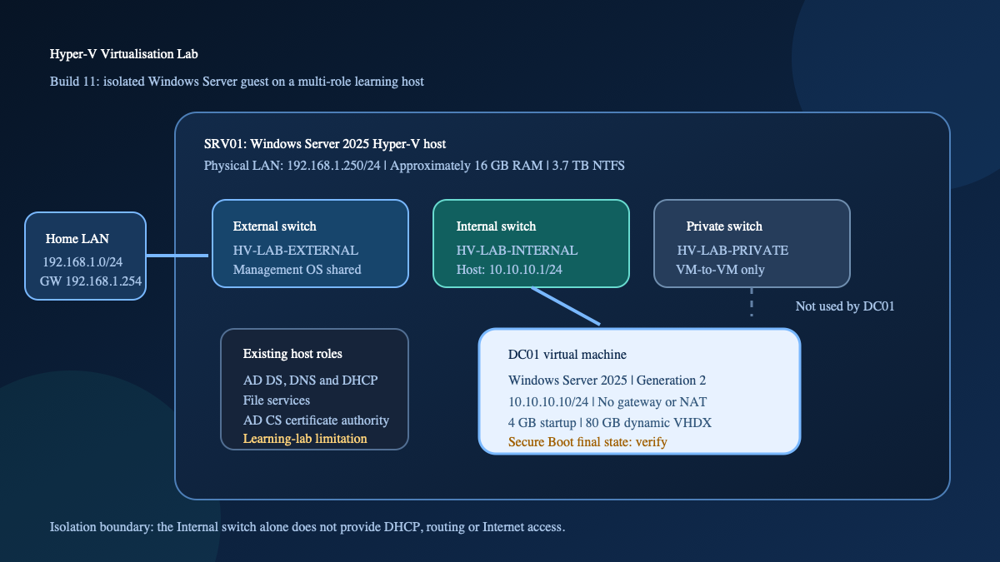

# Build 11: Hyper-V Virtualisation Platform

## Overview

I added Hyper-V to my physical Windows Server 2025 lab host and built an
isolated Windows Server 2025 virtual machine. The aim was to understand the
layers behind a working VM, not simply click through the creation wizard.

The build covered host readiness, the Hyper-V role, virtual switches, VHDX
storage, a Generation 2 VM, guest networking, scoped firewall troubleshooting,
production checkpoints and PowerShell-based inspection.

This is a learning-lab write-up. `SRV01` already performs several infrastructure
roles in my home lab, so the design is intentionally compact and should not be
treated as a production Hyper-V architecture.

## Repository contents

- [Read-only Hyper-V state audit](scripts/Get-HyperVLabState.ps1)
- [PowerShell snippets](POWERSHELL-SNIPPETS-CHEATSHEET.md)
- [Hyper-V study guide](HYPER-V-STUDY-GUIDE.md)
- [Hyper-V quick reference](HYPER-V-CHEATSHEET.md)
- [Architecture image for GitHub or LinkedIn](assets/hyper-v-lab-architecture.png)
- [Editable architecture SVG](assets/hyper-v-lab-architecture.svg)

## Environment

| Component | Configuration |
| --- | --- |
| Hyper-V host | `SRV01`, physical Windows Server 2025 |
| Existing host roles | Active Directory Domain Services, DNS, DHCP, file services and AD CS |
| Host physical LAN address | `192.168.1.250/24` |
| Physical LAN gateway | `192.168.1.254` |
| Host memory | Approximately 16 GB |
| Hyper-V storage | Approximately 3.7 TB NTFS |
| Virtual machine | `DC01` |
| Guest operating system | Windows Server 2025 Standard Evaluation, Desktop Experience |
| VM generation | Generation 2 |
| Startup memory | 4096 MB |
| Dynamic Memory | Enabled |
| Virtual disk | `DC01-OS.vhdx`, 80 GB dynamically expanding |
| Lab switch | `HV-LAB-INTERNAL` |
| Host lab address | `10.10.10.1/24` |
| Guest lab address | `10.10.10.10/24` |
| Guest default gateway | None during this build |
| Checkpoint type | Production |
| Automatic checkpoints | Disabled |

The name `DC01` is the guest computer name used for the next stage of the lab.
This build did not promote it to an Active Directory domain controller.

## Architecture



The Internal switch gives `SRV01` and `DC01` a private host-to-guest network.
Because the guest has no default gateway and no NAT configuration, it does not
have a route to the physical LAN or Internet through this switch.

I also created External and Private switches to understand their behaviour:

- **External:** connects VMs through a physical network adapter. Management OS
  sharing was enabled during the test.
- **Internal:** connects the host and VMs attached to that switch.
- **Private:** connects attached VMs to one another but not to the host.

The final isolated guest used `HV-LAB-INTERNAL`.

## Implementation

### 1. Checked host readiness

Before installing the role, I checked for:

- VM Monitor Mode extensions
- Firmware-enabled virtualisation
- Second Level Address Translation
- Hardware-enforced Data Execution Prevention

I then installed the Hyper-V role and management tools on `SRV01`.

### 2. Tested virtual networking

Creating the External switch moved `SRV01`'s management connection onto the
Hyper-V virtual Ethernet adapter. Because changing the host's management path
could interrupt connectivity, I verified the host address, gateway and physical
network access after the change.

For the isolated lab network, I assigned the host-side Internal switch adapter:

```text
10.10.10.1/24
```

The guest received:

```text
10.10.10.10/24
```

No guest default gateway was configured at this stage.

### 3. Organised virtual storage

I used a simple host folder structure:

```text
C:\Hyper-V\
|-- ISO\
|-- Virtual Hard Disks\
`-- VMs\
```

I created and inspected a dynamically expanding VHDX. This helped separate the
disk's maximum virtual capacity from the physical space currently consumed on
the host.

### 4. Created the guest

`DC01` was created as a Generation 2 VM with 4 GB startup memory, Dynamic
Memory, an 80 GB VHDX and the Internal lab switch.

After Windows Server was installed, I changed the computer name inside the
guest. This confirmed that the Hyper-V display name and the Windows computer
name are separate settings.

## Troubleshooting

### Windows Server ISO did not boot

The Windows Server 2025 ISO initially failed to boot in the Generation 2 VM.
Instead of replacing several settings at once, I checked each part of the boot
path:

- the ISO was approximately 7.59 GB;
- Windows could mount it on `SRV01`;
- `bootx64.efi` and `install.wim` were present;
- the virtual DVD drive was attached;
- the DVD drive was first in the UEFI boot order;
- the VM was Generation 2;
- Secure Boot used the `MicrosoftWindows` template.

Windows Setup booted after I disabled Secure Boot for the VM.

That solved the immediate installation problem, but it created a security
follow-up. Secure Boot is enabled by default for Generation 2 Windows guests,
and the final post-install state was not captured in the original notes. Before
reusing `DC01`, I need to verify the current state, re-enable Secure Boot if the
installed guest supports it, and confirm that Windows still starts normally.

### APIPA address

Before static addressing was configured, `DC01` received a `169.254.x.x`
address. The virtual NIC was present, but the isolated Internal switch had no
DHCP service. I replaced the APIPA address with `10.10.10.10/24`.

### ICMP blocked by Windows Firewall

The host could see that the VM adapter was connected and reporting an IP
address, but ICMP echo requests failed.

I kept Windows Firewall enabled, inspected the matching inbound rules and
enabled the specific IPv4 Echo Request allow rule required for the test. I then
retested host-to-guest connectivity.

The PowerShell reference now uses a discovery-first approach so the exact rule
name and profile are reviewed before any rule is enabled.

## Checkpoints and recovery

I configured `DC01` to use production checkpoints and disabled automatic
checkpoints. I then created:

```text
Baseline - Windows Installed
```

After creating a harmless marker file in the guest, I applied the checkpoint.
The post-checkpoint file disappeared when the VM returned to the earlier state.

This demonstrated short-term rollback, but a checkpoint is not the backup
strategy for this VM. If the host storage containing the VHDX and checkpoint
files is lost, both can be lost together. A later lab should add a separate VM
backup location and a tested restore.

## PowerShell evidence

The [PowerShell snippets](POWERSHELL-SNIPPETS-CHEATSHEET.md) record the discovery,
configuration and verification commands used during the build.

I also added a
[read-only state audit](scripts/Get-HyperVLabState.ps1) that collects the
important final settings into one structured object. It does not make
configuration changes. The script should be run on `SRV01` and its sanitised
output reviewed before being added as final runtime evidence.

The audit checks:

- Hyper-V role and management service state
- VM generation, power state and memory configuration
- switch and virtual NIC attachment
- host-side Internal switch address
- guest-reported IP addresses
- virtual disk path
- checkpoint configuration and count
- Generation 2 Secure Boot state

## Security and design review

| Area | Current learning-lab design | Limitation or next control |
| --- | --- | --- |
| Host roles | Hyper-V was added to multi-role `SRV01` | A production design would normally separate the hypervisor from the domain controller and certification authority to reduce blast radius |
| Guest network | Internal switch, static private address and no gateway | Add NAT only when outbound access is required, then document the new route and exposure |
| Host management | External switch briefly changed the management path | Preserve console access and verify address, gateway and connectivity after switch changes |
| Firewall | Firewall remained enabled and a specific ICMP rule was used | Keep rules limited to the required profile and traffic |
| Secure Boot | Disabled to complete installation | Verify the final state, re-enable if supported and retest |
| Checkpoints | Production checkpoint with automatic checkpoints disabled | Add a separate backup and test a full restore |
| Availability | One physical host with no cluster or replica | Failure of `SRV01` stops every hosted workload |
| Resources | Approximately 16 GB shared by the host roles and guest | Record Dynamic Memory limits and monitor pressure before adding more VMs |
| Evidence | Original screenshots were not retained | Run the read-only audit and capture a small set of final-state screenshots if the lab is available |

## What I learned

- Hyper-V host and guest systems are separate administrative contexts.
- A VM name does not rename Windows inside the guest.
- External, Internal and Private switches provide different connectivity.
- An Internal switch does not provide DHCP, routing or Internet access by itself.
- Creating an External switch can change the host's management network path.
- Dynamically expanding VHDX files grow as data is written.
- Generation 2 VMs use UEFI and support Secure Boot.
- APIPA can show that a NIC exists while DHCP is unavailable.
- Windows Firewall should be diagnosed and scoped, not disabled.
- Production checkpoints support controlled rollback but do not replace backups.
- PowerShell exposes the configuration behind Hyper-V Manager and makes
  independent verification easier.

## Evidence boundary

The original build screenshots were not retained. This repository therefore
documents the build from my notes and provides the commands, architecture and a
read-only audit script, but it does not claim screenshot-backed proof of every
completed step.

The architecture image is a diagram of the documented design, not a screenshot
of the running environment.

## Outcome

The documented build produced an isolated Windows Server guest on a functioning
Hyper-V host, with structured storage, controlled networking and tested
checkpoint rollback.

The platform provides a base for later virtualised Windows infrastructure labs.
The immediate next verification is to run the state audit on `SRV01` and resolve
the recorded Secure Boot finding.

## References

- [System requirements for Hyper-V](https://learn.microsoft.com/en-us/windows-server/virtualization/hyper-v/host-hardware-requirements)
- [Install Hyper-V on Windows Server](https://learn.microsoft.com/en-us/windows-server/virtualization/hyper-v/get-started/Install-Hyper-V)
- [Plan Hyper-V networking](https://learn.microsoft.com/en-us/windows-server/virtualization/hyper-v/plan/plan-hyper-v-networking-in-windows-server)
- [Generation 2 virtual machine security](https://learn.microsoft.com/en-us/windows-server/virtualization/hyper-v/generation-2-virtual-machine-security-features)
- [Use Hyper-V checkpoints](https://learn.microsoft.com/en-us/windows-server/virtualization/hyper-v/checkpoints)
- [Hyper-V backup approaches](https://learn.microsoft.com/en-us/windows-server/virtualization/hyper-v/backup-approaches)
