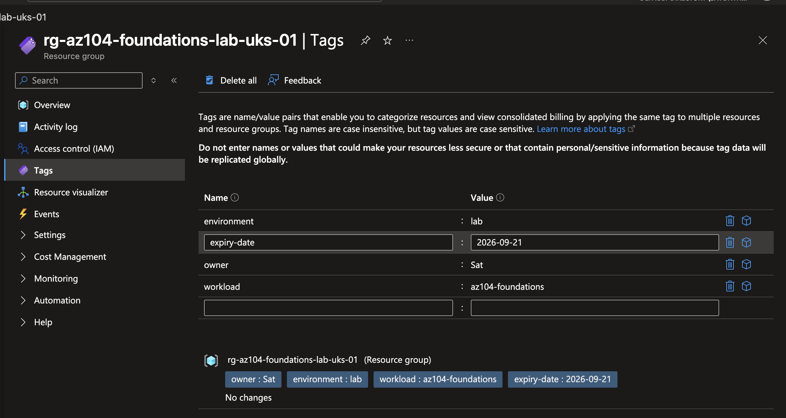
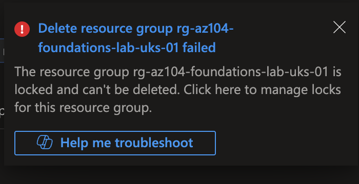
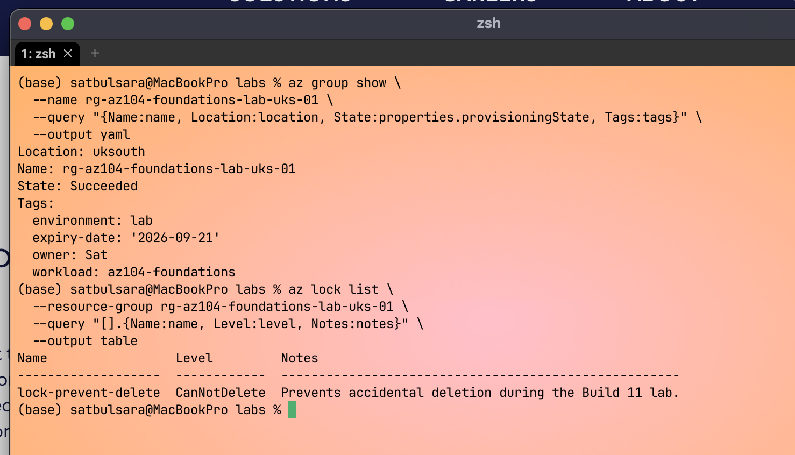
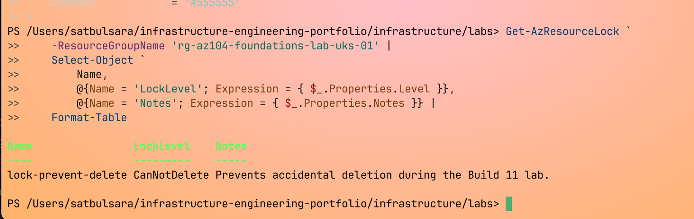
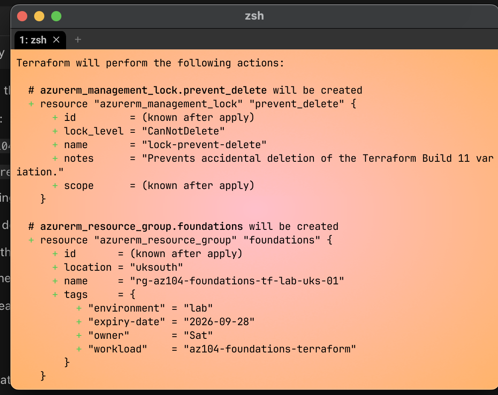

# Azure Foundations and Safe Lab Operations

This initial Azure setup lab established a safe workflow for working in a
personal subscription. I created and classified a disposable resource
group in the portal, added cost monitoring and a delete lock, proved the lock
worked, and verified the result with Azure CLI and Azure PowerShell. I then
rebuilt the resource group and lock with Terraform and performed the cleanup
workflow for both versions.

The point was not to deploy a workload. It was to understand Azure's basic
structure and practise the checks and controls that should happen before later
projects create chargeable resources.

## Status

Guided implementation, verification, break/fix and Azure cleanup were performed.
This does not demonstrate independent fluency yet. The retained evidence proves
the main configuration, lock enforcement and Terraform apply, but it does not
independently prove the budget notification threshold or final Azure absence.

The five embedded screenshots are public-safe and use descriptive names. The lab
is not ready for publication yet because one unembedded raw portal screenshot
contains account and subscription metadata, and final Azure absence was not
retained as public evidence.

## Lab Scope

| Item | Value |
| --- | --- |
| Azure environment | Personal learning tenant and subscription |
| Region | UK South |
| Portal resource group | `rg-az104-foundations-lab-uks-01` |
| Terraform variation | `rg-az104-foundations-tf-lab-uks-01` |
| Resource type | Empty resource groups with management locks |
| Cost | No chargeable workload resources were deployed |
| Tools | Azure portal, Azure CLI, Azure PowerShell and Terraform |

The resource names contain `az104` because that was the naming convention used
when the lab was performed. They are retained so the documentation agrees with
the real screenshots and command output. Future projects can use neutral Azure
workload names.

## What I Built

The portal-built resource group used four tags:

| Tag | Purpose | Lab value |
| --- | --- | --- |
| `owner` | Identifies responsibility | `Sat` |
| `environment` | Distinguishes lab from other environments | `lab` |
| `workload` | Describes the purpose | `az104-foundations` |
| `expiry-date` | Records the intended review or cleanup date | `2026-09-21` |



I configured a £10 monthly subscription budget. The lab notes record a
notification at 50 per cent of actual cost, but the retained budget screenshot
shows the amount and dates rather than the notification settings. This is an
alerting control, not a spending cap. Azure budgets notify when a threshold is
reached, but do not stop resources or their consumption automatically.

A `CanNotDelete` management lock named `lock-prevent-delete` was applied at
resource-group scope. A controlled deletion attempt failed as expected.



The Activity Log recorded successful tag and lock operations and two failed
delete operations. This supplied independent control-plane evidence instead of
relying only on the notification.

## CLI and PowerShell Verification

The Azure CLI context check showed the intended subscription as enabled and
default. Read-only queries returned the group in `uksouth`, provisioning state
`Succeeded`, all four expected tags and lock level `CanNotDelete`.



Azure PowerShell returned the same resource-group state and tags. The lock
object stored the useful level and notes values under `Properties`, so the final
query selected those nested fields explicitly. The retained PowerShell output
supports the group, tag and lock claims without exposing the subscription ID.



The performed commands are recorded in
[reference/code-snippets.md](reference/code-snippets.md).

## Terraform Variation

After understanding the portal workflow, I described a changed version in
Terraform. It used a different resource-group name, workload tag and expiry date
so it tested the same skill without attempting to take over the portal-built
group.

The retained plan and configuration contained exactly two additions:

1. `azurerm_resource_group.foundations`
2. `azurerm_management_lock.prevent_delete`



After apply, Azure CLI independently confirmed the group, tags and lock. The
configuration is retained in [terraform/](terraform/), including the provider
lock file. Generated plans, state and the downloaded provider cache were
removed after the recorded Azure cleanup.

## Troubleshooting

### Expired Azure CLI token

The first live resource query failed because the cached refresh token had
expired after a long period of inactivity.

- Cause: the local Azure CLI login was stale.
- Correction: log out, authenticate interactively and inspect the active
  subscription again.
- Verification: the resource-group query returned the expected live state.
- Lesson: a familiar terminal prompt is not proof of a valid session or correct
  Azure target.

### Azure PowerShell browser sign-in failed in WezTerm

`Connect-AzAccount` could not complete interactive browser authentication in
the macOS terminal session.

- Cause: the macOS broker required browser interaction on the main thread.
- Correction: use `Connect-AzAccount -UseDeviceAuthentication`.
- Verification: `Get-AzContext` and the resource queries succeeded.
- Lesson: change the authentication method, not the security requirements.

### Terraform provider startup appeared stuck

The first Terraform plan spent an unexpectedly long time during AzureRM
provider startup.

- Working hypothesis: automatic legacy resource-provider registration was a
  likely contributor to the delay, but the retained evidence does not prove it
  was the root cause.
- Controlled change: set `resource_provider_registrations = "none"` in the
  provider because this foundations build did not need automatic registration.
- Verification: the next plan completed with two additions and no changes or
  destruction.
- Limitation: later builds must confirm and register only the providers their
  resources require.

### Terraform subscription variable was missing

A new terminal did not inherit the temporary `ARM_SUBSCRIPTION_ID` variable.

- Cause: shell environment variables are session-scoped unless persisted.
- Correction: derive it from the already verified Azure CLI context.
- Verification: a non-secret presence check passed and Terraform produced the
  expected plan.
- Lesson: validate context inputs before every plan and apply.

## Security, Cost and Limitations

- No credentials, tokens, tenant IDs or full subscription IDs belong in this
  repository.
- One unembedded raw portal screenshot currently contains account and
  subscription metadata. It must be removed from the public set or replaced with
  a tightly cropped version before the lab is staged.
- The delete lock protected control-plane deletion. It was not an access role
  and did not make the resource group read-only.
- Tags provided metadata only. They did not enforce naming, expiry or cleanup.
- The budget provided visibility and notification only. It was not a hard cap.
- The groups were empty, so this lab does not prove the behaviour, security or
  cost of a deployed workload.
- This was a guided single-subscription exercise, not a production landing zone.
- A missing Terraform context was used for break/fix instead of manufacturing
  access to an unauthorised second subscription.

## Cleanup

Cleanup was recorded as completed and followed dependency order:

1. Destroy the Terraform-managed lock and resource group.
2. Confirm the Terraform group no longer exists.
3. Remove the portal-built lock.
4. Delete the original empty group and confirm its absence.
5. Confirm Terraform state is empty.
6. Remove generated plans, local state and the provider cache.

The reusable Terraform source, `.terraform.lock.hcl` and `.gitignore` remain.
The missing local state and plan files confirm local artifact cleanup, but they
do not independently prove that the Azure groups were deleted. No public-safe
final output showing both `az group exists` results or the empty Terraform state
was retained. A fresh read-only existence check should be captured if the
authorised Azure context is still available.

The budget was intentionally configured to expire at the end of August 2026 so
the workflow can be repeated in a changed later lab.

## Learning Result

```text
Microsoft Entra tenant
└── Azure subscription
    └── Resource group
        └── Resource
```

A tenant is the Microsoft Entra ID identity boundary. A subscription is the
billing and management boundary used by Azure resources. A resource group is a
lifecycle and management container inside a subscription, and resources sit in
that group.

- A tag is metadata used to classify and find resources.
- A lock blocks deletion or modification, depending on its type.
- Azure Policy evaluates or enforces rules across a chosen scope.

The practical workflow is complete with full guided help. Independent rebuild,
delayed recall and transfer into later builds remain to be demonstrated.

## Publication Checklist

- Remove or privately retain the raw full-portal screenshot containing account
  and subscription metadata.
- Keep the current five embedded screenshots focused on distinct central
  outcomes.
- Remove or privately retain unused raw screenshots after checking them for
  account details and unrelated content.
- Capture fresh sanitised `az group exists` output for both deleted groups when
  possible.
- Treat the 50 per cent budget threshold and empty Terraform state as performed
  but not independently retained unless new evidence is captured.
- Re-run the link, identifier, Terraform and Git-diff checks before committing.

## Supporting Files

- [Repeatable build instructions](instructions.md)
- [Azure foundations cheat sheet](reference/azure-foundations-cheat-sheet.md)
- [Azure CLI, PowerShell and Terraform snippets](reference/code-snippets.md)
- [Terraform configuration](terraform/)

## References

- [Manage Azure subscriptions with Azure CLI](https://learn.microsoft.com/en-us/cli/azure/manage-azure-subscriptions-azure-cli)
- [Lock Azure resources](https://learn.microsoft.com/en-us/azure/azure-resource-manager/management/lock-resources)
- [Create and manage Azure budgets](https://learn.microsoft.com/en-us/azure/cost-management-billing/costs/tutorial-acm-create-budgets)
- [Get-AzContext](https://learn.microsoft.com/en-us/powershell/module/az.accounts/get-azcontext)
- [Terraform AzureRM provider](https://registry.terraform.io/providers/hashicorp/azurerm/latest/docs)
