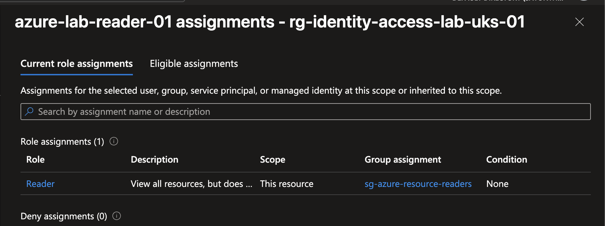
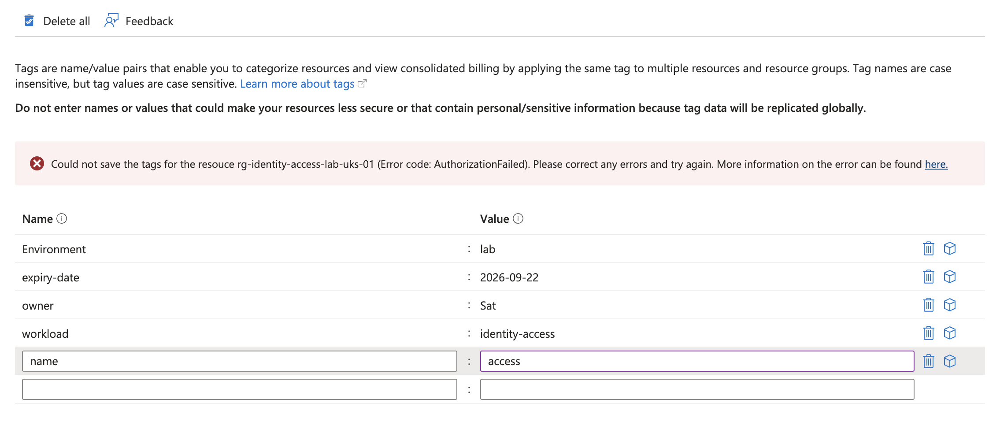
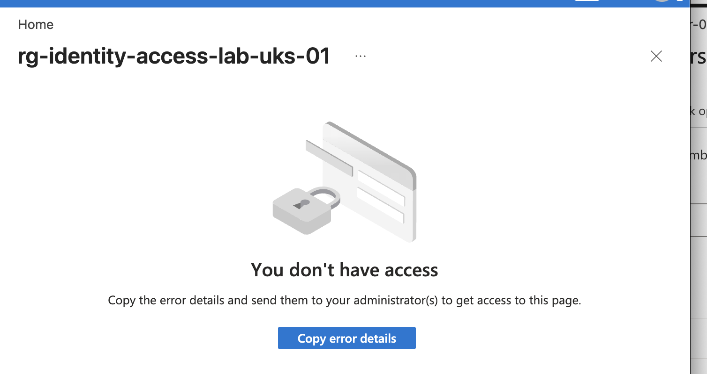
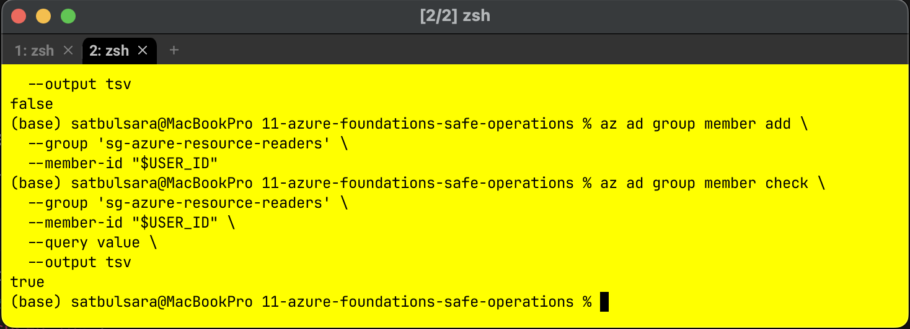
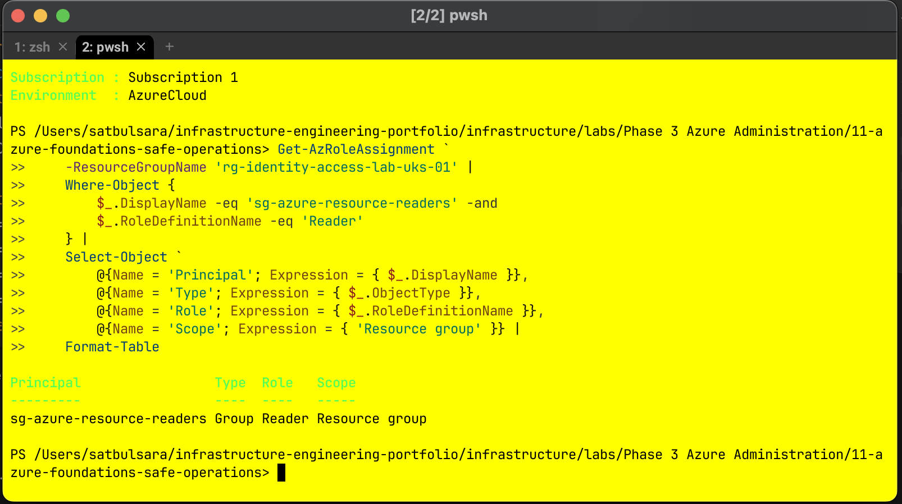

# Microsoft Entra Identity and Azure Access

This lab explores a simple group-based access model using Microsoft Entra ID
and Azure role-based access control (RBAC). I created a fictional user, placed
the user in a security group and assigned the built-in Reader role to that group
at resource-group scope. I then tested the user's effective permissions and
removed the membership to simulate a leaver.

The environment was disposable and has been cleaned up. It was a focused
learning lab, not a production identity design.

## Business Need

An organisation needs a manageable way to give staff access to Azure resources.
Assigning permissions separately to every user makes joiner, mover and leaver
processes harder to review and easier to get wrong.

The chosen model assigns access to a security group. Staff receive or lose that
access through group membership, much like security-group-based access in
on-premises Active Directory.

```text
Microsoft Entra user
        |
        v
Assigned security-group membership
        |
        v
Azure Reader role
        |
        v
Dedicated resource group
```

## What I Built

| Component | Lab value | Purpose |
| --- | --- | --- |
| Test identity | `azure-lab-reader-01` | Fictional user used to test effective access |
| Security group | `sg-azure-resource-readers` | Membership boundary for Azure read access |
| Azure role | Reader | Permitted resource viewing without management changes |
| Scope | `rg-identity-access-lab-uks-01` | Limited the assignment to one disposable resource group |
| Membership | Assigned | Supported a controlled joiner and leaver test |

The resource group was created in UK South and tagged for owner, environment,
workload and expiry date. This repeated the naming and tagging workflow from my
previous Azure foundations lab.

## Design and Security Decisions

- Access was assigned to the group rather than directly to the user.
- Reader was selected because the test user only needed to inspect the lab.
- The assignment was limited to one resource group rather than the subscription.
- A separate fictional user was used to test effective permissions.
- Both an allowed action and a denied write action were tested.
- The role assignment, membership, group, user and resource group were removed
  after verification.
- Passwords, tenant identifiers, subscription identifiers and object identifiers
  are not included in the repository.

Reader is an Azure resource role. It does not make the user a Microsoft Entra
administrator and does not grant permission to modify the resource group. Azure
RBAC is additive, so other assignments inherited by a real user would also need
to be considered during an access review.

## Implementation and Verification

The portal was used first so I could see the relationship between the identity,
group, role and scope. Azure CLI and Azure PowerShell were then used for
read-only verification and selected membership administration.

### 1. Effective access through the group



The test user's effective assignment shows Reader at the resource-group scope,
with `sg-azure-resource-readers` recorded as the group assignment.

### 2. Least privilege blocked a write



The signed-in test user could view the resource group and existing tags, but an
attempt to add a tag returned `AuthorizationFailed`. Refreshing the page
confirmed that the configuration had not changed.

### 3. Leaver access was removed



Removing the user from the group and starting a fresh sign-in session removed
the inherited access. This demonstrated the value of changing group membership
instead of searching for direct assignments to an individual.

### 4. Membership was restored with Azure CLI



The CLI first returned `false`, added the member, then returned `true` on a new
membership check. The second query was the independent verification, rather
than relying on the add command alone.

### 5. RBAC was checked with Azure PowerShell



`Get-AzRoleAssignment` returned the security group as a group principal with the
Reader role at resource-group scope.

## Troubleshooting and Break/Fix

The first assignment was made directly to the test user by mistake. Effective
access displayed no group assignment, which showed that the intended group
relationship was not providing the access. The direct assignment was removed,
Reader was assigned to the security group and the user was added to that group.
A fresh effective-access check then displayed the group name.

Later, removing the membership deliberately reproduced an access failure. The
CLI membership query returned `false`; adding the member and checking again
returned `true`. This separated the observed symptom, the missing relationship,
the controlled correction and the retest.

## RBAC Matrix

| Principal | Role | Scope | Business reason | Final state |
| --- | --- | --- | --- | --- |
| `sg-azure-resource-readers` | Reader | `rg-identity-access-lab-uks-01` | Allow group members to inspect the lab without changing it | Removed during cleanup |
| `azure-lab-reader-01` | No direct assignment | Access inherited through group membership | Keep user lifecycle separate from permission design | User deleted during cleanup |

## Cleanup and Cost

No chargeable workload was deployed. Microsoft Entra objects and Azure role
assignments used in this lab did not create a separate workload charge. The
disposable role assignment, group membership, resource group, security group and
test user were removed, then checked with narrow CLI queries.

## Limitations and Next Steps

This lab used one tenant, one assigned-membership group, one role and one
resource-group scope. It did not test dynamic groups, licences, privileged
identity management, access reviews, external collaboration, conditional access
or hybrid identity. The next useful repetition is a changed role-and-scope
scenario completed with hints rather than exact steps.

## Supporting Files

- [Step-by-step lab instructions](instructions.md)
- [Identity and RBAC cheat sheet](reference/identity-rbac-cheat-sheet.md)
- [Azure CLI and PowerShell snippets](reference/code-snippets.md)
- [Screenshot evidence index](screenshots/README.md)

## References

- [What is Azure RBAC?](https://learn.microsoft.com/en-us/azure/role-based-access-control/overview)
- [Understand scope for Azure RBAC](https://learn.microsoft.com/en-us/azure/role-based-access-control/scope-overview)
- [Manage Microsoft Entra groups and membership](https://learn.microsoft.com/en-us/entra/fundamentals/how-to-manage-groups)
- [Azure CLI group membership commands](https://learn.microsoft.com/en-us/cli/azure/ad/group/member)
- [Get-AzRoleAssignment](https://learn.microsoft.com/en-us/powershell/module/az.resources/get-azroleassignment)
