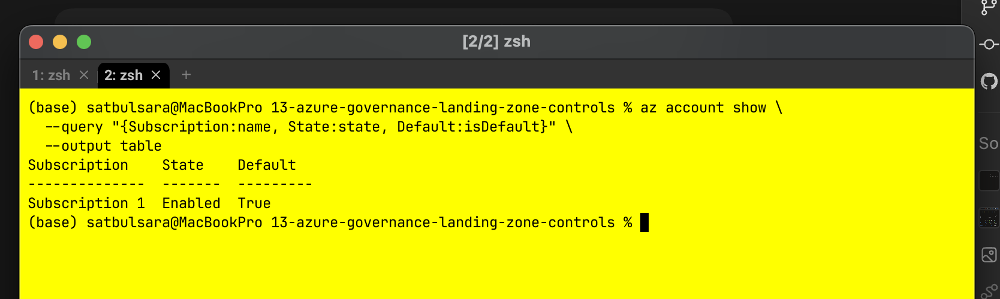
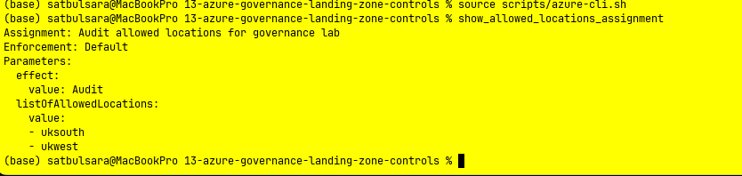
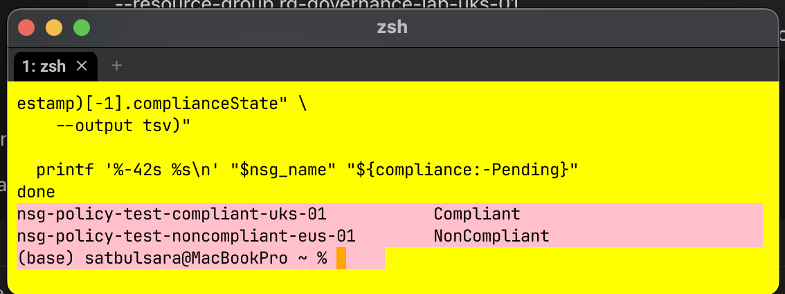
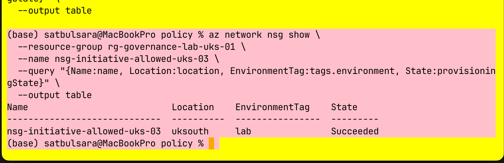
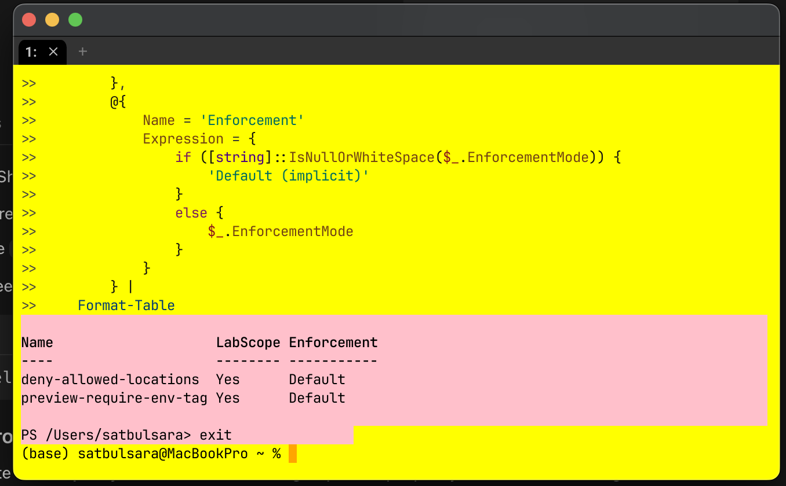

# Azure Governance and Landing-Zone Controls

This project built and tested a small Azure governance baseline for a fictional
UK organisation. The goal was to control where resources could be deployed and
require a basic environment tag before wider workloads were introduced.

This was an isolated learning environment, not a production landing zone.

## Business Need

The organisation needed two initial guardrails:

- resources must remain in UK South or UK West;
- every governed resource must include an `environment` tag.

The controls had to be introduced without unexpectedly disrupting workloads. I
started in report-only modes, checked compliant and non-compliant resources,
then enabled enforcement inside one disposable resource group.

## Governance Design

| Decision | Configuration | Reason |
| --- | --- | --- |
| Primary region | UK South | Main deployment region |
| Secondary region | UK West | Approved recovery region |
| Required resource tag | `environment` | Identifies the resource lifecycle boundary |
| Assignment scope | `rg-governance-lab-uks-01` | Limits the blast radius |
| Safe introduction | Audit or `DoNotEnforce` first | Shows impact before blocking changes |
| Enforcement | Deny with `Default` enforcement | Prevents known non-compliant deployments |

The resource group also used `owner`, `workload`, `cost-centre`,
`expiry-date` and `data-classification` tags. No secrets or sensitive data
were stored in tag values.

## Implementation

I first confirmed the active subscription using filtered Azure CLI output.

The built-in **Allowed locations** policy was assigned in Audit mode with UK
South and UK West as approved values. This allowed an East US NSG to be created
while still recording it as non-compliant.

After verifying both outcomes, I moved the location control to Deny. A fresh
East US request returned `RequestDisallowedByPolicy`, and a separate list query
proved that the denied NSG had not been created.

The **Require a tag on resources** definition was introduced with
`DoNotEnforce`. Both untagged NSGs initially appeared as non-compliant. I added
`environment=lab` to the UK South NSG, triggered a new policy evaluation and
then compared the latest states.

The tag assignment was then changed to `Default` enforcement. An untagged UK
South NSG was blocked, while a tagged UK South NSG succeeded.

## Custom Initiative

The final governance baseline grouped both built-in definitions into a custom
initiative:

- Allowed locations, parameterised with UK South and UK West
- Require a tag on resources, parameterised with `environment`

The initiative structure and assignment values are stored as version-controlled
JSON under [policy](policy/). I assigned it in `DoNotEnforce`, verified the
parameters, moved it to active enforcement and then removed the two redundant
individual assignments.

Fresh tests proved that the initiative alone:

- blocked an untagged UK South NSG through the tag member;
- blocked a tagged East US NSG through the location member;
- allowed a tagged UK South NSG satisfying both controls.

## PowerShell Verification

Azure PowerShell independently confirmed that the individual assignments were
attached directly to the lab resource group with active enforcement.

When an assumed nested property returned blank values, I used `Get-Member` to
inspect the actual policy-assignment object. It showed that `EnforcementMode`
was a direct property in the installed Az module. This was a useful reminder to
inspect objects rather than guess their structure.

## Troubleshooting

### Built-in policy lookup failure

Azure CLI 2.83.0 returned `PolicyDefinitionNotFound` even though a read-only
query proved that the built-in definition existed. Passing the definition's
public name instead of its root-level ID allowed the assignment to succeed. The
evidence supports this as a CLI workaround rather than an Azure Policy failure.

### Duplicate tag assignment

The tag policy was accidentally created twice, once with a readable internal
name and once with a portal-generated name. I listed both assignments and their
parameters, confirmed that they were equivalent and removed only the generated
duplicate.

### Compliance delay

The live NSG tag was correct before Azure Policy changed its compliance result.
Rather than changing a healthy resource repeatedly, I checked the assignment
parameter, verified the live tag, triggered another scan and waited for the
latest timestamped state.

## Security and Cost

All assignments were restricted to a disposable resource group. Report-only
evaluation came before Deny, and each negative test changed only one condition
so that the responsible policy could be identified.

Azure Policy and the NSGs used here did not introduce a direct resource charge.
The project avoided VMs, gateways and analytics ingestion. Existing inherited
subscription policies were observed but not changed.

## Cleanup

The initiative assignment was removed first. The resource group and all test
NSGs were then deleted, followed by the subscription-level custom initiative
definition. Narrow Azure CLI checks returned an empty initiative query and
`false` for resource-group existence.

## Scope Decisions

Delete-lock and budget workflows were not repeated because they were already
completed in the previous foundations project. Terraform was deliberately moved
to the next networking project so this build could finish once its governance
behaviour was understood and verified.

## Supporting Files

- [Repeatable instructions](instructions.md)
- [Governance reference](reference/README.md)
- [Azure CLI functions](scripts/azure-cli.sh)
- [Initiative parameters](policy/initiative-parameters.json)
- [Initiative member definitions](policy/initiative-definitions.json)
- [Initiative assignment values](policy/initiative-assignment-parameters.json)
- [Evidence index](screenshots/README.md)
