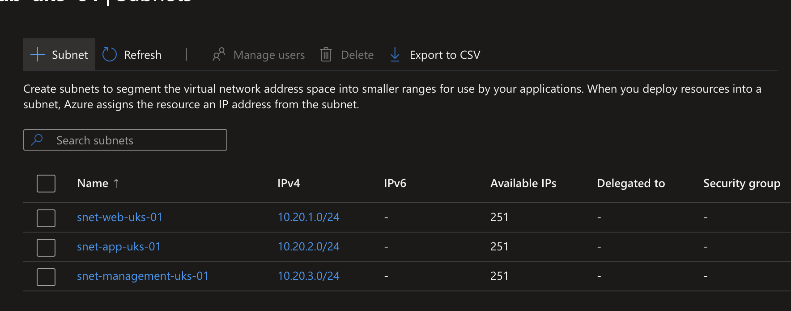
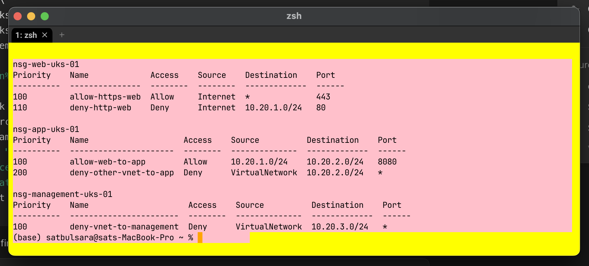
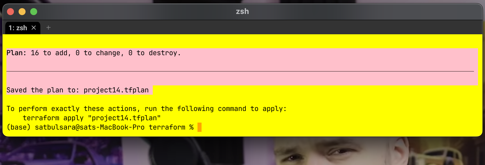
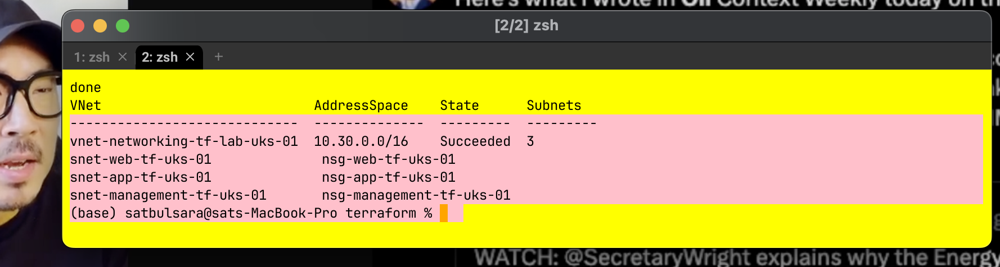
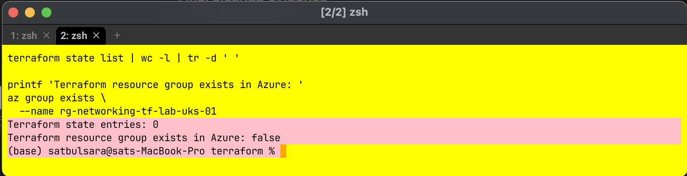

# Project 14: Virtual networks, subnets and NSGs

This learning lab builds a segmented Azure network and applies least-privilege network security controls. I created the first version with the portal and Azure CLI, introduced and repaired an NSG priority fault, then recreated the design with Terraform.

## Outcome

- VNet: `10.20.0.0/16`
- Web, app and management `/24` subnets
- One NSG per subnet with explicit associations
- HTTPS allowed to web, HTTP denied, web-to-app TCP 8080 allowed, management inbound denied
- Terraform variation created and independently verified 16 resources, then destroyed

## Security and limitations

Rules were tested by priority, including a temporary higher-priority HTTPS deny that was removed during break/fix. This is a control-plane lab: no VMs, NICs or live traffic tests were deployed, so effective packet flow was not tested.

## Automation and cleanup

[`terraform/main.tf`](terraform/main.tf) models the dependency graph. `terraform validate`, a 16-resource plan, apply, independent Azure CLI verification and a 16-resource destroy were completed.

The VNet, subnets and NSGs are control-plane resources. Azure Virtual Network itself is free, but peering, NAT, firewalls, public IPs, gateways, VMs and data processing can cost money. Both lab resource groups were removed after verification.

## Supporting files

- [`instructions.md`](instructions.md)
- [`cheatsheet.md`](cheatsheet.md)
- [`code-snippets.md`](code-snippets.md)

## References

- [Azure network security groups overview](https://learn.microsoft.com/en-us/azure/virtual-network/network-security-groups-overview)
- [Azure IP planning](https://learn.microsoft.com/en-us/azure/networking/design-guide/ip-planning)
- [Manage network security groups](https://learn.microsoft.com/en-us/azure/virtual-network/manage-network-security-group)
- [Azure Virtual Network pricing](https://azure.microsoft.com/en-us/pricing/details/virtual-network/)
- [Terraform plan](https://developer.hashicorp.com/terraform/cli/commands/plan)
- [Terraform apply](https://developer.hashicorp.com/terraform/cli/commands/apply)
