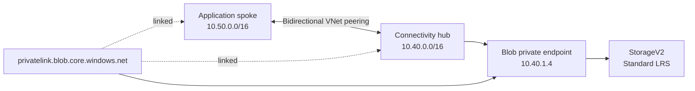
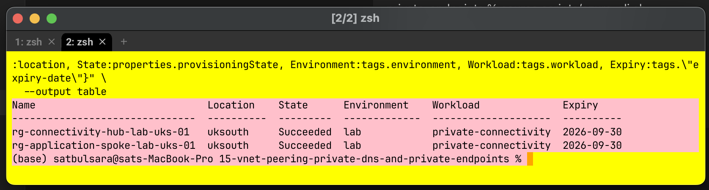
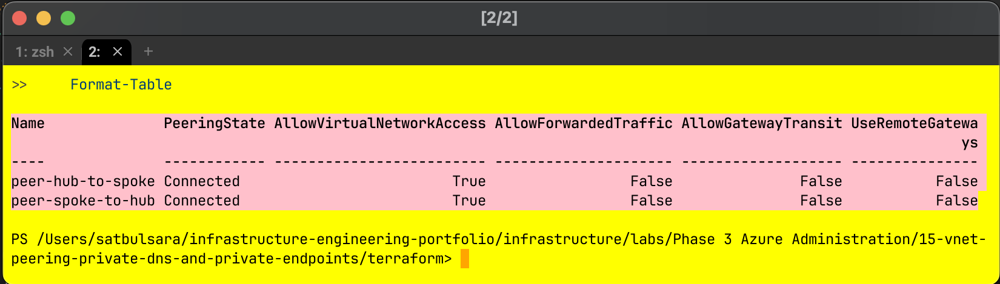
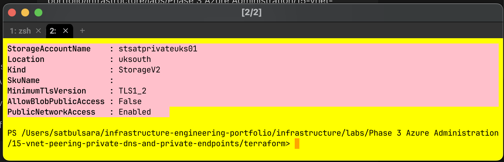
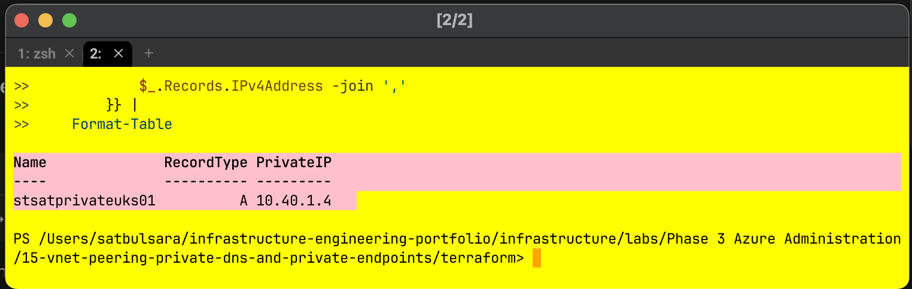
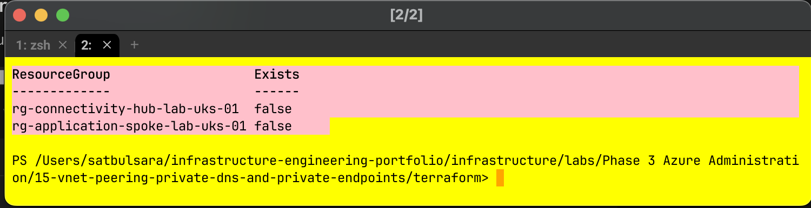

# Project 15: VNet peering, Private DNS and private endpoints

> Status: completed, verified and cleaned up

This learning lab moved beyond isolated virtual networks into private service connectivity. I connected an application spoke to shared services in a hub, adopted the initial Azure CLI-built boundary into Terraform, and made the Blob service available through a private endpoint and Private DNS. Public network access was disabled in the final configuration.

## Business need

An application network needs to reach a shared storage service over private Azure networking. The design must keep the address spaces separate, provide DNS visibility to both networks, prevent anonymous Blob access and leave no paid resources behind after testing.

## Architecture

The hub and spoke used non-overlapping address spaces. Both peerings reached `Connected`, allowed VNet access and deliberately left forwarded traffic, gateway transit and remote gateways disabled.

## Private storage path

The storage account used `StorageV2`, Standard LRS and TLS 1.2. Anonymous Blob access was disabled from the beginning. Public network access was left enabled only for the controlled before-and-after configuration, then disabled after the private endpoint, DNS record and both VNet links had been verified.

The Blob private endpoint was approved in `snet-private-endpoints-uks-01`. Its zone group created an `A` record mapping `stsatprivateuks01` to `10.40.1.4` in `privatelink.blob.core.windows.net`.

## Terraform adoption and drift repair

[`terraform/main.tf`](terraform/main.tf) records the complete dependency graph. Rather than rebuilding the Azure CLI-created resources, I declared matching resources and imported the existing hub resource group, spoke resource group, hub VNet and private-endpoint subnet into Terraform state. I reconciled the configuration until the plan showed no changes, then used reviewed plans to add the spoke, application subnet, peerings, storage account, private endpoint and DNS configuration.

For the break/fix exercise, I manually removed the spoke DNS-zone link while leaving the peering intact. Terraform refreshed Azure state and proposed exactly one addition. Applying the reviewed repair plan restored `link-storage-blob-spoke`, and PowerShell then showed both hub and spoke links in the `Completed` state. This reproduced a realistic configuration-drift incident: the networks can remain connected while the application spoke loses private name resolution for the service.

## Security decisions

- Public network access and anonymous Blob access were both disabled in the final live state.
- The private endpoint targeted only the `blob` storage subresource.
- Both VNets were linked to Private DNS because peering does not automatically share zone visibility.
- No access keys, connection strings, credentials or test data were stored in the repository.
- Generated Terraform plans and local state are excluded from Git.

## Verification and limitations

Azure CLI and PowerShell independently verified the resource groups, VNet and subnet configuration, peering state, storage settings, approved private endpoint, private DNS record, VNet links and final cleanup.

No VM or other workload was deployed inside the spoke, so an end-to-end DNS query and data-plane Blob request were not performed. The retained evidence proves the control-plane configuration, not application traffic. The service-endpoint comparison, public DNS variation, overlapping-address test and one-sided-peering fault remain later practice rather than completed work.

## Cost and cleanup

The private endpoint, Private DNS zone and storage account were short-lived paid resources. A reviewed destroy plan removed all 13 Terraform-managed resources. Azure CLI then independently returned `false` for both lab resource groups.

## What I learned

VNet peering, DNS visibility and service authorisation solve different parts of the connection. A healthy peering state does not prove that a client can resolve a private service name, and a correct private DNS record does not prove that the caller is authorised to use the data. Testing and troubleshooting these layers independently made the final design easier to understand and verify.

## Supporting files

- [`instructions.md`](instructions.md)
- [`cheatsheet.md`](cheatsheet.md)
- [`code-snippets.md`](code-snippets.md)
- [`scripts/azure-cli.sh`](scripts/azure-cli.sh)
- [`terraform/`](terraform/)

## References

- [Azure VNet peering](https://learn.microsoft.com/en-us/azure/virtual-network/virtual-network-peering-overview)
- [Azure Private Endpoint DNS configuration](https://learn.microsoft.com/en-us/azure/private-link/private-endpoint-dns)
- [Azure Storage private endpoints](https://learn.microsoft.com/en-us/azure/storage/common/storage-private-endpoints)
- [Azure Private Link pricing](https://azure.microsoft.com/en-gb/pricing/details/private-link/)
- [Terraform import](https://developer.hashicorp.com/terraform/cli/commands/import)
- [Terraform plan](https://developer.hashicorp.com/terraform/cli/commands/plan)
