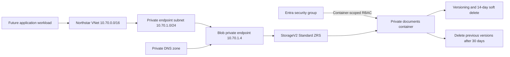
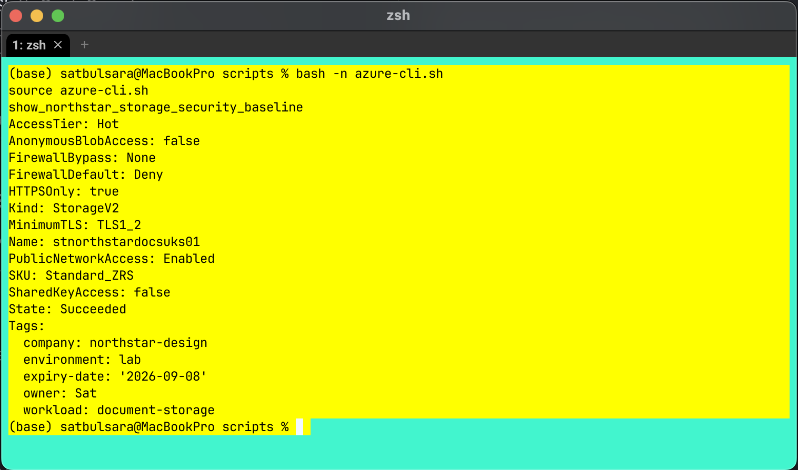
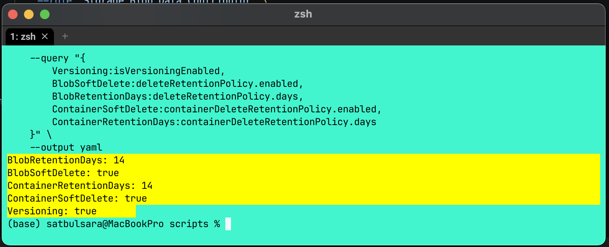
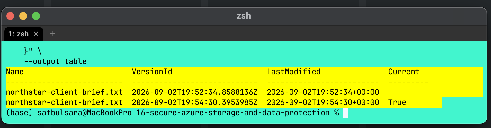
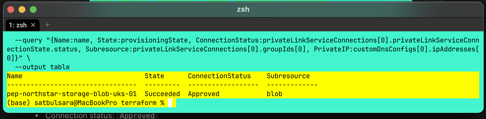
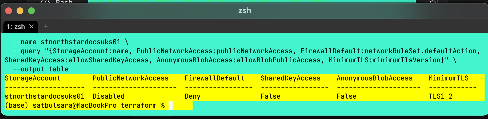

# Project 16: Secure Azure Storage and data protection

> Status: complete, implementation and cleanup verified

## Business brief

Northstar Design Group is a fictional UK design consultancy with about 200
employees and a four-person IT team. Its internal application stores client
documents as objects over HTTPS. The business needs the service to survive one
UK South availability-zone failure, recover accidental overwrites and deletions,
use Microsoft Entra ID for normal access and keep application traffic off the
public internet.

Only fictional data was used. This is a guided learning lab, not a production
deployment.

## Architecture and decisions

- **Blob Storage** fits the application's object-over-HTTPS access pattern.
  Azure Files was rejected because no SMB or NFS-mounted share was required.
- **Standard ZRS** meets the single-zone failure requirement while keeping all
  replicas in UK South. Cross-region disaster recovery was outside scope.
- **Microsoft Entra ID and container-scoped RBAC** avoid normal reliance on
  storage keys and limit the group's data permissions to `documents`.
- **Versioning and soft delete** protect against accidental change and deletion.
  A lifecycle rule prevents previous versions growing indefinitely.
- **Private Endpoint and Private DNS** give the Blob subresource a private IP
  and private name resolution inside the linked VNet.

## What I built

Azure CLI created and verified the tagged resource group, ZRS StorageV2 account,
private Blob container, Entra security group, container-scoped role assignment,
recovery controls and lifecycle policy. Shared Key and anonymous Blob access
were disabled. A temporary IP firewall rule was used only for the authenticated
data-plane test and was removed afterward.

Terraform then added the networking layer:

- `vnet-northstar-storage-uks-01`, `10.70.0.0/16`
- `snet-private-endpoints-uks-01`, `10.70.1.0/24`
- `privatelink.blob.core.windows.net`
- a VNet link with auto-registration disabled
- an approved Blob private endpoint with private IP `10.70.1.4`
- a Private DNS zone group and matching A record

Public network access was disabled after the private endpoint, approval state,
private IP and DNS A record had been verified. Terraform finished with a clean
plan showing no changes.

## Security evidence

The initial account check showed ZRS, HTTPS, TLS, firewall and identity settings
before the final network lockdown.

Blob versioning and both soft-delete policies were enabled with 14-day lab
retention periods.

Overwriting the same Blob produced two versions. I downloaded the earlier
version explicitly and verified its `Version: 1` content. An earlier attempt
used an RTF-formatted file with a `.txt` extension; I rejected that as recovery
evidence and repeated the test with genuine plain-text files.

The private endpoint reached `Succeeded` and its connection was approved for
the Blob subresource. Separate queries verified the private IP and DNS record.

The final storage state disabled public network access while retaining firewall
default deny, disabled Shared Key and anonymous access, and TLS 1.2.

The unredacted RBAC capture was moved to the Git-ignored
`screenshots/private/` directory because it contains the subscription ID.

## Verification and troubleshooting

Implementation messages and verification were treated as separate evidence.
Azure CLI confirmed effective state, Terraform refreshed the live resources and
the final plan reported no differences.

The main troubleshooting lessons were:

1. A rich-text file can contain RTF even when named `.txt`. Recovery was repeated
   with real plain text rather than claiming success from the extension.
2. The endpoint query did not expose the IP through `customDnsConfigs`. Following
   the endpoint's network interface verified `10.70.1.4`.
3. RBAC and networking are independent gates. A data role does not give an
   external laptop a route into a VNet after public access is disabled.
4. Private DNS, not a service endpoint, maps the normal Blob hostname to the
   private endpoint inside a linked VNet.

## Limitations

- No workload was deployed inside the VNet, so an end-to-end Blob request from
  an in-VNet client was not demonstrated. The evidence proves the endpoint,
  approval, private IP and DNS record, but not an application data path.
- Azure Files, AzCopy, customer-managed keys, diagnostics, object replication
  and user-delegation SAS were deferred rather than implemented.
- Azure CLI created the storage and identity resources. Terraform manages only
  the private networking layer in this iteration.
- Monitoring and a deliberately injected network fault remain useful follow-up
  exercises.

## Cost and cleanup

The chargeable components include stored data, transactions, ZRS replication,
the private endpoint and Private DNS zone. Test files are tiny, but resources
must still be removed after evidence review.

Cleanup was completed in this safe order:

1. review and apply a Terraform destroy plan for the network layer;
2. verify an empty Terraform state;
3. delete the CLI-created resource group;
4. delete the lab-only Entra security group; and
5. verify both are absent.

The reviewed Terraform plan destroyed five network resources with no additions
or changes. The final Terraform state was empty, the Entra group lookup returned
no match and the resource-group existence query returned `false`.

## Knowledge check

Final score: **3/5**. Strengths were RBAC versus network-path reasoning, Blob
version recovery and ZRS selection. Review is needed on Private DNS versus
service endpoints and lifecycle management versus recovery.

## Repository guide

- `instructions.md`: repeatable build, verification and cleanup sequence
- `cheatsheet.md`: concise concepts and retrieval commands
- `code-snippets.md`: reusable CLI, PowerShell and Terraform patterns
- `scripts/azure-cli.sh`: Bash functions used during the build
- `terraform/`: private networking configuration
- `reference/`: business requirements and lifecycle policy
- `data/`: fictional recovery-test files
- `screenshots/`: public-safe evidence

## Official references

- [Azure Storage redundancy](https://learn.microsoft.com/en-us/azure/storage/common/storage-redundancy)
- [Authorise Blob access with Microsoft Entra ID](https://learn.microsoft.com/en-us/azure/storage/blobs/authorize-access-azure-active-directory)
- [Blob versioning](https://learn.microsoft.com/en-us/azure/storage/blobs/versioning-overview)
- [Soft delete for Blobs](https://learn.microsoft.com/en-us/azure/storage/blobs/soft-delete-blob-overview)
- [Blob lifecycle management](https://learn.microsoft.com/en-us/azure/storage/blobs/lifecycle-management-overview)
- [Azure Storage private endpoints](https://learn.microsoft.com/en-us/azure/storage/common/storage-private-endpoints)
- [Private Endpoint DNS](https://learn.microsoft.com/en-us/azure/private-link/private-endpoint-dns)
- [Terraform AzureRM private endpoint](https://registry.terraform.io/providers/hashicorp/azurerm/latest/docs/resources/private_endpoint)
