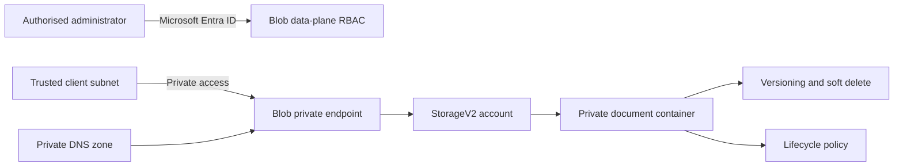

# Project 16: Secure Azure Storage and data protection

> Status: planned, not yet built  
> Progress: `[█████░░░░░] 48%`  
> Estimated learning time: 8 to 12 hours across several sessions

## Company scenario

Northstar Design Group is a fictional UK design consultancy with 200 employees.
Its London office and remote staff work on client design projects, while an
internal application stores project documents in Azure. The company has a small
IT team of four people and no dedicated storage engineer.

The application treats each document as an object over HTTPS. Employees do not
need an SMB-mounted shared drive for this workload. Some projects contain
commercially sensitive client material, so anonymous access and unnecessary
public network exposure are unacceptable.

The business requires:

- continued document availability if one UK South availability zone fails;
- recovery from accidental overwrite, Blob deletion and container deletion;
- Microsoft Entra-based access for normal administration;
- short-lived, read-only sharing for an approved external contractor;
- a private application-to-storage network path;
- controlled retention so old versions do not grow indefinitely; and
- evidence that access, recovery and cleanup work as designed.

The current constraints are:

- UK South is the primary region;
- cross-region disaster recovery is not yet required;
- the team wants the simplest design that meets the stated requirement;
- only fictional, non-sensitive test documents may be used;
- paid resources must be short-lived and removed after verification; and
- the design must be manageable by a small operations team.

The initial design is recorded below, but it remains a proposal until each
decision has been defended and the implementation has been verified.

## How this project will be taught

This is the first full business-scenario project, so the architecture process
is guided. We will work in this order:

1. Understand the company and its workload.
2. Separate business needs from technical constraints.
3. Translate one need at a time into an Azure capability.
4. Learn the relevant Azure options before choosing between them.
5. Add security considerations to each choice.
6. Build, verify, troubleshoot and recover the solution.
7. Explain the finished design in plain business and technical language.

Later projects will reduce the supplied structure. Trade-offs, rejected
alternatives and design defence will gradually become learner-led rather than
being expected immediately.

This is a learning lab, not a production deployment. Completed claims and final
screenshots will be added only after they are independently verified.

## Intended outcome

The completed lab will demonstrate how to choose a storage service and
redundancy option, secure both management-plane and data-plane access, protect
Blob data from accidental change or deletion, control the network path, automate
the baseline and recover from realistic faults.

## Planned architecture

The final architecture may change after the initial requirement and cost
decisions. Any change will be documented rather than silently replacing the
original plan.

## Safety and cost boundary

- Use only fictional, non-sensitive test documents.
- Never store keys, SAS tokens, connection strings or credentials in Git or screenshots.
- Check the active tenant and subscription before every deployment session.
- Use a disposable resource group with an expiry tag.
- Estimate cost before enabling redundancy, private endpoints, diagnostic logs,
  replication or backup features.
- Prefer short retention periods and tiny test files for the learning exercise.
- Review a destroy plan or inventory before cleanup, then verify resource absence.

## Mandatory security gate

Before deployment, we must answer and record:

- **Identity:** Who administers the account, who reads or changes documents and
  which workload identities are involved?
- **Authorisation:** What is the narrowest role and scope that meets each need?
- **Network:** Which traffic must be private, and is any public path genuinely required?
- **Data:** What is sensitive, how is it encrypted and how can it be recovered?
- **Secrets:** Can Entra ID or managed identity replace keys and connection strings?
- **Exposure:** Are anonymous access, broad firewall exceptions and unnecessary
  service endpoints disabled?
- **Detection:** Which logs, metrics and alerts would reveal misuse or failure?
- **Blast radius:** What could a compromised identity, bad policy or mistaken
  deletion affect?
- **Cleanup:** How will temporary access, test data and paid resources be removed
  and independently verified?

These questions will be revisited during implementation and break/fix. Passing
the gate requires evidence, not simply accepting the proposed settings.

## Project steps

### Step 1: Diagnostic and design decision

- [x] Complete a short no-notes diagnostic on storage services, redundancy,
  authorisation and recovery.
- [x] Translate the business requirement into service, redundancy, recovery,
  network and access decisions.
- [x] Compare Blob Storage, Azure Files, Queue and Table storage.
- [x] Compare LRS, ZRS, GRS, RA-GRS, GZRS and RA-GZRS at the level needed for
  the scenario.
- [x] Record the selected design and one rejected alternative.

### Approved guided design

- **Selected service:** Blob Storage in a general-purpose v2 account because
  the application treats documents as objects over HTTPS/API rather than
  mounting an SMB or NFS share.
- **Selected redundancy:** ZRS because the requirement covers one UK South
  availability-zone failure but does not require cross-region recovery.
- **Recovery:** Blob versioning for overwrites, Blob soft delete for individual
  deletion and container soft delete for container deletion. A lifecycle rule
  will limit retained-version cost.
- **Normal authorisation:** Microsoft Entra ID with a narrowly scoped Storage
  Blob Data Contributor assignment. A SAS is reserved for a controlled
  short-lived comparison.
- **Network path:** Blob private endpoint plus the linked
  `privatelink.blob.core.windows.net` Private DNS zone. Public network access
  will be disabled only after private access is verified.
- **Rejected alternative:** Azure Files is unnecessary because the application
  does not need an SMB/NFS-mounted shared drive. Geo-redundant storage is also
  outside the stated zonal-failure requirement.

The design was reviewed through the Northstar architecture exercise before
deployment. The learner mapped the stated requirements to Blob Storage, ZRS,
versioning, Blob and container soft delete, Entra data-plane RBAC, a short-lived
user-delegation SAS and a private endpoint with Private DNS. Implementation and
runtime evidence remain pending.

### Business-brief checkpoint

The learner identified the workload as object-based document storage over
HTTPS and correctly classified zonal availability, data recoverability,
security, operational manageability and the absence of a cross-region recovery
requirement. Service selection remains a guided next step.

### Pre-deployment security decisions

- Anonymous Blob access will be disabled.
- Secure transfer will require HTTPS.
- Normal document administration will use Microsoft Entra ID and Storage Blob
  Data Contributor at the narrowest useful scope.
- A private endpoint and Private DNS will be verified before public network
  access is disabled.
- Broad account keys are not the normal access method, and temporary SAS values
  will never be retained in repository evidence.

**AZ-104 checkpoint:** distinguish durability, availability, read access to the
secondary region and account failover.

### Step 2: Confirm scope, naming and cost

- [ ] Verify the current Azure CLI and Azure PowerShell contexts without
  retaining identifiers in public evidence.
- [ ] Define the resource group, storage account and container names.
- [ ] Define `owner`, `environment`, `workload` and `expiry-date` tags.
- [ ] Check regional feature support and current estimated cost.
- [ ] Create the disposable resource group and verify it independently.

📸 **Screenshot 1:** public-safe context and tagged resource-group evidence.

### Step 3: Create the secure Storage baseline

- [ ] Create a Standard general-purpose v2 Storage account.
- [ ] Configure secure transfer, TLS 1.2 and disabled anonymous Blob access.
- [ ] Confirm the selected redundancy and default access tier.
- [ ] Inspect the account using the portal, Azure CLI and PowerShell.
- [ ] Record which settings affect the management plane, data plane and network plane.

📸 **Screenshot 2:** filtered security and redundancy properties.

### Step 4: Create private Blob storage

- [ ] Create a private Blob container for fictional documents.
- [ ] Upload a tiny test document using Microsoft Entra authentication.
- [ ] List and download the Blob using Azure CLI.
- [ ] Repeat the read-only inventory with Azure PowerShell.
- [ ] Verify that anonymous access is unavailable.

**AZ-104 checkpoint:** explain why Contributor does not automatically grant Blob
data access.

### Step 5: Apply least-privilege data-plane RBAC

- [ ] Identify the narrowest useful scope for Blob access.
- [ ] Compare Storage Blob Data Reader, Contributor and Owner.
- [ ] Assign the selected data role to a fictional group or test identity.
- [ ] Verify permitted data operations and a deliberately denied operation.
- [ ] Remove or narrow any temporary broad access used during setup.

📸 **Screenshot 3:** filtered role, principal and scope evidence.

### Step 6: Compare access methods safely

- [ ] Use Microsoft Entra authorisation as the preferred normal workflow.
- [ ] Create a short-lived, narrowly scoped user-delegation SAS.
- [ ] Inspect its permissions and expiry without publishing the token.
- [ ] Compare user-delegation SAS, service SAS, account SAS and Shared Key.
- [ ] Explore a stored access policy where supported and document its revocation path.
- [ ] Perform any access-key test only as a controlled comparison, then rotate or
  invalidate the temporary exposure and retain no key material.

**Security checkpoint:** no token or key value belongs in terminal screenshots,
shell history extracts, scripts or Git.

### Step 7: Configure data protection

- [ ] Enable Blob versioning.
- [ ] Enable Blob soft delete with a short lab retention period.
- [ ] Enable container soft delete with a short lab retention period.
- [ ] Decide whether change feed or point-in-time restore is justified for this scope.
- [ ] Verify the effective protection settings with two tools.

📸 **Screenshot 4:** versioning and retention settings without identifiers.

### Step 8: Prove recovery

- [ ] Upload version 1 of a fictional document.
- [ ] Overwrite it with version 2 and list both versions.
- [ ] Delete the current Blob deliberately.
- [ ] Restore the intended version and verify its contents.
- [ ] Delete and restore a disposable container if the selected feature supports it.
- [ ] Record the difference between version recovery, soft delete and backup.

📸 **Screenshot 5:** deleted or previous version plus successful restoration evidence.

### Step 9: Apply lifecycle management

- [ ] Define a small lifecycle rule for a test prefix or Blob index tag.
- [ ] Explain Hot, Cool, Cold and Archive trade-offs before choosing an action.
- [ ] Manage old versions so versioning does not create indefinite cost growth.
- [ ] Validate the JSON or IaC representation of the rule.
- [ ] Record that lifecycle execution is asynchronous and is not an immediate test result.

### Step 10: Restrict the network path

- [ ] Reuse the Project 15 private-endpoint pattern for the Blob subresource.
- [ ] Configure and link `privatelink.blob.core.windows.net`.
- [ ] Verify private DNS resolution from a suitable linked network where possible.
- [ ] Disable or restrict the public network path only after private access is proven.
- [ ] Compare this result with ML15-01, where the service endpoint retained public DNS.

📸 **Screenshot 6:** approved private endpoint, private IP and DNS mapping.

### Step 11: Explore Azure Files and transfer tools

- [ ] Create a small Azure file share if current cost and platform support are acceptable.
- [ ] Compare SMB, NFS and Blob object access.
- [ ] Inspect identity-based Azure Files authentication requirements.
- [ ] Practise a small transfer with Storage Explorer or AzCopy.
- [ ] Treat Azure File Sync as a supported design exercise unless a suitable
  Windows Server environment is deliberately authorised.

### Step 12: Encryption and replication decisions

- [ ] Verify Microsoft-managed encryption at rest.
- [ ] Compare customer-managed keys without enabling paid dependencies blindly.
- [ ] Assess infrastructure encryption for the scenario.
- [ ] Run a tiny object-replication exercise only if its account and versioning
  dependencies fit the cost boundary.
- [ ] Explain how encryption, redundancy, replication and backup solve different risks.

### Step 13: Monitoring and controlled break/fix

- [ ] Inspect Activity Log and suitable Storage metrics.
- [ ] Decide which diagnostic logs would be required for data-plane investigation.
- [ ] Introduce one network, DNS or data-role fault at a time.
- [ ] Diagnose control-plane versus data-plane authorisation failure.
- [ ] Restore the intended state and verify recovery independently.
- [ ] Record the symptom, cause, correction and prevention lesson.

📸 **Screenshot 7:** one useful troubleshooting signal and the verified repair.

### Step 14: Rebuild the baseline with infrastructure as code

- [ ] Represent the approved baseline in Terraform or Bicep.
- [ ] Keep variable values and names clear and avoid embedded secrets.
- [ ] Format, validate and preview the deployment.
- [ ] Review every proposed addition, change and deletion before applying it.
- [ ] Verify the deployed state using Azure CLI and PowerShell rather than trusting
  the apply message alone.
- [ ] Introduce one controlled drift change, detect it and decide whether code or
  Azure should win.

📸 **Screenshot 8:** reviewed plan or what-if plus independent verification.

### Step 15: Final verification, cleanup and exit gate

- [ ] Produce a concise inventory of the account, container, protection, RBAC and network state.
- [ ] Confirm that no credentials or sensitive identifiers appear in retained evidence.
- [ ] Remove temporary role assignments, tokens and test data.
- [ ] Review and execute cleanup.
- [ ] Verify the resource group and paid resources are absent.
- [ ] Complete scenario-based AZ-104 questions and a no-notes recovery explanation.
- [ ] Update this README using only work and evidence actually completed.

📸 **Screenshot 9:** final cleanup verification.

## Planned evidence register

| Image | Evidence | Status |
| --- | --- | --- |
| 01 | Context and tagged lab boundary | Pending |
| 02 | Storage security and redundancy baseline | Pending |
| 03 | Least-privilege data-plane RBAC | Pending |
| 04 | Versioning and soft-delete configuration | Pending |
| 05 | Blob or container recovery | Pending |
| 06 | Private endpoint and private DNS | Pending |
| 07 | Break/fix diagnosis and recovery | Pending |
| 08 | IaC preview and independent verification | Pending |
| 09 | Cleanup and resource absence | Pending |

## Known limitations

This section will be completed from observed evidence. Until the lab is built,
no claim is made that private traffic, restore operations, identity-based Azure
Files access, object replication or diagnostic logging have been proven.

## Supporting files

- `instructions.md`: detailed commands and explanations added as the lab is performed
- `cheatsheet.md`: concise retrieval aid containing only verified commands and concepts
- `code-snippets.md`: reusable CLI and PowerShell snippets from completed work
- `scripts/`: reviewed automation
- `terraform/`: Terraform configuration and local exclusions
- `bicep/`: optional Bicep comparison
- `data/`: fictional test files only
- `screenshots/`: cropped, public-safe evidence
- `reference/`: design notes and sanitised supporting material

## Official references

- [Azure Storage account overview](https://learn.microsoft.com/en-us/azure/storage/common/storage-account-overview)
- [Azure Storage redundancy](https://learn.microsoft.com/en-us/azure/storage/common/storage-redundancy)
- [Secure an Azure Storage account](https://learn.microsoft.com/en-us/azure/storage/common/secure-storage)
- [Authorise Blob access with Microsoft Entra ID](https://learn.microsoft.com/en-us/azure/storage/blobs/authorize-access-azure-active-directory)
- [Blob soft delete](https://learn.microsoft.com/en-us/azure/storage/blobs/soft-delete-blob-overview)
- [Lifecycle management](https://learn.microsoft.com/en-us/azure/storage/blobs/lifecycle-management-overview)
