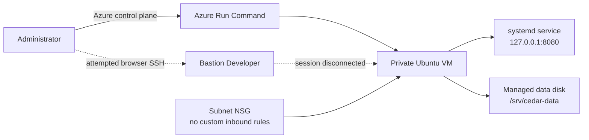
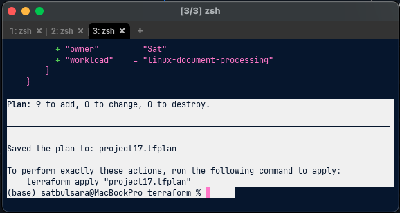
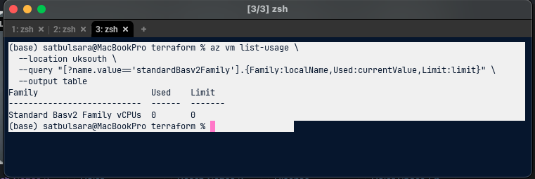
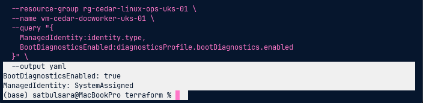
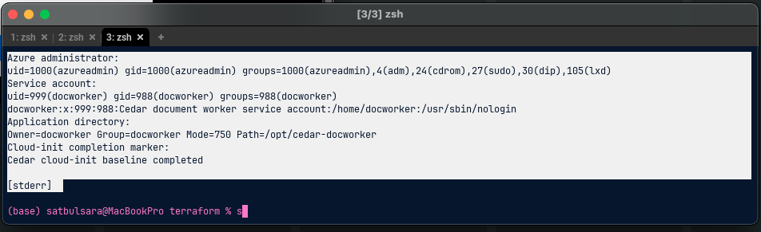
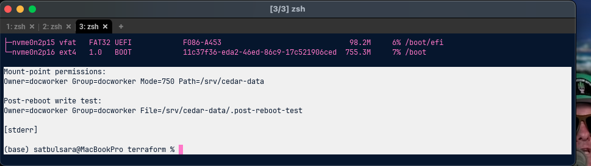
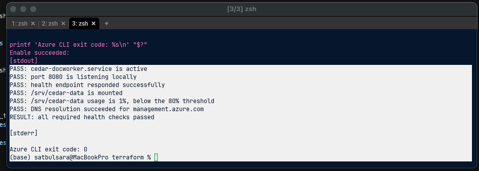
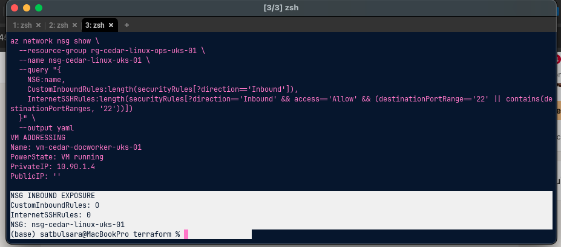
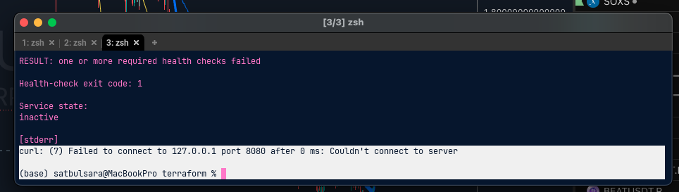

# Linux VM Administration and Secure Access

Status: Complete. Azure resources removed after verification.

## Company brief

Cedar & Finch Legal needs a small Linux host for an internal document-processing service. The workload is not public, but administrators still need a controlled way to deploy, inspect and recover it. I built the environment as a single-VM learning project, so high availability and production support processes are outside its scope.

## What I built

- A Terraform-managed resource group, VNet, workload subnet, NSG and private NIC
- An Ubuntu 24.04 LTS VM with no public IP or internet-facing SSH rule
- SSH-key authentication with password authentication disabled
- A system-assigned managed identity with no unnecessary Azure role assignment
- Managed boot diagnostics
- An 8 GB managed data disk attached at LUN 0
- A cloud-init baseline that created a locked `docworker` service account and a systemd service listening only on `127.0.0.1:8080`
- A persistent ext4 mount at `/srv/cedar-data`, owned by `docworker` with mode `750`
- A Bash health-check script covering the service, listener, HTTP response, mount, disk utilisation and DNS

## Security decisions

The VM had no public IP. The subnet NSG contained no custom inbound rule, including no rule allowing TCP 22 from the internet. Password authentication was disabled and the dedicated service account was locked, had no interactive shell and did not have a home directory. The application listened on loopback rather than the VNet or internet.

The data disk denied public network access. Guest permissions restricted its mount point to the service account and group. Cloud-init contained configuration only, not credentials or private-key material.

Bastion Developer was chosen for a low-cost browser-based test without adding a public IP. The session repeatedly connected and then closed before authentication while I was using a hotspot. SSH was active, the public and authorised-key fingerprints matched, and the NSG was associated correctly. I did not weaken the network controls to force the session to work. Azure Run Command provided the private control-plane administration path for the remaining exercises. The exact cause of the Bastion browser disconnect was not proven, so this is recorded as an unresolved client or broker-path limitation rather than a confirmed Azure configuration fault.

## Deployment and verification

Terraform initially planned nine resources. The selected `Standard_B2als_v2` VM could not be deployed because the subscription's Basv2-family quota in UK South was zero. I confirmed that with `az vm list-usage`, selected the available `Standard_D2als_v6` size, created a new plan and applied only the two remaining resources. The final VM was running on `10.90.1.4`, with no public IP.

The verification covered:

| Area | Verified result |
| --- | --- |
| VM | Ubuntu VM provisioned successfully with SSH passwords disabled |
| Identity | System-assigned managed identity enabled |
| Diagnostics | Managed boot diagnostics enabled |
| Network | Private NIC only, subnet NSG attached, no custom inbound or internet SSH rules |
| Guest baseline | Cloud-init completed; `docworker` was locked and non-interactive |
| Service | systemd service active and HTTP health endpoint returned the expected response |
| Storage | Data disk attached at LUN 0, formatted as ext4 and mounted persistently by UUID |
| Reboot | Mount, permissions and service-account write access survived a reboot |
| Lifecycle | Stop/deallocate/restart behaviour was observed and the workload recovered |
| Drift | `terraform plan -detailed-exitcode` returned 0 before cleanup |

## Controlled failure and recovery

I stopped `cedar-docworker.service` deliberately. The health script then reported the inactive service, the missing listener and failed HTTP request, aggregated the failures and returned exit code `1`. The journal showed a clean administrator-initiated stop rather than a crash.

After restarting the service, the journal recorded a successful start and HTTP 200 responses. Running the health check again returned all PASS results and exit code `0`.

## Troubleshooting notes

### VM-family quota

The original plan was valid, but Azure rejected the VM size because this subscription had a zero-vCPU quota for that family. Checking regional SKU restrictions alone was not sufficient. The successful workaround was to query family quota, choose an available family and create a fresh Terraform plan.

### Bastion Developer disconnect

The browser session closed repeatedly. I verified the guest SSH daemon, port 22 listener, NSG attachment, absence of an explicit deny, cloud-init status and matching SSH-key fingerprints. Guest logs showed the Azure platform address closing the connection before authentication. Run Command allowed the lab to continue without creating a public IP. This evidence narrows the fault boundary but does not establish a single root cause.

### Stale destroy plan

The first saved destroy plan became stale after Terraform state changed during another operation. I did not bypass the warning. I reconciled Terraform state with live Azure resources, removed the separately created Bastion Developer resource, produced a fresh destroy plan and applied it. The final Terraform state was empty and `az group exists` returned `false`.

## Cost and limitations

The VM accrued compute cost while allocated. The OS disk and data disk could continue to cost money while the VM was deallocated. Resources were therefore kept only for the working sessions and removed at completion.

This project proves a secure single-VM administration pattern, not high availability or a complete production platform. It does not include load balancing, backups, patch orchestration, central log retention, alerting, private DNS, a dedicated Bastion tier or an application deployment pipeline. A production design would assess those controls against recovery, support, compliance and availability requirements.

## Repository guide

- [Terraform configuration](terraform/)
- [Cloud-init baseline](cloud-init/cedar-docworker.yaml)
- [Bash health check](scripts/check-cedar-docworker.sh)
- [Azure CLI helpers](scripts/azure-cli.sh)
- [Completion guide](instructions.md)
- [Command cheatsheet](cheatsheet.md)
- [Reusable code snippets](code-snippets.md)

## Official references

- [Use cloud-init to customise a Linux VM](https://learn.microsoft.com/en-us/azure/virtual-machines/linux/using-cloud-init)
- [Attach and mount a managed data disk on Linux](https://learn.microsoft.com/en-us/azure/virtual-machines/linux/attach-disk-portal)
- [Azure VM power states and billing](https://learn.microsoft.com/en-us/azure/virtual-machines/states-billing)
- [Azure Bastion Developer](https://learn.microsoft.com/en-us/azure/bastion/quickstart-developer-sku)
- [Run commands on a Linux VM](https://learn.microsoft.com/en-us/azure/virtual-machines/linux/run-command)
