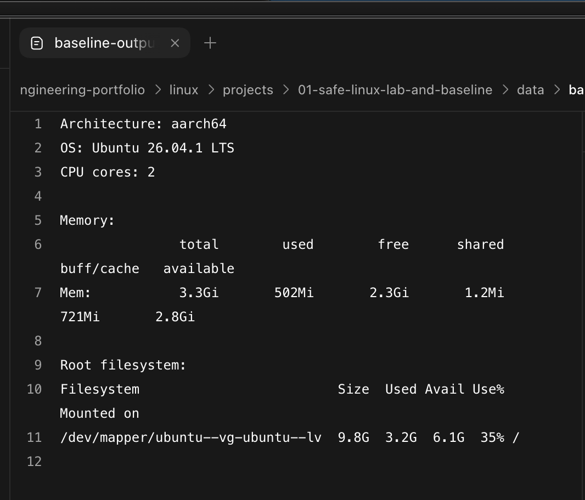

# Project 01: Safe Linux Lab and Baseline

## Operational problem

An administrator should not make changes until they know which system, user and
scope they are operating in. This project creates a disposable Linux lab and a
small public-safe baseline that later projects can compare against.

## Outcome

Identify the Linux distribution, user context, filesystem location and basic
host state, then record a sanitised read-only baseline using commands Sat can
explain.

## Lab files

- [Working instructions](instructions.md)
- [Bash scripts](scripts/)
- [Sanitised output](data/)
- [Screenshots](screenshots/)

## Evidence collected

The first guided, public-safe host summary is retained in
[`data/baseline-summary.txt`](data/baseline-summary.txt). It records the release,
architecture, CPU count, memory capacity and root-filesystem usage without a
username, hostname or IP address. The values were collected from the disposable
Ubuntu VM and reviewed before the file was copied into this repository.

The guided dynamic version is retained as
[`scripts/baseline.sh`](scripts/baseline.sh), with its reviewed Ubuntu result in
[`data/baseline-output.txt`](data/baseline-output.txt). The script passed a Bash
syntax check and collected live read-only evidence. Its current status is
guided, not independent Bash fluency.

## Controlled storage variation

A targeted 500 MiB test file was allocated in the disposable VM. The root
filesystem increased from 35 per cent to 40 per cent used. Removing the exact
test file returned it to 35 per cent, demonstrating both detection and rollback.
The sanitised result is retained in
[`data/storage-variation.txt`](data/storage-variation.txt).

## Progressive build

1. Confirm the distribution and release.
2. Confirm the current user, UID, groups and privilege boundary.
3. Explain the working directory, home directory and root directory.
4. Inspect kernel, CPU, memory and storage using read-only commands.
5. Answer one command question using `--help` or a man page.
6. Save a narrow, sanitised baseline report in this project.
7. Turn selected read-only checks into a first small Bash script with variables,
   comments and understandable output.
8. Create a controlled storage change on the same VM, detect it and roll it
   back safely.
9. Complete the Project 01 exit check and record where corrections were needed.

## Safety and scope

- Use a disposable, authorised Linux VM or equivalent lab.
- No privileged changes are required for the baseline.
- Do not publish usernames, hostnames, public IPs, keys or unrelated history.
- A snapshot is required before later system-changing projects.

## Completion evidence

- [x] Distribution and release explained
- [x] User and privilege boundary explained
- [x] Linux path model explained and demonstrated
- [x] Sanitised baseline report reviewed
- [x] One local documentation lookup demonstrated
- [x] Controlled storage variation detected and safely rolled back
- [x] First Bash baseline script explained and verified with guided support
- [x] Project exit check completed and corrected output verified

## Screenshot

## Completion status

Project 01 is complete as a guided lab. It demonstrates safe discovery,
sanitised evidence collection, a first Bash script and rollback of a controlled
storage change. Independent Bash mastery is not claimed; the concepts that
needed help will return later through spaced practice on the same VM.

The current learning action remains in
[`../../learning/PROGRESS.md`](../../learning/PROGRESS.md).
